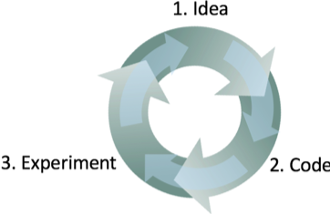

[返回目录](../MLY_index.html)

# 10. Having a dev set and metric speeds up iterations

2018-10-07

[TOC]

## 学习收获

> sh

内容

It is very difficult to know in advance what approach will work best for a new problem. Even experienced machine learning researchers will usually try out many dozens of ideas before they discover something satisfactory. When building a machine learning system, I will often:

事先很难知道哪种方法最适合新问题。即使是经验丰富的机器学习研究人员，在发现令人满意的事情之前，通常会尝试许多想法。在构建机器学习系统时，我经常会：

1. Start off with some **idea** on how to build the system.

   首先介绍如何构建系统。

2. Implement the idea in **code**.

   在代码中实现这个想法。

3. Carry out an **experiment** which tells me how well the idea worked. (Usually my first few ideas don’t work!) Based on these learnings, go back to generate more ideas, and keep on iterating.

   进行一项实验，告诉我这个想法有多好。 （通常我的前几个想法不起作用！）基于这些学习，回过头来产生更多的想法，并继续迭代。

 

This is an iterative process. The faster you can go round this loop, the faster you will make progress. This is why having dev/test sets and a metric are important: Each time you try an idea, measuring your idea’s performance on the dev set lets you quickly decide if you’re heading in the right direction.

这是一个迭代过程。围绕这个循环越快，你进步的速度就越快。这就是为什么拥有开发/测试集和度量标准很重要的原因：每次尝试一个想法时，在开发集上测量你的想法的性能可以让你快速决定你是否朝着正确的方向前进。

In contrast, suppose you don’t have a specific dev set and metric. So each time your team develops a new cat classifier, you have to incorporate it into your app, and play with the app for a few hours to get a sense of whether the new classifier is an improvement. This would be incredibly slow! Also, if your team improves the classifier’s accuracy from 95.0% to 95.1%, you might not be able to detect that 0.1% improvement from playing with the app. Yet a lot of progress in your system will be made by gradually accumulating dozens of these 0.1% improvements. Having a dev set and metric allows you to very quickly detect which ideas are successfully giving you small (or large) improvements, and therefore lets you quickly decide what ideas to keep refining, and which ones to discard.

相反，假设您没有特定的开发集和指标。因此，每当您的团队开发新的猫分类器时，您必须将其合并到您的应用程序中，并使用该应用程序几个小时，以了解新分类器是否是一项改进。这将非常慢！此外，如果您的团队将分类器的准确度从95.0％提高到95.1％，您可能无法检测到使用该应用程序的效率提高了0.1％。然而，通过逐渐累积数十个0.1％的改进，您的系统将取得很多进展。拥有开发设置和指标可以让您快速检测哪些想法成功地为您提供了小的（或大的）改进，因此可以让您快速决定要改进哪些想法以及丢弃哪些想法。