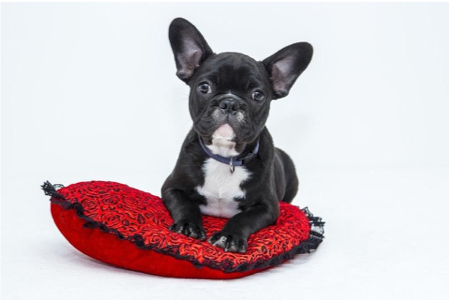

[返回目录](../MLY_index.html)

# 14. Error analysis: Look at dev set examples to evaluate ideas

2018-10-09

[TOC]

## 学习收获

> sh

内容

When you play with your cat app, you notice several examples where it mistakes dogs for cats. Some dogs do look like cats!

当你玩你的猫应用程序时，你会注意到几个例子，它会误认为猫的狗。有些狗看起来像猫！

A team member proposes incorporating 3rd party software that will make the system do better on dog images. These changes will take a month, and the team member is enthusiastic. Should you ask them to go ahead?

团队成员建议合并第三方软件，使系统在狗图像上做得更好。这些变化需要一个月的时间，团队成员也很热情。你应该让他们继续吗？

Before investing a month on this task, I recommend that you first estimate how much it will actually improve the system’s accuracy. Then you can more rationally decide if this is worth the month of development time, or if you’re better off using that time on other tasks.

在为这项任务投入一个月之前，我建议您首先估计它实际上会提高系统准确性的程度。然后你可以更合理地决定这是否值得在开发时间的月份，或者你是否更好地利用这个时间在其他任务上。

In detail, here’s what you can do:

详细说明，这是你可以做的：

1. Gather a sample of 100 dev set examples that your system *misclassified*. I.e., examples that your system made an error on.

   收集系统错误分类的100个开发示例示例。即，您的系统出错的示例。

2. Look at these examples manually, and count what fraction of them are dog images.

   手动查看这些示例，并计算它们中的哪一部分是狗图像。

The process of looking at misclassified examples is called **error analysis**. In this example, if you find that only 5% of the misclassified images are dogs, then no matter how much you improve your algorithm’s performance on dog images, you won’t get rid of more than 5% of your errors. In other words, 5% is a “ceiling” (meaning maximum possible amount) for how much the proposed project could help. Thus, if your overall system is currently 90% accurate (10% error), this improvement is likely to result in at best 90.5% accuracy (or 9.5% error, which is 5% less error than the original 10% error).

查看错误分类示例的过程称为错误分析。在这个例子中，如果您发现只有5％的错误分类图像是狗，那么无论您在狗图像上提高算法的性能有多少，您都不会失去超过5％的错误。换句话说，5％是拟议项目可以提供多少帮助的“上限”（意味着最大可能数量）。因此，如果您的整个系统目前90％准确（10％误差），这种改进可能最多导致90.5％的准确度（或9.5％的误差，误差比原始的10％误差少5％）。

In contrast, if you find that 50% of the mistakes are dogs, then you can be more confident that the proposed project will have a big impact. It could boost accuracy from 90% to 95% (a 50% relative reduction in error, from 10% down to 5%).

相反，如果你发现50％的错误都是狗，那么你可以更加确信拟议的项目会产生很大的影响。它可以将准确度从90％提高到95％（误差相对减少50％，从10％降低到5％）。

This simple counting procedure of error analysis gives you a quick way to estimate the possible value of incorporating the 3rd party software for dog images. It provides a quantitative basis on which to decide whether to make this investment.

这种简单的错误分析计数程序为您提供了一种快速估算将第三方软件纳入狗图像的可能价值的方法。它为决定是否进行此项投资提供了定量依据。

Error analysis can often help you figure out how promising different directions are. I’ve seen many engineers reluctant to carry out error analysis. It often feels more exciting to just jump in and implement some idea, rather than question if the idea is worth the time investment. This is a common mistake: It might result in your team spending a month only to realize afterward that it resulted in little benefit.

错误分析通常可以帮助您弄清楚不同方向的前景。我见过很多工程师都不愿意进行错误分析。只是跳进去实施一些想法通常会感觉更令人兴奋，而不是质疑这个想法是否值得投入时间。这是一个常见的错误：它可能会导致您的团队花费一个月的时间才意识到它后来几乎没有带来任何好处。

Manually examining 100 examples does not take long. Even if you take one minute per image, you’d be done in under two hours. These two hours could save you a month of wasted effort.

手动检查100个示例并不需要很长时间。即使你每张图片需要一分钟，你也可以在两小时内完成。这两个小时可以为你节省一个月的精力。

**Error Analysis** refers to the process of examining dev set examples that your algorithm misclassified, so that you can understand the underlying causes of the errors. This can help you prioritize projects—as in this example—and inspire new directions, which we will discuss next. The next few chapters will also present best practices for carrying out error analyses.

错误分析是指检查您的算法错误分类的开发集示例的过程，以便您可以了解错误的根本原因。这可以帮助您确定项目的优先级 - 如本例所示 - 并启发新的方向，我们将在下面讨论。接下来的几章还将介绍进行错误分析的最佳实践。