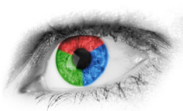

[返回目录](../MLY_index.html)

# 18. Eyeball和Blackbox开发者应该有多大？ How big should the Eyeball and Blackbox dev sets be?

2018-10-09

[TOC]

## 学习收获

> sh

内容

Your Eyeball dev set should be large enough to give you a sense of your algorithm’s major error categories. If you are working on a task that humans do well (such as recognizing cats in images), here are some rough guidelines:

您的Eyeball开发设置应该足够大，以便您了解算法的主要错误类别。如果你正在做一项人类做得好的任务（比如识别图像中的猫），这里有一些粗略的指导方针：

- An eyeball dev set in which your classifier makes 10 mistakes would be considered very small. With just 10 errors, it’s hard to accurately estimate the impact of different error categories. But if you have very little data and cannot afford to put more into the Eyeball dev set, it’s better than nothing and will help with project prioritization.

  一个眼球开发设置，你的分类器犯10个错误将被认为是非常小的。只有10个错误，很难准确估计不同错误类别的影响。但是如果你的数据非常少，并且无法承担更多的费用，那么它优于什么，它将有助于项目的优先级排序。

- If your classifier makes ~20 mistakes on eyeball dev examples, you would start to get a rough sense of the major error sources.

  如果你的分类器在眼球开发示例中犯了大约20个错误，你就会开始大致了解主要的错误来源。

- With ~50 mistakes, you would get a good sense of the major error sources.

  大约有50个错误，你会很好地理解主要的错误来源。

- With ~100 mistakes, you would get a very good sense of the major sources of errors. I’ve seen people manually analyze even more errors—sometimes as many as 500. There is no harm in this as long as you have enough data.

  如果出现大约100个错误，您将非常了解错误的主要来源。我看到人们手动分析更多的错误 - 有时甚至多达500个。只要你有足够的数据，就没有任何害处。

Say your classifier has a 5% error rate. To make sure you have ~100 misclassified examples in the Eyeball dev set, the Eyeball dev set would have to have about 2,000 examples (since 0.05*2,000 = 100). The lower your classifier’s error rate, the larger your Eyeball dev set needs to be in order to get a large enough set of errors to analyze.

假设您的分类器的错误率为5％。为了确保你在Eyeball开发套装中有大约100个错误分类的例子，Eyeball开发套装必须有大约2,000个例子（因为0.05 * 2,000 = 100）。分类器的错误率越低，您的眼球开发设置需要越大，以便分析足够大的错误集。

If you are working on a task that even humans cannot do well, then the exercise of examining an Eyeball dev set will not be as helpful because it is harder to figure out why the algorithm didn’t classify an example correctly. In this case, you might omit having an Eyeball dev set. We discuss guidelines for such problems in a later chapter.

如果你正在处理甚至人类都做不好的任务，那么检查一个Eyeball开发集的练习将没有那么有用，因为很难弄清楚为什么算法没有正确地对一个例子进行分类。在这种情况下，您可能会省略设置Eyeball开发。我们将在后面的章节中讨论这些问题的指导原则。

 

How about the Blackbox dev set? We previously said that dev sets of around 1,000-10,000 examples are common. To refine that statement, a Blackbox dev set of 1,000-10,000 examples will often give you enough data to tune hyperparameters and select among models, though there is little harm in having even more data. A Blackbox dev set of 100 would be small but still useful.

Blackbox dev设置如何？我们之前曾说过大约1,000-10,000个示例的开发常见。为了优化该语句，Blackbox dev设置1,000-10,000个示例通常会为您提供足够的数据来调整超参数并在模型中进行选择，尽管获得更多数据几乎没有什么害处。 Blackbox dev设置为100，虽然很小但仍然有用。

If you have a small dev set, then you might not have enough data to split into Eyeball and Blackbox dev sets that are both large enough to serve their purposes. Instead, your entire dev set might have to be used as the Eyeball dev set—i.e., you would manually examine all the dev set data.

如果你有一个小的开发设置，那么你可能没有足够的数据可以分成Eyeball和Blackbox开发组，这些开发组都足够大，可以满足他们的目的。相反，您的整个开发设置可能必须用作Eyeball开发设置 - 即，您将手动检查所有开发设置数据.

Between the Eyeball and Blackbox dev sets, I consider the Eyeball dev set more important (assuming that you are working on a problem that humans can solve well and that examining the examples helps you gain insight). If you only have an Eyeball dev set, you can perform error analyses, model selection and hyperparameter tuning all on that set. The downside of having only an Eyeball dev set is that the risk of overfitting the dev set is greater.

在Eyeball和Blackbox开发套件之间，我认为Eyeball开发设置更重要（假设您正在解决人类可以很好地解决的问题，并且检查示例可以帮助您获得洞察力）。如果您只设置了Eyeball开发，则可以在该组上执行错误分析，模型选择和超参数调整。仅设置Eyeball开发的缺点是过度拟合开发设置的风险更大。

If you have plentiful access to data, then the size of the Eyeball dev set would be determined mainly by how many examples you have time to manually analyze. For example, I’ve rarely seen anyone manually analyze more than 1,000 errors.

如果您有足够的数据访问权限，那么Eyeball开发集的大小主要取决于您有多少时间手动分析。例如，我很少见到有人手动分析超过1,000个错误。