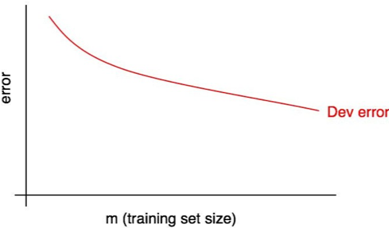
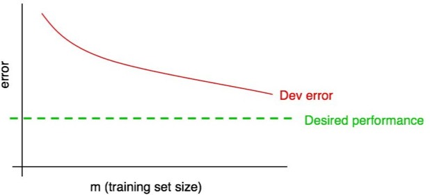

[返回目录](../MLY_index.html)

# 28. Diagnosing bias and variance/ Learning curves

2018-10-11

[TOC]

## 学习收获

> sh

内容

We’ve seen some ways to estimate how much error can be attributed to avoidable bias vs. variance. We did so by estimating the optimal error rate and computing the algorithm’s training set and dev set errors. Let’s discuss a technique that is even more informative: plotting a learning curve.

我们已经看到一些方法来估计错误可归因于可避免偏差与方差的差异。我们通过估计最佳错误率并计算算法的训练集和开发设置错误来实现。让我们讨论一种更具信息性的技术：绘制学习曲线。

A learning curve plots your dev set error against the number of training examples. To plot it, you would run your algorithm using different training set sizes. For example, if you have 1,000 examples, you might train separate copies of the algorithm on 100, 200, 300, …, 1000 examples. Then you could plot how dev set error varies with the training set size. Here is an example:

学习曲线将您的开发设置错误与训练示例的数量进行对比。要绘制它，您将使用不同的训练集大小运行算法。例如，如果您有1,000个示例，则可以在100,200,300，...，1000示例上训练算法的单独副本。然后你可以绘制dev set error如何随训练集大小而变化。这是一个例子：

As the training set size increases, the dev set error should decrease.

随着训练集大小的增加，开发集错误应该减少。

We will often have some “desired error rate” that we hope our learning algorithm will eventually achieve. For example:

我们经常会有一些“期望的错误率”，我们希望我们的学习算法最终会实现。例如：

- If we hope for human-level performance, then the human error rate could be the “desired error rate.”

  如果我们希望人类的表现，那么人为错误率可能是“所需的错误率”。

- If our learning algorithm serves some product (such as delivering cat pictures), we might have an intuition about what level of performance is needed to give users a great experience.

  如果我们的学习算法服务于某些产品（例如提供猫图片），我们可能会直觉知道需要什么级别的性能来为用户提供良好的体验。

- If you have worked on a important application for a long time, then you might have intuition about how much more progress you can reasonably make in the next quarter/year.

  如果您长期从事重要的应用程序，那么您可能会对下一季度/年度可以合理地取得多少进展有所直觉。

Add the desired level of performance to your learning curve:

在学习曲线中添加所需的性能级别：

You can visually extrapolate the red “dev error” curve to guess how much closer you could get to the desired level of performance by adding more data. In the example above, it looks plausible that doubling the training set size might allow you to reach the desired performance.

您可以通过视觉外推红色“dev error”曲线来猜测通过添加更多数据可以达到所需的性能水平。在上面的示例中，将训练集大小加倍可能会使您达到所需的性能似乎是合理的。

But if the dev error curve has “plateaued” (i.e. flattened out), then you can immediately tell that adding more data won’t get you to your goal:

但是，如果开发错误曲线已经“平稳”（即变平），那么您可以立即告诉您添加更多数据无法实现您的目标：

 

Looking at the learning curve might therefore help you avoid spending months collecting twice as much training data, only to realize it does not help.

因此，考虑学习曲线可能会帮助您避免花费数月时间收集两倍的训练数据，但实现它并没有帮助。

One downside of this process is that if you only look at the dev error curve, it can be hard to extrapolate and predict exactly where the red curve will go if you had more data. There is one additional plot that can help you estimate the impact of adding more data: the training error.

这个过程的一个缺点是，如果你只看一下开发误差曲线，如果你有更多的数据，很难推断和预测红色曲线的确切位置。还有一个附加图可以帮助您估计添加更多数据的影响：训练错误。