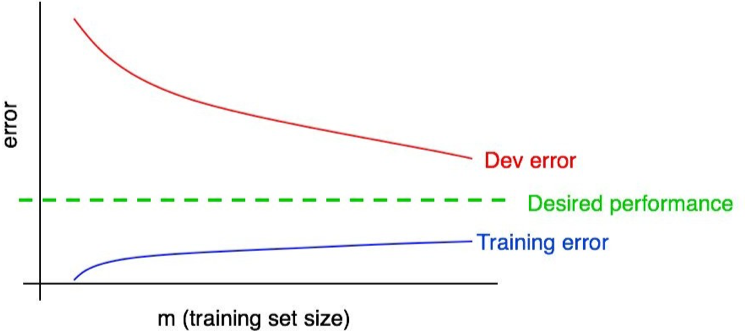

[返回目录](../MLY_index.html)

# 29. Plotting training error

2018-10-11

[TOC]

## 学习收获

> sh

内容

Your dev set (and test set) error should decrease as the training set size grows. But your training set error usually *increases* as the training set size grows.

随着训练集大小的增加，您的开发集（和测试集）错误应该会减少。但是，随着训练集大小的增加，训练集错误通常会增加。

Let’s illustrate this effect with an example. Suppose your training set has only 2 examples: One cat image and one non-cat image. Then it is easy for the learning algorithms to “memorize” both examples in the training set, and get 0% training set error. Even if either or both of the training examples were mislabeled, it is still easy for the algorithm to memorize both labels.

让我们用一个例子说明这种效果。假设您的训练集只有两个示例：一个猫图像和一个非猫图像。然后，学习算法很容易“记住”训练集中的两个示例，并获得0％的训练集错误。即使其中一个或两个训练样例都被错误标记，算法仍然很容易记住两个标签。

Now suppose your training set has 100 examples. Perhaps even a few examples are mislabeled, or ambiguous—some images are very blurry, so even humans cannot tell if there is a cat. Perhaps the learning algorithm can still “memorize” most or all of the training set, but it is now harder to obtain 100% accuracy. By increasing the training set from 2 to 100 examples, you will find that the training set accuracy will drop slightly.

现在假设你的训练集有100个例子。也许甚至一些例子都被贴错了标签，或者含糊不清 - 有些图像非常模糊，所以即使是人类也无法判断是否有猫。也许学习算法仍然可以“记住”大部分或全部训练集，但现在更难以获得100％的准确度。通过将训练集从2个增加到100个，你会发现训练集的准确度会略有下降。

Finally, suppose your training set has 10,000 examples. In this case, it becomes even harder for the algorithm to perfectly fit all 10,000 examples, especially if some are ambiguous or mislabeled. Thus, your learning algorithm will do even worse on this training set.

最后，假设您的训练集有10,000个示例。在这种情况下，算法更难以完全适合所有10,000个示例，特别是如果有些模糊不清或标注错误。因此，您的学习算法在此训练集上会更糟糕。

Let’s add a plot of training error to our earlier figures:

让我们在之前的数据中添加一个训练误差图：

 

You can see that the blue “training error” curve increases with the size of the training set. Furthermore, your algorithm usually does better on the training set than on the dev set; thus the red dev error curve usually lies strictly above the blue training error curve.

您可以看到蓝色“训练误差”曲线随着训练集的大小而增加。此外，您的算法通常在训练集上比在开发集上做得更好;因此，红色偏差误差曲线通常严格地位于蓝色训练误差曲线之上。

Let’s discuss next how to interpret these plots.

我们接下来讨论如何解释这些图。