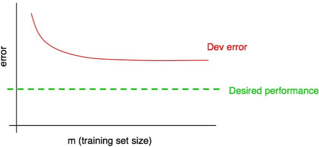
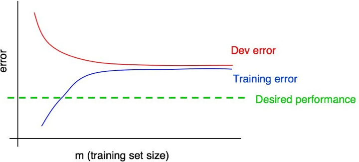

[返回目录](../MLY_index.html)

# 30. Interpreting learning curves: High bias

2018-10-11

[TOC]

## 学习收获

> sh

内容

Suppose your dev error curve looks like this:

假设您的dev错误曲线如下所示：

  

We previously said that, if your dev error curve plateaus, you are unlikely to achieve the desired performance just by adding data.

我们之前曾说过，如果你的开发误差曲线稳定，你不可能仅通过添加数据来达到预期的性能。

But it is hard to know exactly what an extrapolation of the red dev error curve will look like. If the dev set was small, you would be even less certain because the curves could be noisy.

但很难确切地知道红色偏差误差曲线的外推是什么样的。如果开发设置很小，你会更加确定，因为曲线可能会很嘈杂。

Suppose we add the training error curve to this plot and get the following:

假设我们将训练误差曲线添加到该图中并获得以下内容：

  

Now, you can be absolutely sure that adding more data will not, by itself, be sufficient. Why is that? Remember our two observations:

现在，您可以绝对确定添加更多数据本身就不够了。这是为什么？记住我们的两个观察：

- As we add more training data, training error can only get worse. Thus, the blue training error curve can only stay the same or go higher, and thus it can only get further away from the (green line) level of desired performance.

  随着我们添加更多训练数据，训练错误只会变得更糟。因此，蓝色训练误差曲线只能保持相同或更高，因此它只能远离所需性能的（绿线）水平。

- The red dev error curve is usually higher than the blue training error. Thus, there’s almost no way that adding more data would allow the red dev error curve to drop down to the desired level of performance when even the training error is higher than the desired level of performance.

  红色偏差误差曲线通常高于蓝色训练误差。因此，即使训练误差高于期望的性能水平，添加更多数据也几乎无法使红色偏差误差曲线下降到所需的性能水平。

Examining both the dev error curve and the training error curve on the same plot allows us to more confidently extrapolate the dev error curve.

在相同的图上检查开发误差曲线和训练误差曲线使我们能够更自信地推断开发误差曲线。

Suppose, for the sake of discussion, that the desired performance is our estimate of the optimal error rate. The figure above is then the standard “textbook” example of what a learning curve with high avoidable bias looks like: At the largest training set size—presumably corresponding to all the training data we have—there is a large gap between the training error and the desired performance, indicating large avoidable bias. Furthermore, the gap between the training and dev curves is small, indicating small variance.

为了便于讨论，假设期望的性能是我们对最佳错误率的估计。上图是具有高可避免偏差的学习曲线的标准“教科书”示例：在最大训练集大小 - 可能与我们所有的训练数据相对应 - 训练误差与训练误差之间存在较大差距。期望的性能，表明可避免的偏差很大。此外，训练曲线和dev曲线之间的差距很小，表明方差很小。

Previously, we were measuring training and dev set error only at the rightmost point of this plot, which corresponds to using all the available training data. Plotting the full learning curve gives us a more comprehensive picture of the algorithms’ performance on different training set sizes.

以前，我们仅在该图的最右侧点测量训练和开发设置误差，这对应于使用所有可用的训练数据。绘制完整的学习曲线，可以更全面地了解算法在不同训练集大小上的表现。