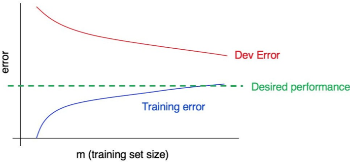
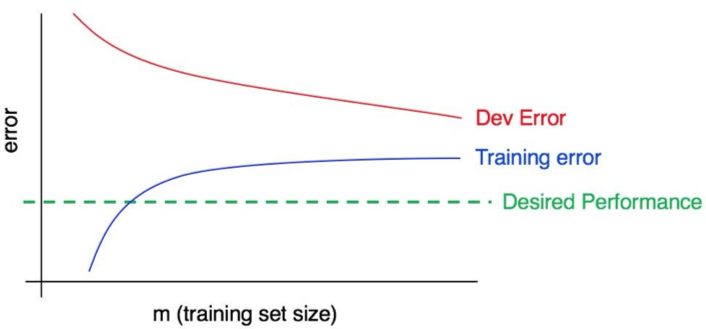

[返回目录](../MLY_index.html)

# 31. 解释学习曲线：其他案例 Interpreting learning curves: Other cases

2018-10-11

[TOC]

## 学习收获

> sh

内容

Consider this learning curve:

考虑这个学习曲线： 

Does this plot indicate high bias, high variance, or both?

该图是否表示高偏差，高差异或两者兼而有之？

The blue training error curve is relatively low, and the red dev error curve is much higher than the blue training error. Thus, the bias is small, but the variance is large. Adding more training data will probably help close the gap between dev error and training error.

蓝色训练误差曲线相对较低，红色偏差误差曲线远高于蓝色训练误差。因此，偏差很小，但方差很大。添加更多训练数据可能有助于缩小开发错误和训练错误之间的差距。

Now, consider this:

现在，考虑一下：

 

This time, the training error is large, as it is much higher than the desired level of performance. The dev error is also much larger than the training error. Thus, you have significant bias and significant variance. You will have to find a way to reduce both bias and variance in your algorithm.

这次，训练误差很大，因为它远远高于所需的性能水平。 dev错误也比训练错误大得多。因此，您有显着的偏差和显着的差异。您必须找到一种方法来减少算法中的偏差和方差。