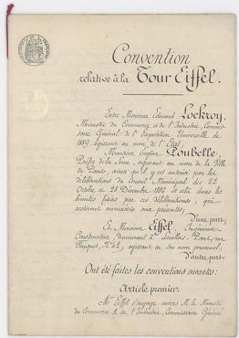

[返回目录](../MLY_index.html)

# 37. 如何决定是否使用所有数据 How to decide whether to use all your data

2018-10-13

[TOC]

## 学习收获

> sh

内容

Suppose your cat detector’s training set includes 10,000 user-uploaded images. This data comes from the same distribution as a separate dev/test set, and represents the distribution you care about doing well on. You also have an additional 20,000 images downloaded from the internet. Should you provide all 20,000+10,000=30,000 images to your learning algorithm as its training set, or discard the 20,000 internet images for fear of it biasing your learning algorithm?

假设您的猫探测器的训练集包括10,000个用户上传的图像。此数据来自与单独的开发/测试集相同的分发，并表示您关心的分发。您还可以从互联网上下载20,000张图像。您是否应该将所有20,000 + 10,000 = 30,000张图像作为其训练集提供给您的学习算法，或者丢弃20,000个互联网图像，因为它会影响您的学习算法？

When using earlier generations of learning algorithms (such as hand-designed computer vision features, followed by a simple linear classifier) there was a real risk that merging both types of data would cause you to perform worse. Thus, some engineers will warn you against including the 20,000 internet images.

当使用前几代学习算法（例如手工设计的计算机视觉特征，然后是简单的线性分类器）时，合并两种类型的数据会导致您的表现更差。因此，一些工程师会警告您不要包含20,000个互联网图像。

But in the modern era of powerful, flexible learning algorithms—such as large neural networks—this risk has greatly diminished. If you can afford to build a neural network with a large enough number of hidden units/layers, you can safely add the 20,000 images to your training set. Adding the images is more likely to increase your performance.

但在强大，灵活的学习算法（如大型神经网络）的现代时代，这种风险已大大降低。如果您能够构建具有足够数量的隐藏单元/层的神经网络，则可以安全地将20,000个图像添加到训练集中。添加图像更有可能提高您的性能。

This observation relies on the fact that there is some x —> y mapping that works well for both types of data. In other words, there exists some system that inputs either an internet image or a mobile app image and reliably predicts the label, even without knowing the source of the image.

这种观察依赖于这样一个事实：有一些x  - > y映射适用于这两种类型的数据。换句话说，存在一些输入互联网图像或移动应用图像并且可靠地预测标签的系统，即使不知道图像的来源也是如此。

Adding the additional 20,000 images has the following effects:

添加额外的20,000个图像具有以下效果：

1. It gives your neural network more examples of what cats do/do not look like. This is helpful, since internet images and user-uploaded mobile app images do share some similarities. Your neural network can apply some of the knowledge acquired from internet images to mobile app images.

   它为您的神经网络提供了更多关于猫做/不看的例子。这很有用，因为互联网图像和用户上传的移动应用图像确实有一些相似之处。您的神经网络可以将从互联网图像获取的一些知识应用于移动应用图像。

2. It forces the neural network to expend some of its capacity to learn about properties that are specific to internet images (such as higher resolution, different distributions of how the images are framed, etc.) If these properties differ greatly from mobile app images, it will “use up” some of the representational capacity of the neural network. Thus there is less capacity for recognizing data drawn from the distribution of mobile app images, which is what you really care about. Theoretically, this could hurt your algorithms’ performance.

   它迫使神经网络花费一些能力来学习特定于互联网图像的属性（例如更高的分辨率，图像如何构图的不同分布等）。如果这些属性与移动应用图像有很大不同，那么将“消耗”神经网络的一些代表性能力。因此，识别从移动应用程序图像的分布中获取的数据的能力较低，这是您真正关心的。从理论上讲，这可能会损害算法的性能。

To describe the second effect in different terms, we can turn to the fictional character Sherlock Holmes, who says that your brain is like an attic; it only has a finite amount of space. He says that “for every addition of knowledge, you forget something that you knew before. It is of the highest importance, therefore, not to have useless facts elbowing out the useful ones.”^12^

为了用不同的术语描述第二种效果，我们可以转向虚构人物福尔摩斯，他说你的大脑就像一个阁楼;它只有有限的空间。他说，“每增加一点知识，你就会忘记以前知道的事情。因此，最重要的是，不要将无用的事实排除在有用的事实之外。“12

Fortunately, if you have the computational capacity needed to build a big enough neural network—i.e., a big enough attic—then this is not a serious concern. You have enough capacity to learn from both internet and from mobile app images, without the two types of data competing for capacity. Your algorithm’s “brain” is big enough that you don’t have to worry about running out of attic space.

幸运的是，如果你有足够的计算能力建立一个足够大的神经网络 - 即一个足够大的阁楼 - 那么这不是一个严重的问题。您有足够的能力从互联网和移动应用图像中学习，而不会有两种类型的数据竞争容量。你的算法的“大脑”足够大，你不必担心阁楼空间不足。

But if you do not have a big enough neural network (or another highly flexible learning algorithm), then you should pay more attention to your training data matching your dev/test set distribution.

但是如果你没有足够大的神经网络（或其他高度灵活的学习算法），那么你应该更多地关注与你的开发/测试集分布相匹配的训练数据。

If you think you have data that has no benefit,you should just leave out that data for computational reasons. For example, suppose your dev/test sets contain mainly casual pictures of people, places, landmarks, animals. Suppose you also have a large collection of scanned historical documents:

如果您认为自己的数据没有任何好处，那么出于计算原因，您应该忽略这些数据。例如，假设您的开发/测试集主要包含人物，地点，地标，动物的随意图片。假设您还拥有大量已扫描的历史文档：

 These documents don’t contain anything resembling a cat. They also look completely unlike your dev/test distribution. There is no point including this data as negative examples, because the benefit from the first effect above is negligible—there is almost nothing your neural network can learn from this data that it can apply to your dev/test set distribution. Including them would waste computation resources and representation capacity of the neural network.

这些文件中没有任何类似于猫的文件。它们看起来与您的开发/测试分发完全不同。没有必要将这些数据作为反面例子，因为上述第一个效应的好处可以忽略不计 - 您的神经网络几乎没有任何东西可以从这些数据中学到它可以应用于您的开发/测试集分布。包括它们会浪费计算资源和神经网络的表示能力。

---

12 *A Study in Scarlet* by Arthur Conan Doyle

12亚瑟柯南道尔的血色研究