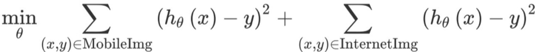
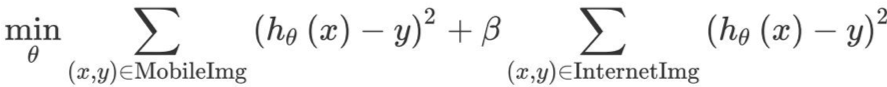

[返回目录](../MLY_index.html)

# 39. 加权数据 Weighting data

2018-10-13

[TOC]

## 学习收获

> sh

内容

Suppose you have 200,000 images from the internet and 5,000 images from your mobile app users. There is a 40:1 ratio between the size of these datasets. In theory, so long as you build a huge neural network and train it long enough on all 205,000 images, there is no harm in trying to make the algorithm do well on both internet images and mobile images.

假设您有来自互联网的200,000张图片和来自您的移动应用用户的5,000张图片。这些数据集的大小之间的比率为40：1。从理论上讲，只要你构建一个巨大的神经网络并在所有205,000个图像上训练它足够长时间，试图使算法在互联网图像和移动图像上都能很好地完成就没有任何害处。

But in practice, having 40x as many internet images as mobile app images might mean you need to spend 40x (or more) as much computational resources to model both, compared to if you trained on only the 5,000 images.

但实际上，拥有40倍于移动应用图片的互联网图像可能意味着您需要花费40倍（或更多）的计算资源来对两者进行建模，相比之下，您只需要训练5,000张图像。

If you don’t have huge computational resources, you could give the internet images a much lower weight as a compromise.

如果您没有庞大的计算资源，那么您可以将互联网图像作为折衷方案给予更低的权重。

For example, suppose your optimization objective is squared error (This is not a good choice for a classification task, but it will simplify our explanation.) Thus, our learning algorithm tries to optimize:

例如，假设您的优化目标是平方误差（这不是分类任务的好选择，但它将简化我们的解释。）因此，我们的学习算法尝试优化：

  

The first sum above is over the 5,000 mobile images, and the second sum is over the 200,000 internet images. You can instead optimize with an additional parameter 𝛽:

上面的第一笔金额超过5,000张移动图像，第二笔金额超过200,000张互联网图像。您可以使用附加参数β进行优化：

  

If you set 𝛽=1/40, the algorithm would give equal weight to the 5,000 mobile images and the 200,000 internet images. You can also set the parameter 𝛽 to other values, perhaps by tuning to the dev set.

如果设置β= 1/40，算法将给予5,000个移动图像和200,000个互联网图像相同的权重。您也可以通过调整到开发集来将参数β设置为其他值。

By weighting the additional Internet images less, you don’t have to build as massive a neural network to make sure the algorithm does well on both types of tasks. This type of re-weighting is needed only when you suspect the additional data (Internet Images) has a very different distribution than the dev/test set, or if the additional data is much larger than the data that came from the same distribution as the dev/test set (mobile images).

通过减少额外的互联网图像权重，您不必构建庞大的神经网络，以确保算法在两种类型的任务上都能很好地完成。只有当您怀疑附加数据（Internet图像）的分布与开发/测试集的分布非常不同，或者附加数据远远大于来自同一分发的数据时，才需要这种类型的重新加权。开发/测试集（移动图像）。