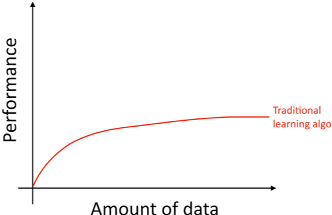
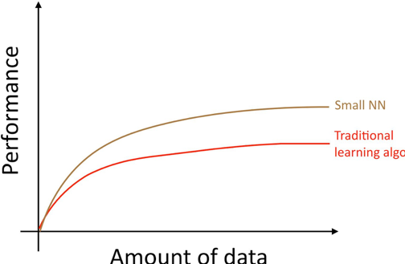
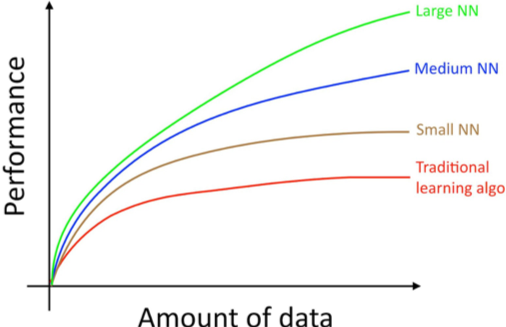

[返回目录](../MLY_index.html)

# 4. Scale促进了机器学习的发展 Scale drives machine learning progress

2018-10-08

[TOC]

## 学习收获

> 深度学习变火的原因：数据可用性（data availability）和计算能力（computational scale）
>
> 传统的机器学习算法会有高原效应（plateaus）
>
> 神经网络越大、数据越多，效果越好（最可靠的提升方法）
>
> 神经网络架构也很重要
>
> 小型数据集上，特征工程比算法的选择更重要

 

Many of the ideas of deep learning (neural networks) have been around for decades. Why are these ideas taking off now?

许多深度学习（神经网络）的想法已经存在了几十年。为什么这些想法现在突然就火了呢？

Two of the biggest drivers of recent progress have been:

促进近年来取得进展的两个最大驱动因素是：

- **Data availability.** People are now spending more time on digital devices (laptops, mobile devices). Their digital activities generate huge amounts of data that we can feed to our learning algorithms.

  数据可用性。人们现在将更多时间花在数字设备（笔记本电脑、移动设备）上。这些数字活动产生了大量的数据，我们可以将其提供给我们的学习算法。

- **Computational scale.** We started just a few years ago to be able to train neural networks that are big enough to take advantage of the huge datasets we now have.

  计算规模。近年来我们才能够开始训练足够大的神经网络，将我们现在拥有的庞大数据集利用起来。

In detail, even as you accumulate more data, usually the performance of older learning algorithms, such as logistic regression, “plateaus.” This means its learning curve “flattens out,” and the algorithm stops improving even as you give it more data:

具体来说，即使你积累了更多的数据，较老的学习算法（例如逻辑回归）的性能通常也会出现“高原效应（plateaus）”。这意味着它的学习曲线“变平坦”，即使你给它更多的数据，算法效果也不再提升：

It was as if the older algorithms didn’t know what to do with all the data we now have.

就好像旧的算法不知道如何处理我们现在拥有的所有数据。

If you train a small neutral network (NN) on the same supervised learning task, you might get slightly better performance:

如果您在同一个监督学习任务上训练一个小型中立网络（NN），您可能会获得稍微好一点的性能：

 

Here, by “Small NN” we mean a neural network with only a small number of hidden units/layers/parameters. Finally, if you train larger and larger neural networks, you can obtain even better performance^1^:

这里，“小型神经网络（small NN）”是指仅具有少量隐藏单元/层/参数的神经网络。最后，如果你训练越来越大的神经网络，你可以获得更好的性能^1^：

Thus, you obtain the best performance when you (i) Train a very large neural network, so that you are on the green curve above; (ii) Have a huge amount of data.

因此，若您想要获得最佳性能，您需要（i）训练一个非常大的神经网络，使您处于上图的绿色曲线上; （ii）拥有大量数据。

Many other details such as neural network architecture are also important, and there has been much innovation here. But one of the more reliable ways to improve an algorithm’s performance today is still to (i) train a bigger network and (ii) get more data.

许多其他细节，如神经网络架构也很重要，这里有很多创新。但是，目前提高算法性能的一种更可靠的方法仍然是（i）训练更大的网络和（ii）获得更多数据。

The process of how to accomplish (i) and (ii) are surprisingly complex. This book will discuss the details at length. We will start with general strategies that are useful for both traditional learning algorithms and neural networks, and build up to the most modern strategies for building deep learning systems.

完成（i）和（ii）的过程是极其复杂的。本书将详细讨论这些细节。我们将从对传统学习算法和神经网络都有用的一般策略开始，并构建最先进的深度学习系统的策略。

----------------------------

1 This diagram shows NNs doing better in the regime of small datasets. This effect is less consistent than the effect of NNs doing well in the regime of huge datasets. In the small data regime, depending on how the features are hand-engineered, traditional algorithms may or may not do better. For example, if you have 20 training examples, it might not matter much whether you use logistic regression or a neural network; the hand-engineering of features will have a bigger effect than the choice of algorithm. But if you have 1 million examples, I would favor the neural network.

1此图显示NN在小型数据集的情况下的表现也更好。这种较好的表现并不如在庞大数据集中的效果一致。在小数据集中，传统算法能不能做的更好，取决于手工设计的特征。例如，如果您有20个训练样例，那么使用逻辑回归还是神经网络可能没有多大区别；手工设计的特征工程将比算法的选择具有更好的效果。但如果您有100万的数据量，我会倾向于使用神经网络。