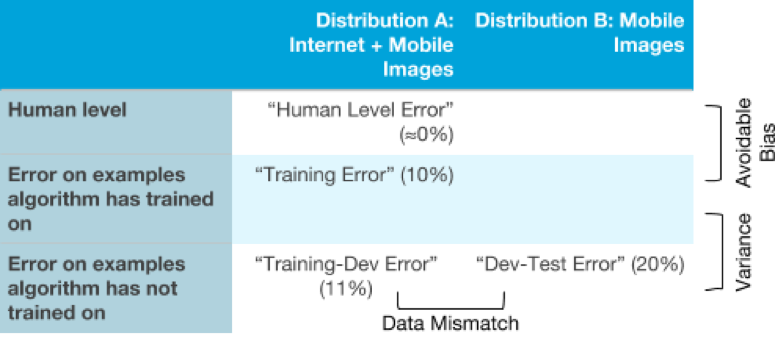

[返回目录](../MLY_index.html)

# 41. 识别偏差，方差和数据不匹配错误 Identifying Bias, Variance, and Data Mismatch Errors

2018-10-13

[TOC]

## 学习收获

> sh

内容

Suppose humans achieve almost perfect performance (≈0% error) on the cat detection task, and thus the optimal error rate is about 0%. Suppose you have:

假设人类在猫检测任务上达到几乎完美的性能（≈0％误差），因此最佳误差率约为0％。假设你有：

•    1% error on the training set. 

•    5% error on training dev set.

•    5% error on the dev set. 

What does this tell you? Here, you know that you have high variance. The variance reduction techniques described earlier should allow you to make progress.

这告诉你什么？在这里，你知道你有很大的差异。前面描述的方差减少技术应该可以让你取得进步。

Now, suppose your algorithm achieves:

现在，假设您的算法达到：

•    10% error on the training set.

•    11% error on training dev set.

•    12% error on the dev set.

This tells you that you have high avoidable bias on the training set. I.e., the algorithm is doing poorly on the training set. Bias reduction techniques should help.

这告诉您训练集上有很高的可避免偏差。即，该算法在训练集上表现不佳。偏差减少技术应该有所帮助。

In the two examples above, the algorithm suffered from only high avoidable bias or high variance. It is possible for an algorithm to suffer from any subset of high avoidable bias, high variance, and data mismatch. For example:

在上面的两个例子中，该算法仅遭受高可避免偏差或高方差。算法可能遭受高可避免偏差，高方差和数据不匹配的任何子集。例如：

•    10% error on the training set.

•    11% error on training dev set.

•    20% error on the dev set.

This algorithm suffers from high avoidable bias and from data mismatch. It does not, however, suffer from high variance on the training set distribution.

该算法存在高可避免偏差和数据不匹配的问题。但是，它不会受到训练集分布的高度差异的影响。

It might be easier to understand how the different types of errors relate to each other by drawing them as entries in a table:

通过将它们作为表中的条目绘制，可能更容易理解不同类型的错误如何相互关联：

Continuing with the example of the cat image detector, you can see that there are two different distributions of data on the x-axis. On the y-axis, we have three types of error: human level error, error on examples the algorithm has trained on, and error on examples the algorithm has not trained on. We can fill in the boxes with the different types of errors we identified in the previous chapter.

继续猫图像检测器的示例，您可以看到x轴上有两种不同的数据分布。在y轴上，我们有三种类型的错误：人为错误，算法已训练的示例上的错误，以及算法未训练的示例上的错误。我们可以用上一章中确定的不同类型的错误填写框。

If you wish, you can also fill in the remaining two boxes in this table: You can fill in the upper-right box (Human level performance on Mobile Images) by asking some humans to label your mobile cat images data and measure their error. You can fill in the next box by taking the mobile cat images (Distribution B) and putting a small fraction of into the training set so that the neural network learns on it too. Then you measure the learned model’s error on that subset of data. Filling in these two additional entries may sometimes give additional insight about what the algorithm is doing on the two different distributions (Distribution A and B) of data.

如果您愿意，您还可以填写此表中的其余两个框：您可以通过要求某些人标记您的移动猫图像数据并测量其错误来填写右上方框（移动图像上的人员级别性能）。您可以通过移动猫图像（分布B）填写下一个框，并将一小部分放入训练集中，以便神经网络也可以学习它。然后，您可以在该数据子集上测量学习模型的错误。填写这两个附加条目有时可以提供关于算法在数据的两个不同分布（分布A和B）上做什么的额外见解。

By understanding which types of error the algorithm suffers from the most, you will be better positioned to decide whether to focus on reducing bias, reducing variance, or reducing data mismatch.

通过了解算法最容易遭受哪种类型的错误，您将能够更好地决定是关注减少偏差，减少差异还是减少数据不匹配。