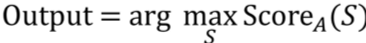

[返回目录](../MLY_index.html)

# 44. 优化验证测试 The Optimization Verification test

2018-10-14

[TOC]

## 学习收获

> sh

内容

Suppose you are building a speech recognition system. Your system works by inputting an audio clip *A*, and computing some Score~A~(*S*) for each possible output sentence *S*. For example, you might try to estimate Score~A~(*S*) = P(*S*|*A*), the probability that the correct output transcription is the sentence *S*, given that the input audio was *A*.

假设您正在构建语音识别系统。您的系统通过输入音频剪辑A，并为每个可能的输出句子S计算一些ScoreA（S）来工作。例如，您可能会尝试估计ScoreA（S）= P（S | A），即正确输出的概率转录是句子S，因为输入的音频是A.

Given a way to compute Score~A~(*S*), you still have to find the English sentence *S* that maximizes it:

给定一种计算ScoreA（S）的方法，您仍然需要找到最大化它的英语句子S：

  

How do you compute the “arg max” above? If the English language has 50,000 words, then there are (50,000)^N^ possible sentences of length $N$—far too many to exhaustively enumerate. So, you need to apply an approximate search algorithm, to try to find the value of *S* that optimizes (maximizes) Score~A~(*S*). One example search algorithm is “beam search,” which keeps only *K* top candidates during the search process. (For the purposes of this chapter, you don’t need to understand the details of beam search.) Algorithms like this are not guaranteed to find the value of *S* that maximizes Score~A~(*S*).

你如何计算上面的“arg max”？如果英语有50,000个单词，则有（50,000）N个可能的长度为N的句子 - 太多而无法详尽列举。因此，您需要应用近似搜索算法，以尝试找到优化（最大化）ScoreA（S）的S值。一个示例搜索算法是“波束搜索”，其在搜索过程期间仅保留K个最佳候选者。 （出于本章的目的，您无需了解波束搜索的详细信息。）此类算法无法保证找到最大化ScoreA（S）的S值。

Suppose that an audio clip *A* records someone saying “I love machine learning.” But instead of outputting the correct transcription, your system outputs the incorrect “I love robots.” There are now two possibilities for what went wrong:

假设一个音频片段A记录了一个人说“我喜欢机器学习。”但是不是输出正确的转录，而是系统输出错误的“我爱机器人”。现在有两种可能出现的问题：

1. **Search algorithm problem**. The approximate search algorithm (beam search) failed to find the value of *S* that maximizes Score~A~(*S*).

   搜索算法问题。近似搜索算法（波束搜索）未能找到使ScoreA（S）最大化的S值。

2. **Objective (scoring function) problem.** Our estimates for Score~A~(*S*) = P(*S*|*A*) were inaccurate. In particular, our choice of Score~A~(*S*) failed to recognize that “I love machine learning” is the correct transcription.

   目标（评分功能）问题。我们对ScoreA（S）= P（S | A）的估计是不准确的。特别是，我们选择ScoreA（S）未能认识到“我喜欢机器学习”是正确的转录。

Depending on which of these was the cause of the failure, you should prioritize your efforts very differently. If #1 was the problem, you should work on improving the search algorithm. If #2 was the problem, you should work on the learning algorithm that estimates Score~A~(*S*).

根据这些是导致失败的原因，您应该以非常不同的方式确定您的工作优先顺序。如果＃1是问题，那么您应该努力改进搜索算法。如果＃2是问题，你应该研究估算ScoreA（S）的学习算法。

Facing this situation, some researchers will randomly decide to work on the search algorithm; others will randomly work on a better way to learn values for Score~A~(S). But unless you know which of these is the underlying cause of the error, your efforts could be wasted. How can you decide more systematically what to work on?

面对这种情况，一些研究人员将随机决定研究搜索算法;其他人将随机研究更好的方法来学习ScoreA（S）的价值观。但除非您知道哪些是导致错误的根本原因，否则您的努力可能会被浪费掉。你怎么能更系统地决定做什么？

Let S~out~ be the output transcription (“I love robots”). Let S^*^ be the correct transcription (“I love machine learning”). In order to understand whether #1 or #2 above is the problem, you can perform the **Optimization Verification test**: First, compute ScoreA(*S*^*^) and Score~A~(*S*~out~). Then check whether ScoreA(*S*^*^) > Score~A~(*S*~out~). There are two possibilities:

让Sout成为输出转录（“我爱机器人”）。让S *成为正确的转录（“我爱机器学习”）。为了理解上面的＃1或＃2是否存在问题，您可以执行优化验证测试：首先，计算ScoreA（S *）和ScoreA（Sout）。然后检查ScoreA（S *）> ScoreA（Sout）。有两种可能性：

Case 1: Score~A~(S^*^) > Score~A~(S~out~)

In this case, your learning algorithm has correctly given S^*^ a higher score than S~out~. Nevertheless, our approximate search algorithm chose S~out~ rather than S^*^. This tells you that your approximate search algorithm is failing to choose the value of S that maximizes Score~A~(*S*). In this case, the Optimization Verification test tells you that you have a search algorithm problem and should focus on that. For example, you could try increasing the beam width of beam search.

在这种情况下，您的学习算法正确地给出S *比Sout更高的分数。然而，我们的近似搜索算法选择了Sout而不是S *。这告诉您，您的近似搜索算法未能选择最大化ScoreA（S）的S值。在这种情况下，优化验证测试会告诉您有搜索算法问题，应该关注它。例如，您可以尝试增加光束搜索的光束宽度。

Case 2: Score~A~(S^*^) ≤ Score~A~(S~out~)

In this case, you know that the way you’re computing Score~A~(.) is at fault: It is failing to give a strictly higher score to the correct output *S*^*^ than the incorrect *S*~out~. The Optimization Verification test tells you that you have an objective (scoring) function problem. Thus, you should focus on improving how you learn or approximate Score~A~(*S*) for different sentences *S*.

在这种情况下，您知道计算ScoreA（。）的方式是错误的：它没有给出正确的输出S *严格更高的分数而不是错误的Sout。优化验证测试告诉您有一个客观（评分）功能问题。因此，您应该专注于改善您学习或近似于不同句子S的ScoreA（S）的方式。

Our discussion has focused on a single example. To apply the Optimization Verification test in practice, you should examine the errors in your dev set. For each error, you would test whether Score~A~(S^*^) > Score~A~(S~out~). Each dev example for which this inequality holds will get marked as an error caused by the optimization algorithm. Each example for which this does not hold (Score~A~(S^*^) ≤ Score~A~(S~out~)) gets counted as a mistake due to the way you’re computing Score~A~(.).

我们的讨论集中在一个例子上。要在实践中应用优化验证测试，您应该检查开发集中的错误。对于每个错误，您将测试ScoreA（S *）> ScoreA（Sout）。该不等式所持有的每个开发示例将被标记为由优化算法引起的错误。由于您计算ScoreA（。）的方式，每个不适用的示例（ScoreA（S *）≤ResgetA（Sout））被计为错误。

For example, suppose you find that 95% of the errors were due to the scoring function Score~A~(.), and only 5% due to the optimization algorithm. Now you know that no matter how much you improve your optimization procedure, you would realistically eliminate only ~5% of our errors. Thus, you should instead focus on improving how you estimate Score~A~(.).

例如，假设您发现95％的错误是由评分函数ScoreA（。）引起的，而由于优化算法，只有5％。现在您知道，无论您如何改进优化程序，您实际上只能消除约5％的错误。因此，您应该专注于改进估计ScoreA（。）的方式。