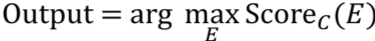

[返回目录](../MLY_index.html)

# 45. 优化验证测试的一般形式 General form of Optimization Verification test

2018-10-14

[TOC]

## 学习收获

> sh

内容

You can apply the Optimization Verification test when, given some input $x$, you know how to compute Score~x~($y$) that indicates how good a response $y$ is to an input $x$. Furthermore, you are using an approximate algorithm to try to find arg max~y~ Score~x~($y$), but suspect that the search algorithm is sometimes failing to find the maximum. In our previous speech recognition example, $x=A$ was an audio clip, and $y=S$ was the output transcript.

您可以应用优化验证测试，在给定输入x的情况下，您知道如何计算Scorex（y），表示响应y对输入x的好坏程度。此外，您使用近似算法尝试查找arg maxy Scorex（y），但怀疑搜索算法有时无法找到最大值。在我们之前的语音识别示例中，x = A是音频剪辑，y = S是输出抄本。

Suppose y^*^ is the “correct” output but the algorithm instead outputs y~out~. Then the key test is to measure whether Score~x~(y^*^) > Score~x~(y~out~). If this inequality holds, then we blame the optimization algorithm for the mistake. Refer to the previous chapter to make sure you understand the logic behind this. Otherwise, we blame the computation of Score~x~(y).

假设y *是“正确的”输出，但算法改为输出你。然后关键测试是测量Scorex（y *）> Scorex（yout）。如果这种不等式成立，那么我们就会把错误归咎于优化算法。请参阅前一章，以确保您了解其背后的逻辑。否则，我们会责怪Scorex（y）的计算。

Let’s look at one more example. Suppose you are building a Chinese-to-English machine translation system. Your system works by inputting a Chinese sentence $C$, and computing some Score~C~($E$) for each possible translation $E$. For example, you might use Score~C~($E$) = P($E|C$), the probability of the translation being $E$ given that the input sentence was $C$.

让我们看一个例子。假设您正在构建一个中英文机器翻译系统。您的系统通过输入中文句子C并为每个可能的翻译E计算一些ScoreC（E）来工作。例如，您可以使用ScoreC（E）= P（E | C），翻译的概率为E给出输入句子是C.

Your algorithm translates sentences by trying to compute:

您的算法通过尝试计算来翻译句子：

 

However, the set of all possible English sentences $E$ is too large, so you rely on a heuristic search algorithm.

但是，所有可能的英语句子E的集合太大，所以你依赖于启发式搜索算法。

Suppose your algorithm outputs an incorrect translation $E_{out}$ rather than some correct translation $E^*$. Then the Optimization Verification test would ask you to compute whether $Score_C(E^*) > Score_C(E_{out})$. If this inequality holds, then the $Score_C(.)$ correctly recognized $E^*$ as a superior output to $E_{out}$; thus, you would attribute this error to the approximate search algorithm. Otherwise, you attribute this error to the computation of $Score_C(.)$.

假设您的算法输出错误的翻译E_ {out}而不是一些正确的翻译E ^ *。然后，优化验证测试会要求您计算Score_C（E ^ *）> Score_C（E_ {out}）。如果这个不等式成立，则Score_C（。）正确地将E ^ *识别为E_ {out}的优良输出;因此，您可以将此错误归因于近似搜索算法。否则，您将此错误归因于Score_C（。）的计算。

It is a very common “design pattern” in AI to first learn an approximate scoring function $Score_x(.)$, then use an approximate maximization algorithm. If you are able to spot this pattern, you will be able to use the Optimization Verification test to understand your source of errors.

在AI中，首先要学习近似得分函数Score_x（。），然后使用近似最大化算法，这是一种非常常见的“设计模式”。如果您能够发现此模式，则可以使用优化验证测试来了解错误来源。