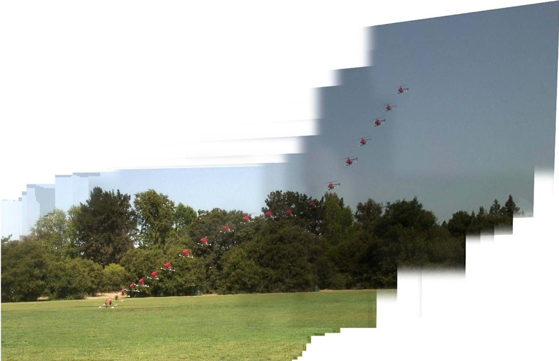

[返回目录](../MLY_index.html)

# 46. 强化学习的例子 Reinforcement learning example

2018-10-14

[TOC]

## 学习收获

> sh

内容

Suppose you are using machine learning to teach a helicopter to fly complex maneuvers. Here is a time-lapse photo of a computer-controller helicopter executing a landing with the engine turned off.

假设您正在使用机器学习来教直升机飞行复杂的机动动作。这是计算机控制器直升机在发动机关闭时执行着陆的延时照片。

This is called an “autorotation” maneuver. It allows helicopters to land even if their engine unexpectedly fails. Human pilots practice this maneuver as part of their training. Your goal is to use a learning algorithm to fly the helicopter through a trajectory *T* that ends in a safe landing.

这被称为“自转”机动。它允许直升机着陆，即使它们的发动机意外失效。作为训练的一部分，人类飞行员练习这种机动。您的目标是使用学习算法使直升机飞过以安全着陆结束的轨迹T.

To apply reinforcement learning, you have to develop a “Reward function” *R*(.) that gives a score measuring how good each possible trajectory *T* is. For example, if *T* results in the helicopter crashing, then perhaps the reward is *R(T)* = -1,000—a huge negative reward. A trajectory *T* resulting in a safe landing might result in a positive *R(T)* with the exact value depending on how smooth the landing was. The reward function *R*(.) is typically chosen by hand to quantify how desirable different trajectories *T* are. It has to trade off how bumpy the landing was, whether the helicopter landed in exactly the desired spot, how rough the ride down was for passengers, and so on. It is not easy to design good reward functions.

要应用强化学习，您必须开发一个“奖励函数”R（。），它给出一个分数，用于衡量每个可能的轨迹T的好坏程度。例如，如果T导致直升机坠毁，那么奖励可能是R（T）= -1,000-一个巨大的负面奖励。导致安全着陆的轨迹T可能导致具有确切值的正R（T），这取决于着陆的平滑程度。通常手动选择奖励函数R（。）以量化期望的不同轨迹T的程度。它必须权衡着陆的崎岖不平，直升机是否完全落在所需的位置，乘客下降的程度如何，等等。设计好的奖励功能并不容易。

Given a reward function *R(T),* the job of the reinforcement learning algorithm is to control the helicopter so that it achieves max~T~ *R(T)*. However, reinforcement learning algorithms make many approximations and may not succeed in achieving this maximization.

给定奖励函数R（T），强化学习算法的工作是控制直升机以使其达到maxT R（T）。然而，强化学习算法会产生许多近似值，并且可能无法成功实现这种最大化。

Suppose you have picked some reward *R(.)* and have run your learning algorithm. However, its performance appears far worse than your human pilot—the landings are bumpier and seem less safe than what a human pilot achieves. How can you tell if the fault is with the reinforcement learning algorithm—which is trying to carry out a trajectory that achieves  max~T~ *R(T)*—or if the fault is with the reward function—which is trying to measure as well as specify the ideal tradeoff between ride bumpiness and accuracy of landing spot?

假设你已经选择了一些奖励R（。）并运行了你的学习算法。然而，它的表现似乎比你的飞行员更糟糕 - 着陆更加崎岖，似乎不像人类飞行员那样安全。你如何判断故障是否与强化学习算法有关 - 它试图执行达到maxT R（T）的轨迹 - 或者如果故障是奖励函数 - 试图测量并指定乘坐颠簸与着陆点准确性之间的理想权衡？

To apply the Optimization Verification test, let *T*~human~ be the trajectory achieved by the human pilot, and let *T*~out~ be the trajectory achieved by the algorithm. According to our description above, *T*human is a superior trajectory to *T*out. Thus, the key test is the following: Does it hold true that *R*(*T*~human~) > *R*(*T*~out~)?

为了应用优化验证测试，让Thuman成为人类飞行员实现的轨迹，让Tout成为算法实现的轨迹。根据我们上面的描述，Thuman是Tout的优秀轨迹。因此，关键测试如下：R（Thuman）> R（Tout）是否适用？

Case 1: If this inequality holds, then the reward function *R*(.) is correctly rating *T*~human~ as superior to *T*~out~. But our reinforcement learning algorithm is finding the inferior *T*~out~. This suggests that working on improving our reinforcement learning algorithm is worthwhile.

案例1：如果这种不等式成立，则奖励函数R（。）正确地将Thuman评为优于Tout。但我们的强化学习算法正在寻找劣质的Tout。这表明，改进我们的强化学习算法是值得的。

Case 2: The inequality does not hold: *R*(*T*~human~) ≤ *R*(*T*~out~). This means *R*(.) assigns a worse score to *T*~human~ even though it is the superior trajectory. You should work on improving *R*(.) to better capture the tradeoffs that correspond to a good landing.

案例2：不等式不成立：R（Thuman）≤R（Tout）。这意味着R（。）为Thuman分配更差的分数，即使它是优越的轨迹。您应该努力改进R（。）以更好地捕获与良好着陆相对应的权衡。

Many machine learning applications have this “pattern” of optimizing an approximate scoring function Score~x~(.) using an approximate search algorithm. Sometimes, there is no specified input *x*, so this reduces to just Score(.). In our example above, the scoring function was the reward function Score(*T*)=R(*T*), and the optimization algorithm was the reinforcement learning algorithm trying to execute a good trajectory *T*.

许多机器学习应用程序具有使用近似搜索算法优化近似评分函数Scorex（。）的“模式”。有时，没有指定的输入x，因此这会减少到只有分数（。）。在上面的例子中，评分函数是奖励函数Score（T）= R（T），优化算法是试图执行良好轨迹T的强化学习算法。

One difference between this and earlier examples is that, rather than comparing to an “optimal” output, you were instead comparing to human-level performance *T*~human~.We assumed *T*~human~ is pretty good, even if not optimal. In general, so long as you have some y^*^ (in this example, *T*~human~) that is a superior output to the performance of your current learning algorithm—even if it is not the “optimal” output—then the Optimization Verification test can indicate whether it is more promising to improve the optimization algorithm or the scoring function.

这个和前面的例子之间的一个区别在于，不是与“最佳”输出进行比较，而是与人类级别的性能Thuman进行比较。我们假设Thuman非常好，即使不是最优的。一般来说，只要你有一些y *（在这个例子中，Thuman），它是当前学习算法性能的优异输出 - 即使它不是“最佳”输出 - 那么优化验证测试可以指示是否更有希望改进优化算法或评分功能。