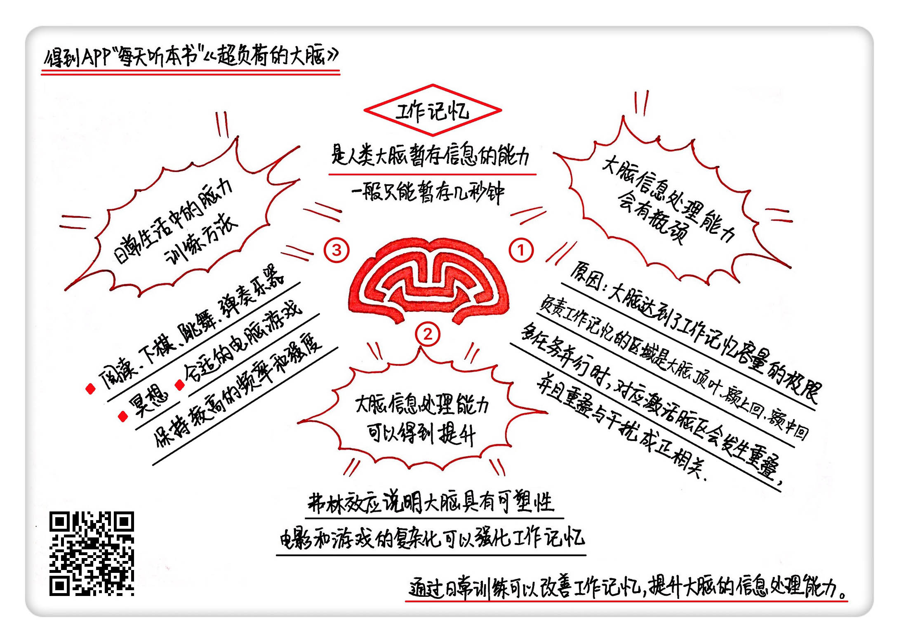

[返回到首页](../../index.html)

#《超负荷的大脑》 | 姚广孝解读

2018-07-16

[TOC]

##关于作者

托克尔·克林贝里教授，就职于瑞典两所著名的学府——卡罗林斯卡研究所和斯德哥尔摩脑研究所，是认知神经科学领域的专家，在大脑记忆领域有着极高的造诣。他将自己多年的学术成果转化为专门用于训练和改善工作记忆的软件，并收获了良好的市场反馈。`脑研究教授` `认知神经科学领域` `记忆` `学术成果->软件`

##关于本书

这本《超负荷的大脑》试图告诉读者，为什么你会觉得自己的大脑在某些情况下不够用。不仅如此，这本书还列举了一些具有可操作性的锻炼脑力的方法。如果你对有关记忆的脑科学研究感兴趣，那么这本书会为你带来很多启发；如果你只是一个希望提升自己阅读理解与逻辑思维能力的读者，那么这本书同样会让你受益匪浅。`为什么觉得大脑不够用` `锻炼脑力的方法` `对记忆感兴趣` `提高阅读理解和逻辑思维能力`

##核心内容

本书认为，工作记忆决定了人类大脑在一段有限的时间里记住信息的能力，而这种能力就是我们日常所说的“脑力”。工作记忆在我们的语言理解、学习、逻辑推理等复杂的大脑认知功能中占据着核心地位，我们只有围绕工作记忆开展一系列有针对性的训练，才能真正地从整体上提升大脑信息处理能力。`工作记忆` `作用` `训练`

###前言

你好，欢迎每天听本书。今天为你解读的这本书是《超负荷的大脑》。这本书的中文版大约十五万字，我会用大概22分钟的时间，为你讲解这本书的精华：大脑信息处理能力的瓶颈在哪里，为什么说这种能力可以得到提升，如何才能有效提升大脑的信息处理能力。`大脑信息处理能力的瓶颈` `为什么能提升` `如何提升`

近年来，人工智能在众多领域掀起翻天覆地的浪潮。上至科技界大佬，下至学生白领，人人都以谈论人工智能为荣。其实今天这场科技革命所仰赖的技术储备，早在二十世纪下半叶就已经陆续建立了起来得益于新千年以来计算机性能的飞速提升，很多早年间只停留在纸面上的设想、理论和算法才终于走进现实，最终诞生了Alpha go这样惊世骇俗的智力怪兽。`人工智能` `为荣` `技术，计算机性能` `纸面->现实` `Alpha go`

然而与普通人的盲目乐观相反，很多人工智能领域的专家认为，刚刚摆脱了计算资源瓶颈的智能技术，正在陷入另一个瓶颈之中，这个瓶颈就是人们对于自身智力运作方式的粗浅理解。 Alpha go之父，谷歌公司的深度学习技术专家德米斯·哈萨比斯认为，只有在我们更好地了解人类大脑的智能之后，才有希望让人工智能实现更多看似不可能的任务。`解决计算资源瓶颈`  `瓶颈：对智力运作方式对粗浅理解` `Alpha go之父`

的确，今天的人们对自己的了解还是太少了，对我们而言，大脑的许多方面都还是谜团。我们知道电脑中数量庞大的电子元器件是如何通过复杂的逻辑运算，来实现各种强大功能的。但我们却不知道大脑内八百多亿个神经元的电发放活动中，是如何涌现出自我意识的；我们知道电脑的CPU和内存占满时，计算性能就已经达到了极限，但大多数人却不知道是大脑的什么东西，让我们在日常生活中有了脑子不够用的感觉。`电子元器件-神经元` `计算性能到极限，CPU和内存占满-脑子不够用？`

今天给大家分享的这本《超负荷的大脑》，正是试图告诉读者，为什么你会觉得自己的大脑在某些情况下不够用。不仅如此，这本书还列举了一些具有可操作性的锻炼脑力的方法。如果你对有关记忆的脑科学研究感兴趣，那么这本书会为你带来很多启发；如果你只是一个希望提升自己阅读理解与逻辑思维能力的读者，那么这本书同样会让你受益匪浅。

本书作者是托克尔·克林贝里教授，就职于瑞典两所著名的学府卡罗林斯卡研究所和斯德哥尔摩脑研究所，从事认知神经科学方向的研究。他拥有神经科学和哲学的双重学科背景，因此在大脑记忆领域有着非常宽阔的视野。他还面向市场开发了专门用于训练和改善工作记忆的软件，从而将自己多年的学术成果转化为了成熟的商业产品，并收获了良好的市场反馈。

在今天这期音频中，我会从以下三个部分对这本书进行解读。第一部分简单介绍大脑处理信息的能力瓶颈是如何被发现的，第二部分解释为什么大脑的信息处理能力可以得到提升，第三部分则会介绍提升脑力的一些具体办法。`发现瓶颈` `为什么能提升` `怎么提升`

###第一部分

日常生活中，我们都会在某个时刻发现脑子似乎不够用了。当你在办公室忙着处理周末积攒下来的邮件时，突然被一通来自客户的电话打断，等你好不容易处理了客户的投诉之后，回过神来，一瞬间却忘了自己刚才准备千什么。一份美国的工作环境调查报告显示，每个办公室职员平均三分钟会被打搅一次，工作电脑平均会同时打开八个工作窗口。当代科技的发展和生活节奏的加快，都在鼓励我们—或者说在事实上强迫我们增强自己大脑的多任务协同处理能力。`脑子不够用` `举例` `被打断` `多任务协同处理能力`

当代生活里巨量的信息洪流，也给我们日常的工作生活带来了大量干扰噪声。在安静地阅读一本纸质书时，你可以轻松地进入专注状态，可当你在互联网上阅读文章时，就容易被文章四周的动态小广告干扰了。那么在我们的大脑里，到底是什么东西在决定我们能否排除信息干扰，聚精会神地完成某一项特定任务呢？`干扰噪声` `看纸质书-网上阅读` `什么决定排除信息干扰的能力`

心理学研究表明，我们协同执行多项任务的能力，以及排除信息干扰的能力，都与同一个核心能力相关，那就是大脑暂时存放信息的能力。当你在两项任务之间切换时，必须同时在大脑中切换两项任务各自所需的指令，这样大脑中的信息量就比只存储一套指令时多出了一倍。只有信息暂存能力足够强，你才能经受起双倍的工作负荷。而当你在嘈杂的办公室里执行某项任务时，只有稳健的信息暂存能力才能保证你的注意力不被分散，否则你就会很容易丢掉脑海里存放的信息，完全回忆不起来自己之前要干什么。`大脑暂时存放信息到能力` `切换，信息量变多` `稳健的信息暂存能力`

对于人类大脑暂存信息的能力，心理学界使用“工作记忆”这一概念来定义。简单来说，所谓的工作记忆，就是人们在有限的一段时间里记住信息的能力，这段时间一般只有几秒钟。心理学家阿兰·巴德利将工作记忆分为三个组成部分：第一个部分负责存储视觉信息，被称为视觉空间模板，你下象棋时推演棋子在棋盘上的走法，用的就是这个模板；第二个部分负责存储文字信息，叫作语音回路，当你在记忆一串电话号码时，调用语音回路比较方便；第三部分是负责协调前两者的中心，被称为中央执行系统。`工作记忆`  `只有几秒`  `视觉空间模版-存储视觉信息` `语音回路-存储文字信息` `中央执行系统-协调前两者`

工作记忆的容量限制是它区别于长期记忆的重要特征。理论上说，长期记忆可以存储的信息量几乎是无限的，只要一件事情进入了你的长期记忆，哪怕几年后，你也可以轻松回忆起来。然而工作记忆需要时刻处在注意力的密切监控之下，一旦你的注意力转向别处，工作记忆里存放的内容很快就会丢失。`工作记忆VS长期记忆` `工作记忆易丢失`

工作记忆并不只是简单地用来存储指令、数字和位置信息，它在我们的语言理解、学习、逻辑推理等复杂的大脑认知功能中也占据着核心地位。我们来玩一个小测试，请听题：93减去7加上3等于多少？这是一道简单的心算题，我们试着梳理一遍这个过程中所发生的思维活动。如果你的思路和大多数人一样，那么你一开始会先用93减7来得到86，然后把86记下来，接着回想起下一项任务，也就是加3。接着你再回忆起之前得到的86，加上3，得到了最终结果89。在这个过程中，你不仅记住了问题，还记住了中间结果，并经历了中间结果在大脑里的保存和调出。以上这些思维活动都得依赖工作记忆，没有工作记忆的参与，哪怕上面这种简单的心算题你也算不出来。`工作记忆的作用` `大脑认知功能` `心算题举例`

那么工作记忆能力到底是由大脑中的哪些区域实现的呢？为了寻找这个问题的答案，科学家们使用了磁共振成像扫描仪。这种仪器可以直接查看大脑不同部位的工作情况。一旦某个大脑区域被激活，在磁共振扫描仪上，这个区城就会被“点亮”。在磁共振扫描仪的帮助下，加利福尼亚大学伯克利分校的克雷顿·柯蒂斯和马克·德斯波西托设计了一个心理学实验来测试15名受试者的工作记忆，在测试的同时他们对大脑进行了不间断的扫描。实验结束后，两位研究者对扫描仪采集到的四万多张脑部影像进行分析，发现大脑中叫作顶叶、额上回和额中回的三个脑区出现了强烈的活动。这说明，负责工作记忆的是大脑中的三个局部区域，并不是整个大脑。`负责工作记忆的区域` `核磁共振扫描` `心理学实验` `顶叶、额上回、额中回`

负责工作记忆的脑区找到了，那么工作记忆的容量为什么会是有限的呢？本书作者设计了一项心理学实验，先让被试者执行一个需要用到视觉工作记忆的任务，再执行一个用到听觉工作记忆的任务，最后同时执行这两项任务。测试的同时，他还使用磁共振扫描仪观察受试者的脑部激活情况。结果发现，在同时执行两项任务时，每个任务在大脑中所对应的激活脑区发生了重叠，而且重叠得越多，两个任务之间的相互干扰也会越强烈。这个实验说明，大脑里的这种区域重叠现象，就是我们信息处理能力的瓶颈所在。`实验：视觉工作记忆任务+听觉工作记忆任务` `激活脑区重叠->瓶颈`

以上就是对本书第一部分内容的介绍。作者提出了工作记忆这一概念。工作记忆与人们日常生活中的阅读理解、逻辑推理等脑力运动息息相关，人们发现自己脑子不够用，往往都是因为达到了工作记忆容量的极限。然而工作记忆的容量其实是可以发生变化的，下面我们就来看看作者是如何论证这一点的。`工作记忆容量有限` `容量可变`

### 第二部分

在心理学界中，有一个非常著名的现象叫作弗林效应。20世纪80年代，新西兰社会学家詹姆斯·弗林在检查人们历年的智商测试分数时发现，从1932年到1978年间，每隔十年，被测人群的平均智商就比十年前的平均值增加三分。这意味着一个人如果在1990年的智商测试中成绩只能达到平均水平，那么这个人回到30年前，他的成绩排名将进入前六分之一。经过更广泛的考察后，弗林发现这一现象广泛存在于很多国家，这说明智商增长现象与民族文化和教育水平无关。要知道，这可是非常违反常识的，因为根据考古学研究，当今人类的大脑结构，和生活在四万多年前的克罗马农人几乎完全一样。如果现代人类的先天资质并不比他们的祖先们更强，那么人类的智商为什么会逐代发生可以观察到的显著进步呢？`弗林效应` `平均智商增加，与民族文化和教育水平无关` `大脑结构几乎同四万多年前的克罗马农人一样` `为什么又进步`

作者认为，这是由于全世界的大众文化在过去的三十年里，总体上正变得越来越复杂，而不断提升的复杂性，就是产生弗林效应的重要原因。一个最典型的例子就是影视作品。在二十世纪70年代的警匪居《极速双雄》中，每一集都只有两个相同的主角和一条简单的故事线。而到了90年代的美剧《黑道家族》里，剧情就已经演变成了五到十条情节线索相互纠缠、相互影响的复杂结构。如果说过去的电视剧观众只用坐在沙发上思考“最后到底会发生什么”，那么当代的观众们则更多地在思考“现在究竟是怎么回事”，同时脑海里不得不一直拼凑各种线索，这可是一项非常辛苦的练习。`大众文化变复杂` `影视作品`

除了影视剧，游戏同样呈现出越来越复杂的趋势。例如《塞尔达传说》这款冒险游戏已经不再遵循传统冒险游戏打怪升级的套路，而是将多个任务层层嵌套，每个任务都成为更高一级任务的子目标。嵌套结构的游戏要求玩家将一系列分级目标保存在大脑中，强化了玩家的工作记忆能力。总体来说，游戏、媒体、信息技术都在不断增加我们工作记忆的负荷，从而逼迫我们提升了自己的工作记忆，这反过来又为负荷的进一步提升打下了基础。`游戏` `嵌套结构` `迫使提升工作记忆` `负荷进一步提升`

电影和游戏的复杂化可以强化人们的工作记忆，这暗示我们，大脑是具有可塑性的。这一点也被一系列大脑功能研究所证实。在一个案例中，被试者受伤失去了自己的食指，导致来自食指的感觉信息不再传递到大脑里的对应脑区，这块脑区就会开始萎缩，而周边接收来自中指、拇指等肢体感觉信息的脑区则开始扩展，慢慢侵占这个原本属于食指的区域。在另一项实验里，麻省理工学院的梅甘卡·苏尔教授把动物向大脑传输视觉信息的神经接入到了处理听觉信息的脑区，诱导原本处理听觉的脑区重组，变得像视觉皮层，于是实验动物开始依靠它们的听觉皮层来观察四周。`大脑可塑` `失去食指` `诱导闹区重组`

与工作记忆有关的脑区同样具有可塑性，那我们是否可以针对这些脑区开展强化训练呢？受此启发，一些科学家们开始研究治疗注意力缺陷障碍的方法。注意力缺陷障碍是一种容易被忽略的精神疾病，更通俗的说法叫多动症，患者的特点是难以维持自己的注意力，难以规划任务，日常活动中容易出现健忘。现代心理学研究证明，工作记忆的缺失有可能是导致多动症的重要原因。患有该疾病的儿童不仅工作记忆容量较小，而且病情还会随着年龄的增长而不断恶化。一些治疗方案是让患者服用一种名叫安非他命的药剂来提升中枢神经系统的兴奋性，但安非他命具有成瘾性，长期使用会有危险。`多动症`  `工作记忆的缺失` `治疗方案一：药剂提升中枢神经系统兴奋性` `成瘾性`

作者另辟蹊径，开发了款名为“记忆机器人”的软件来训练多动症儿童的工作记忆。这个软件要求受试儿童每天练习四十分钟，训练任务包括记忆一组位置信息，或是记忆一串字母和数字，每次训练都是全新的组合。一旦他们的表现进步了，游戏难度就会提高，因此受试儿童可以不断挑战自己的极限。作者在经过两年的实验分析后发现，使用这款软件训练的儿童，工作记忆改善的幅度大约是百分之十八，而且这种改善不是暂时的，经过三个月后再检测，效果依然存在。受试儿童的父母也普遍表示，经过训练后，孩子变得更加专注了，在学习生活中，对注意力的控制能力也有明显的进步。`记忆机器人` `不断挑战极限` `结果：改善了工作记忆，非暂时`

上面就是本书的第二部分内容。作者借助著名的弗林效应，指出大脑是具有可塑性的；多动症儿童的治疗研究也表明，只要训练方法得当，与学习、逻辑推理相关的工作记忆能力，可以获得显著的提升。

###第三部分

那么对于我们普通人而言，在日常生活中可以通过什么手段来训练自己的大脑呢？

在介绍具体方法之前，作者首先指出，我们对“训练大脑”这项工作一定要有正确的理解。如果你练习辨别声音的高低，得到锻炼的只是大脑的听觉皮层；如果你练习杂耍抛球，得到锻炼的只有运动皮层。如果想全面提升自己在逻辑思维、阅读理解等多个方面的脑力，而不是某项特殊技能的熟练程度，那么你需要锻炼的就是自己的工作记忆能力。`全面提升，锻炼工作记忆能力`

锻炼工作记忆最简单的方法是阅读、下棋、弹奏乐器和跳舞这几项活动。爱因斯坦医学院的乔·韦尔盖赛对超过四百名老年人进行了为期五年的观察，发现如果每周能够进行八次以上的上述活动，发生老年痴呆的风险会降低一半。这其实也是显而易见的，因为下棋对工作记忆和注意力控制有着相当高的要求，预先想好接下来的几步棋该怎么走，对普通人而言可能是工作记忆负荷最高的日常活动之一了。`下棋，得预先想好接下来几步棋`

类似的还有阅读，而且很显然，文字内容越复杂，效果会越好。作者指出，大家可以主动去尝试进入自己不熟悉的领域，阅读这个领域里夹带大量术语的专业文章，在这个过程中，我们会经常回忆起前文提到的某个深奥术语的含义，这对我们保存句子中所包含信息的能力提出了很高的要求。当然，阅读晦涩的专业文章实在是项太艰巨的挑战了，并不是所有人都能坚持下去，因此作者也推荐大家去阅读菜谱，尝试看自己能否一次性地把烹饪步骤全都装入自己的工作记忆，直到烹饪完毕。这无疑是一种更能带来乐趣的脑力锻炼方式。然而必须明确的是，如果希望训练有效，一定要达到足够的训练频率和强度，每周只下一次棋是不会有任何效果的。`阅读不熟悉的领域` `阅读菜谱` `训练频率和强度`

除了下棋，冥想是另一种可以有效锻炼工作记忆的方法。在练习冥想时，你要半闭着眼睛静坐，专注于自己的姿势和呼吸。你不需要念任何经文，也不需要在脑海里幻想任何具体的形象，你要做的就是数你的呼吸，每呼吸一下计一次数，直到数到十，然后从头开始。计数的作用是让你知道自己从什么时候开始走神，如果你忘了数到几，或者突然发现自己已经数到了十六，你就会意识到自己的注意力已经分散了。`冥想` `数呼吸`

东方式的冥想常常被认为是最纯粹的锻炼大脑专注力的活动，事实上是否如此呢？2007年，布瑞夫钦斯基·刘易斯和理查德戴维森使用磁共振扫描仪对佛教僧佀的大脑活动进行检测，发现在测试注意力的实验中，僧侣的一些脑区表现出了更强烈的活动，而这些脑区刚好就是与工作记忆相关的脑区。另一项发表于2007年的研究则比较了十三位禅修者和十三位普通人，发现禅修者的大脑皮层体积和反应速度随年龄衰退的趋势比普通人更慢。上述研究证明，东方禅修所强调的“用心”，很可能就是一种对工作记忆的高强度练习。`禅修者VS普通人`

第三种可行的训练方法是电脑游戏。尽管媒体一直在渲染电脑游戏对儿童大脑发育的损害，但现有的科学研究却普遍得出了相反的结论。瑞典国立公共卫生研究院系统性地总结了三十篇探讨游戏对玩家影响的研究报告，发现其中的六篇研究证明，游戏能够增强玩家的空间技巧和反应时间，同时没有任何一篇报告显示游戏会对人们的工作记忆造成损害，也没有证据表明游戏会在青少年玩家中引发注意力缺陷障碍。`电脑游戏` 

当然，有得必有失，对于一个还处在学生时代的青少年来说，将太多时间花在打游戏上，势必会导致没有足够的时间来学习功课。所以说，关键的问题在于是否合理安排了时间，而不是电脑游戏本身。事实上，巴经出现了很多以提升玩家特定技能为目标的严肃游戏。比如一家名为应用认知工程公司的机构，开发了一款叫作“健智房”的游戏。这个游戏最初是为以色列军方开发的，用来改善战斗机飞行员的表现。现在它经过重新包装后面向职业篮球运动员上市销售，号称能够改善职业篮球运动员的注意力、判断力和空间感知等一系列基本技能，将一个球队的场上表现提升百分之二十五。`合理安排时间` `健智房，改善战斗机飞行员表现->职业篮球运动员`

著名游戏公司任天堂也开发了一款脑力训练游戏《脑白金：锻炼你的大脑》，主要面向那些希望保持思路清晰的成年人，提升他们解决问题的能力和工作记忆能力。在每一轮的末尾，游戏会更新一下对你大脑年龄的估计：如果你表现得很好，你的大脑年龄就会变得更加年轻；反之，你就会看到自己的得分向着痴呆症的深渊又迈出了一步。由于这款游戏对玩家的脑力给出了一套直观的评判标准，因此一经推出就大受好评，销量达到两千万份，成为任天堂游戏销售史上的一个传奇。

不过话说回来，也不是所有的游戏都对提升工作记忆有显著的效果，比如书中提到的一项研究就证明，俄罗斯方块只能提升玩家解决空间视觉问题的能力，没有证据表明它对工作记忆会有什么改善效果。所以如果想要通过游戏来提升自己的脑力，选择合适的游戏是至关重要的。`选择合适的游戏`

上面提到的三种方法，普通人都可以在日常生活中努力实践。除此之外，还有一种争议颇大的手段，就是使用心智兴奋剂。可能还记得，前面提到过有人曾使用低剂量的安非他命来治疗多动症儿童，然而安非他命具有成瘾性，对身心健康具有潜在的危害，因此另一种成瘾性相对较低的物质，利他林，就成了国外广受欢迎的精神类药物。临床检验发现，服用利他林可以提升百分之十的反应速度和工作记忆容量，并显著地减少注意力缺陷症状。国外很多大学生都会在考试复习期间使用它。`利他林` `考试复习期间`

《自然》杂志在2008年进行了一项调查，发现受访者中高达百分之二十的人表示曾服用过药物来增强认知能力。尽管利他林看上去非常神奇，但它毕竟是精神类药物，大脑对其成瘾并产生耐药性的可能性仍然存在，如果服用者在成瘾后想要戒断，同样会非常痛苦。因此为了防止滥用，日本政府已经在全国范围内禁止了利他林的非处方使用。而在中国大陆，这种药物目前也只能在正规的大医院里，通过医生手写的处方才能拿到。`成瘾性` `处方`

利他林只是此类药物中第一个上市的作者成书为止，已经有大约四十种物质陆续开发出来。作者尽管并未流露出对这些药物的强烈批评，但他仍然觉得通过日常训练来改善工作记忆是一种更为稳妥的办法。`日常训练更稳妥`

###总结

以上就是对这本书的完整介绍，最后我们再总结一下。首先，作者简单列举了一些我们在日常生活中遇到的脑子不够用的情况，指出这是由我们大脑中有限的工作记忆容量引起的。工作记忆是贯穿这本书的核心概念。作者分析了工作记忆在大脑中所在的位置，以及工作记忆容量为什么有限的科学原因。

其次，作者通过弗林效应这一著名的心理学现象，指出大脑是具有可塑性的。越来越复杂的电影和游戏在客观上强化了人们的工作记忆，导致了人类智商的不断进步。

最后，作者给出了一系列实际可操作的脑力训练方法，其中既包括我们熟知的看书、下棋、跳舞和弹奏乐器，也有我们不那么熟悉的冥想，甚至还有令人意想不到的电脑游戏。不过想要真正达到预期效果，从事这些活动都要保持较高的频率和强度。

> 我想试一试冥想。

## 来源

得到：每天听本书 20180716 超负荷的大脑

姚广孝解读

