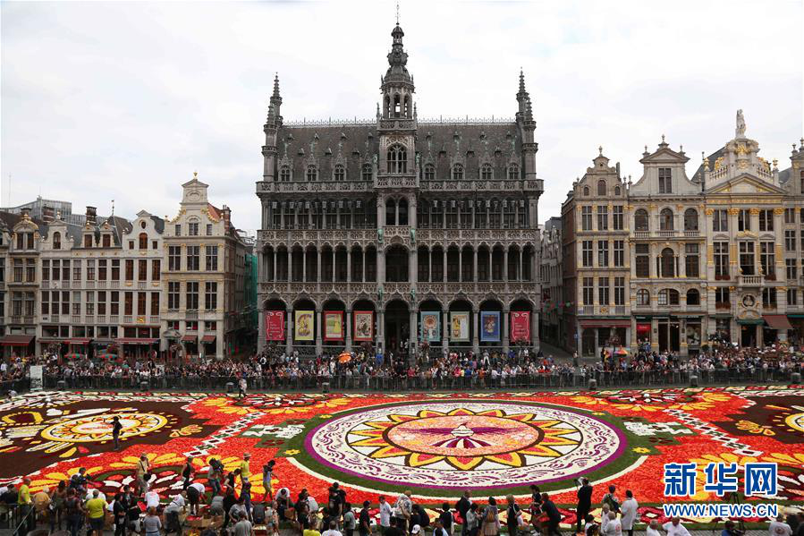
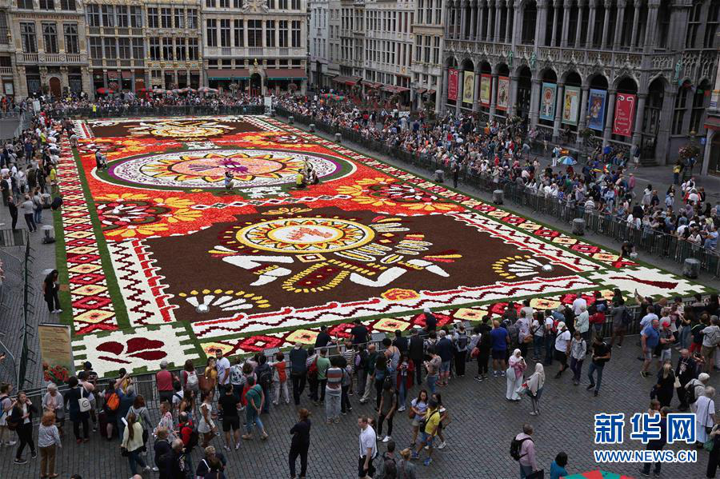

[返回目录](../index.html)

# 隐形眼镜；欧盟总部；北极冻土| 地球电讯

2018-08-28

[TOC]

##历史 | 第一个设想隐形眼镜的人是达·芬奇吗？

根据光明日报报道，最近，教育部跟国家卫生健康委员会联合起草了一项方案，要让政府和学校共同抓好保护青少年视力的工作。到2030年的时候，要让小学生的近视率下降到38%以下，让初中生和高中生的近视率，分别下降到60%和70%以下。咱们国家有6亿人都患有近视，青少年的近视率，更是全世界第一。`保护青少年视力`

近视的人多了，戴眼镜的人自然也就多了。有些人嫌戴眼镜不好看，就给自己配了隐形眼镜，它像一层透明的膜，可以直接戴在眼球上面，用来矫正视力。下面呢，咱们就来说说，隐形眼镜是怎么发明的。`戴眼镜` `隐形眼镜` `发明`

第一个想出隐形眼镜这个点子的，是达·芬奇。500多年前，他在一本书里写到，把脑袋泡在鱼缸里，透过鱼缸看外面的东西，可以看得很清楚。不过，他的想法只是停留在了纸上，没有成为现实。`隐形眼镜的点子，达芬奇` `500多年前的书，透过鱼缸看外面`

后来又过了300多年，到1888年，一个德国的眼科医生用玻璃发明出了第一款隐形眼镜。但是这镜片又大又笨重，一次只能戴几个小时。`1888年` `德国眼科医生` `第一款隐形眼镜` `玻璃`

又过了半个世纪，到1936年，德国有一个验光师，专门给近视的人验光的，他在隐形眼镜的玻璃镜片里加了塑料，这样，隐形眼镜就轻便多了，但是这种隐形眼镜又硬又不透气，戴久了容易伤到眼角膜。`1936年` `德国验光师` `加塑料` `硬，不透气，容易伤到眼角膜`

到20世纪60年代，也就是大概50年前，捷克的化学家发明了一种软软的能够凝固的胶，可以跟人体接触，还能透气，美国的公司就把它拿去做隐形眼镜了，这种材料跟咱们今天能买到的隐形眼镜，已经很接近了。后来人们再改良，主要就是换一换凝胶的材料。`20世纪60年代` `捷克化学家` `凝胶`

这就是隐形眼镜的故事。不过最后要提醒你一句，因为隐形眼镜需要经常护理，如果你戴的方式不正确，可能会导致眼部感染，如果特别想戴，建议你先去医院，听听大夫的建议。`需要经常护理` `听取医生建议`

##社会 | 欧盟的“首都”为什么在比利时？

根据新华社报道，最近，在比利时首都布鲁塞尔的大广场上，人们用50万朵的秋海棠，铺了一张巨大的鲜花地毯，这是当地每两年举办一次的鲜花地毯。今年这个鲜花地毯的图案，它的灵感来自于墨西哥的民俗文化。下面是两张鲜花地毯的图片。`比利时首都，布鲁塞尔` `秋海棠，鲜花地毯` `墨西哥的民俗文化`

说起布鲁塞尔，它可不光是比利时的首都，有人说，它还是整个欧洲的首都，因为欧盟的总部就设在布鲁塞尔。为什么欧盟要把总部放在这儿呢？`欧盟总部在布鲁塞尔`

主要的原因有两类。第一类原因，就是布鲁塞尔的条件确实不错。比利时这个国家在西欧的中部，它旁边儿是英法德这些大国。而且布鲁塞尔这座城市人口密度不大，没那么拥挤，生活比较舒适。更重要的是，如果把欧盟总部放在一个大国，那这个大国很有可能会借着这个优势，欺负别的国家，所以，把欧盟总部放在小国比利时，是一个比较中立的选择。`原因一：条件好` `西欧中部，周边是英法德大国` `人口密度不大` `小国，比较中立`

除了布鲁塞尔本身的条件不错，还有一个历史原因，就是欧盟成立以后，到底要把总部放在哪儿，这事儿吵来吵去，根本定不下来。所以各个国家一商量，说咱们轮着来吧，从谁开始呢？几个国家的名字按字母表一排，比利时，英文是Belgium，B打头的，排在最前面，好，那就你先来吧。欧盟的工作人员就都跑到比利时了。刚搬到布鲁塞尔的时候，欧盟总部还是挺破烂的，办公大楼是租的，后来发现人太多了，不够用，又盖了好几栋楼，欧盟总部才渐渐变得有模有样了。`历史原因` `字母表最前面`

后来很多欧盟国家一看，说把总部搁这儿也挺好的，就这么着吧，别折腾了，这才有了今天的欧盟总部。很多国际机构，也把总部设在了这里，布鲁塞尔这座城市渐渐变成了一座真正的国际化大都市。`国际化大都市`

##科学 | 北极的冻土竟然有“毒”？

根据美国国家航空航天局，也就是NASA官网的报道，最近一项新研究发现，北极有一片被冰冻住的土壤，叫永久冻土带，出现了突然解冻的迹象。你可能会觉得，解冻就解冻了呗，和我有什么关系呢？诶，有关系，这片冻土里有很多物质含有碳元素，当冻土融化了以后，冻土里的微生物，比如细菌什么的，就会分解这些碳元素，把它变成温室气体，也就是二氧化碳和甲烷，这会导致全球变暖更加严重。`永久冻土带` `解冻的迹象` `冻土中很多物质包含碳元素，微生物分解后，变成温室气体，全球变暖更严重`

而且，北极冻土融化，带来的麻烦还不止这些。科学家还发现，北极冻土里面有特别多的汞，这东西是有毒的，当冻土融化以后，这些汞就会流到北冰洋。`汞` `->北冰洋`

咱们先说说汞，这个字儿，上面一个工人的工，下面是一个水，它还有个俗名，叫水银，是一种金属，在常温状态下，它是一种液态的金属。如果你感冒发烧的时候量体温，用过那种老式的体温计，就是夹到胳肢窝底下那种，那种体温计的银色细柱子里装的，就是汞。`水银` `老式体温计`

科学家发现，北极的冻土里面有大量的汞，有多少呢？现在已经发现的，就有80万吨了，其中70%都是气态的汞。气态的汞就跟水蒸气一样，它在大气当中到处飘散，有一些就飘到了北极。北极的植物，在夏天，会从空气里吸收气态的汞，就像吸收二氧化碳一样。到了冬天，这些植物就会冻住、枯死，然后被冰雪覆盖，埋进土壤里，这些汞也就被封在了土壤中。时间久了，北极的冻土里就留下了大量的汞。`气态的汞->北极的植物->被冰雪埋在土壤里`

而现在因为气候变暖，北极的冻土融化，很多汞就顺着水一块儿流出来。科学家发现，北冰洋海水里面的汞，有一半以上都是这些冻土融化后带进来的。`冻土融化，汞流出` `北冰洋里的汞，半数以上由冻土融化后带入`

北极地区的很多生物体内，比方说北极熊、海豹、鱼类、鸟类的身体里，都发现了含量比较高的汞，如果从北极打捞上来的一些海鲜被人吃了以后，汞就会进到人的身体里，对人的健康造成伤害。所以这件事情，确实得引起人类的重视。`北极地区生物体内，汞含量较高` `北极打捞的海鲜`