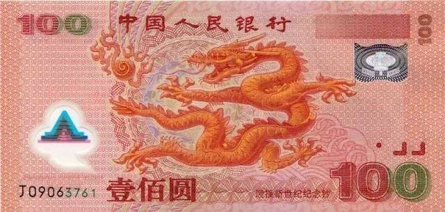
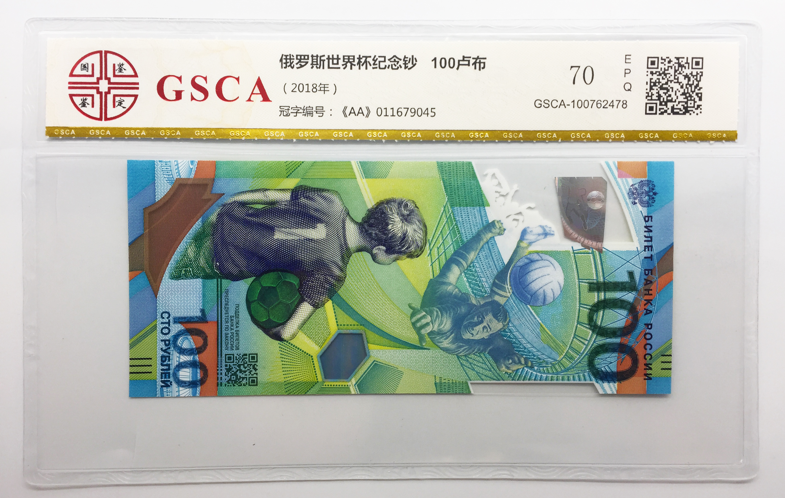

[返回目录](../index.html)

# 多巴胺；古根海姆效应；塑料钞票| 地球电讯

2018-08-03

[TOC]

##科学 | 多巴胺对人体有什么作用？

根据美国《细胞》杂志的报道，中国科学家开发出来一种新型的多巴胺荧光探针，有了这种荧光探针，就可以检测我们身体中，有多少多巴胺，正在跟人体细胞结合了。`多巴胺荧光探针` `检测和人体结合的多巴胺`

多巴胺是什么呢？多巴胺是大脑中的一种化学物质，看不见，摸不着，在多巴胺荧光探针没发明之前，人们很难检测到多巴胺的活动，现在，有了多巴胺荧光探针，检测多巴胺，就容易多了。`什么是多巴胺` `化学物质` `之前难以检测`

听到这儿，你可能会问，多巴胺很重要吗？值得咱们花这么大劲儿去研究吗？诶，很重要。这么说吧，多动症，还有精神分裂症，很多都是因为多巴胺失调导致的。人体内的很多活动，都离不开多巴胺。`重要性` `多动症、精神分裂症` `多巴胺失调`

多巴胺最重要的一个功能，就是能在你做事儿之前，给你一个奖励，推动你去做一件事儿。比方说，如果你妈妈告诉你，你可以痛痛快快地玩儿一小时游戏。听到这个消息，你保证兴奋得不得了，然后马上就打开电脑了。在这个过程里，你的大脑会分泌大量多巴胺，它会刺激你、鼓励你去做这件事儿。`给奖励，刺激你做事`

除了能推动人去做事，多巴胺还有很多作用，比方说，你眼睛里就有多巴胺，在有光的地方，你对颜色会很敏感，分得很清楚；到了黑暗的地方，你的眼睛就对颜色，就没那么敏感了，这就是多巴胺在调节你对颜色的敏感程度。`调节对颜色的敏感程度`

还有一些爷爷奶奶，他们会得一种病，叫帕金森病，导致这个病的原因，就是因为大脑里有一个地方的神经细胞死了，这些细胞就不会再分泌多巴胺了，结果就是爷爷奶奶的四肢活动会变得僵硬。`细胞不分泌多巴胺，帕金森病`

多巴胺的功能还有好多，远不止这些呢。所以说，研究多巴胺，对咱们非常重要。

##文化 | 一个博物馆能改变一座城市？

根据新华社的报道，最近，大英博物馆在中国开了一家网店，把博物馆里的藏品，做成了很多有意思的生活用品，比方说埃及猫的冰箱贴，还有罗塞塔石碑形状的鼠标垫儿。这个网店一开张，很多东西都被一抢而空，非常受欢迎。 `大英博物馆网店 ` `冰箱贴、鼠标垫`

博物馆开店卖东西，只要东西做得好，有创意，确实挺赚钱的，比方说去年，故宫博物院的网店，一年就赚了10个亿。`赚钱` `故宫博物院的网店`

说起博物馆能够带来经济上的好处，这都不算什么，有一座城市，因为修建了博物馆，而改变了整个城市的命运。这座城市叫毕尔巴鄂，在西班牙的海边。这里原来有很多工厂，但是后来钢铁啊、造船啊这些工业就都衰落了，整个城市也都跟着衰落了。`博物馆改变城市命运` `毕尔巴鄂` `西班牙的海边，随工业衰落`

到了上个世纪90年代，这座城市，请来了一个著名的建筑设计师，总共花了9000万美元，建了一个博物馆，叫古根海姆博物馆。这个博物馆的总部在纽约，在西班牙建的这个，相当于是纽约总部的一个分馆。`上世纪90年代` `古根海姆博物馆` `分馆`

你别看它就是一个分馆，但在建完之后，给当地的经济带来了巨大的影响。1997年，古根海姆博物馆开张以后，很快就吸引了世界各地的游客前来参观。毕尔巴鄂这座城市，人口也就30多万，但是在博物馆开业的头三年，就吸引来了400万游客，这些游客，给这座城市创造了5亿欧元的收入，相当于40亿人民币。`吸引游客` `创造收入`

一个博物馆改变了一座城市的命运，这种经济效应，后来被人们称作“古根海姆效应”，也叫“毕尔巴鄂效应”，说的都是一回事儿。`古根海姆效应` `毕尔巴鄂效应`

不过咱们要说的是，真实情况其实没这么简单，不是说任何地方只要建一个博物馆，立马就能振兴本地经济了。人家毕尔巴鄂市，不仅仅是建了博物馆，同时还提升了整个城市的形象，提升了各种配套的服务，比方说交通、住宿、餐饮、购物等等。只有全面地提升一个城市的品质，才能让这座城市变得更吸引人。`全面提升城市的品质` `各种配套服务`

##社会 | 塑料做的钞票长什么样？

根据人民日报海外版的报道，最近香港宣布，要在今年年底到明年年初的时候，推出一套新钞票，从20港元，到1000港元，一共有5种面值。新钞票会采用更先进的防伪技术，以后你去香港旅游换港币的时候，可能就会换到这种新钞票。`香港推出新钞票` `面值` `更先进的防伪技术`

说起钞票，你是不是觉得，钞票都是纸做的？这还真不一定。有一种钞票，叫塑料钞票，它的主要成分是塑料。世界上有很多国家，都发行过塑料钞票，有的国家全国用的都是塑料钞票，没有纸币，比方说澳大利亚。世界上第一款塑料钞票，就是澳大利亚发行的，那是1988年，距离现在有30年的历史了。还有像新加坡、英国、加拿大，都发行过塑料钞票。`->塑料钞票` `都是，澳大利亚，第一款` `发行过，新加坡、英国、加拿大`

咱们中国2000年的时候，为了迎接21世纪的到来，也发行过一版塑料的纪念钞票，面值是100块，正面的图案，是北海公园九龙壁上的一条龙。`中国2000年` `塑料的纪念钞票` `100块` `龙`

今年5月，为了纪念2018年的世界杯，俄罗斯还发行了一款最新的塑料钞票，面值是100卢布。`2018年` `俄罗斯` `纪念世界杯` `100卢布`

下面是中国和俄罗斯的塑料钞票图片。

（100元人民币）

图片来源：<http://m.xincailiao.com/share/news.aspx?id=32716>

（100卢布）

图片来源：<https://www.gjjd010.com/newsdetail-411-427-2823.html>

塑料钞票和纸币比起来，有很多好处，比方说它耐脏、耐撕又耐磨，脏了甚至都可以拿水洗，它的使用寿命会更长，而且在塑料钞票上能用的防伪技术，要比纸币多多了，可以加很多高科技上去，这让造假币也会变得更困难。`塑料钞票VS纸币`

> 只说了塑料钞票的优点，缺点呢？为什么现如今流行的是纸币？