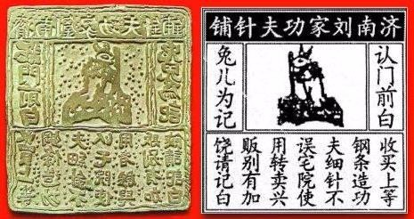

[返回目录](../index.html)

# 盐湖；商标的历史；拟声词| 地球电讯

2018-08-10

[TOC]

## 自然 | 盐湖是怎么形成的？

根据中新社的报道，青海的茶卡盐湖被严重污染。茶卡盐湖，是茶叶的茶，卡片的卡，咸盐的盐，这个湖原本是一个风景优美的旅游景点，被称为“天空之镜”，也就是说，湖水清澈得就像倒映着天空的一面镜子。 `茶卡盐湖被污染` `天空之镜`

>一直对高原的海子充满崇敬和向往，不知下一次去会是什么时候。

但是前不久，有媒体曝光，说这个茶卡盐湖，现在变成了一个大垃圾场，好多游客来了以后，把参观时候穿的塑料鞋套到处乱扔。现在景区回应说，要增加100名保洁人员，清理这些鞋套垃圾。`游客乱扔鞋套`

说起盐湖，它和一般的湖可不一样，盐湖里盐分特别多，有的盐湖甚至比海水里的盐分还要多。那这些盐湖都是怎么形成的呢？`盐湖的形成`

大概有两种情况，会形成盐湖，一种是从海水里获得盐分但咱们中国的盐湖基本都不是这种。`一、海水中获得`

另外一种盐湖，在陆地上，离海边比较远，那它的盐分从哪儿来呢？从石头里来。很多岩石里都夹杂着盐分，这些岩石在自然中不断地被风化、被侵蚀，然后就变成细碎的颗粒，然后里面的盐分就会暴露出来。`岩石中获得`

有了盐，还不够，盐湖的形成还需要这么几个条件：`其他条件`

首先这个有盐的地方，得中间低，四周高，就跟你们家的炒菜锅一样，下雨的时候，水都能流进来，聚集在一起；同时，雨水还要把岩石里的盐分，也一起冲刷进来，沉到湖底。`四周高，中间低` `雨水能聚集，能冲刷岩石里的盐分`

有了水，有了盐，是不是就够了？不行，还得干。也就是说，这个地方还得足够干旱，大太阳晒着，水就容易蒸发，但盐不会蒸发。这样水少了，盐分就会更浓，就会变成盐湖。这也解释了，为什么咱们中国的盐湖，很多都在北边儿，因为南方老下雨，下雨多了，湖里蓄的水就多了，盐就被冲淡了。   `足够干旱` `对比南北方`

日积月累，一个盐湖能积累好多好多的盐，比方说茶卡盐湖，它最厚的地方，有将近10米厚，相当于三四层楼房那么高。`日积月累`

##历史 | 为什么有些公司会注册很多商标？

根据北京青年报报道，最近拼多多上出现了大量的山寨商标，引起了广泛关注。记者调查发现，很多知名品牌为了不让别人山寨自家的品牌和产品，抢先一步，注册了很多自家公司的山寨商标。`拼多多上大量山寨商标` `知名品牌注册自家公司的山寨商标`

比方说，大白兔奶糖，就注册了“小白兔”；老干妈注册了“老干爹”；小米公司注册了蓝米、紫米、虾米，甚至连爆米花都给注册了。反正商标法规定，先到先得，谁先注册商标，法律就保护谁。很多知名品牌这么做，就是为了保护自己的商标。`先到先得`

说起商标，你还别以为它就是咱们现代社会才有的东西，其实在4000多年以前，人们就开始用商标了，今天我就来跟你说说，商标是怎么发展起来的。`商标得发展`

在公元前2700年的时候，古埃及人开始往牛身上印商标，其实严格来说，也不能叫商标，就是印了个标志。他们拿热的烙铁，往牛身上烫一些符号，哎呦，听着就疼，不过呢，这样就没人敢偷牛了，因为牛身上有标志，人们都知道这头牛的主人是谁。`公元前2700年` `古埃及人，牛，烙铁烫符号`

到了古希腊、古罗马的时候，会在陶器上面印上制造商的标记。在中国秦朝的时候，人们也制作了一些类似于品牌商标的印章。因为商标能帮消费者辨认制造商，从而更快地判断商品的质量。`古希腊、古罗马` `陶器` `秦朝`

世界上公认的、古代非常成熟的商标，是中国宋朝的一个商标，这家商标的店主是做缝纫针的，就是缝衣服用的针。商标上有很多字儿，大概意思就是：想买好的缝纫针，请认准济南刘家功夫针铺。中间儿还画了一只兔子跟那儿捣药。啥意思呢？在古代神话里，嫦娥在月宫上有一只玉兔，这玉兔会捣药，它捣药用的东西叫杵。咱有句俗话叫：只要功夫深，铁杵磨成针。这商标的意思就是：我们家的针，磨的功夫深，所以质量好。点击文稿，我给你准备了这个商标的图片。`济南刘家功夫针铺` `兔子捣药，铁杵成针`

图片来源：<http://k.sina.com.cn/article_6424756900_17ef202a400100695n.html>

后来西方进入工业革命以后，大规模生产的产品，就更需要品牌和商标来互相区分了。不过他们用的不是动物，而是人物形象，因为我们对人脸很敏感，所以这些商标也容易被人记住。`工业革命` `需要品牌和商标区分产品` `对人脸敏感，人物形象`

进入20世纪以后，随着广告行业的发展，还有广播电视的出现，商标这种东西就变得更常见了，商标的作用也变得越来越重要。`20世纪后` `广告行业、广播电视`

##文化 | 拟声词可能是人类的第一种语言

根据新华社的报道，印度尼西亚的科学家最近在印尼的森林里发现了一种蛙类动物，这是一个全新的物种，以前没见过。不过刚一发现，科学家就把这种动物列为了极度濒危的物种，因为很多森林被砍伐，变成了农田，这种蛙的栖息地就变少了，它们现在濒临灭绝。`发现蛙类新物种` `极度濒危` `栖息地减少`

说起青蛙，我们一般怎么形容它的叫声？呱呱叫，对吧？那牛怎么叫？哞哞叫。猫呢？喵喵叫。这些词，在咱们汉语当中就叫拟声词，是模拟大自然声音的词汇。`青蛙->叫声` `拟声词`

拟声词跟咱们汉语里的其他词都不太一样。很多词儿，比方说桌子，这个词的读音，跟那个木头做的四个腿儿的东西，其实一点儿关系都没有。是咱们人规定的这么念，桌子，指的就是那个东西。`与其他词比较`

但是拟声词就不一样了，它可以直接用声音来传递你想表达的意思。比如 “砰！”的一声，就算不说，你也知道，这是开枪了，砰的读音，就已经表达了它的意思。`用声音传递意思` `砰-开枪`

美国有一个漫画家叫唐·马丁，他就喜欢在漫画里加拟声词，还自己造词，比方说你听这个，“thwizzit”，像不像一张纸，从打印机里面嗞扭嗞扭打出来的声音？`漫画家自己造词` `thwizzit-打印机打字`

拟声词不光能用来形容声音，还能给东西起名字。有些东西的名字就是它们的声音，比方说布谷鸟，你听它的叫声，像不像“布谷-布谷”？它的英文名字，叫cuckoo，也是根据叫声来起的。`起名字-布谷鸟、cuckoo`

古希腊人认为，拟声词可以证明，咱们人类的语言是源于自然的，是对大自然声音的模仿。现在有一些语言学家也认为，拟声词可能是人类的第一种语言形式。`古希腊人，语言源于对自然声音的模仿` `拟声词可能是人类的第一种语言形式`

> 语言、音乐，最初都是来源于自然的吧。孩子的咿呀学语，一切都是从自然开始的。那我们该如何看待自然呢？不忘本，但也需要发展。我的价值观倾向一直在摇摆。