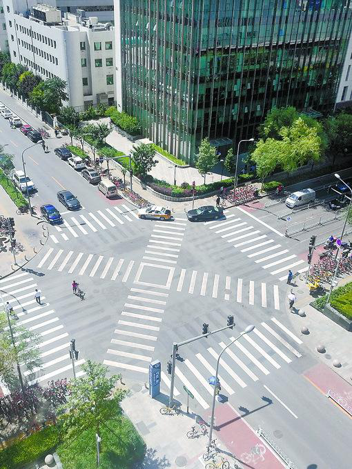
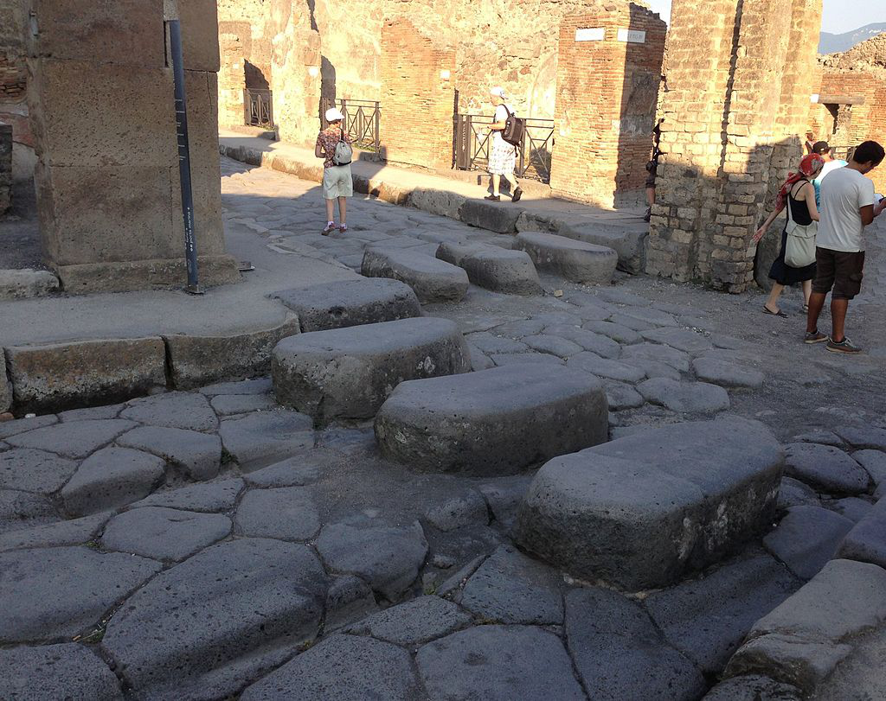
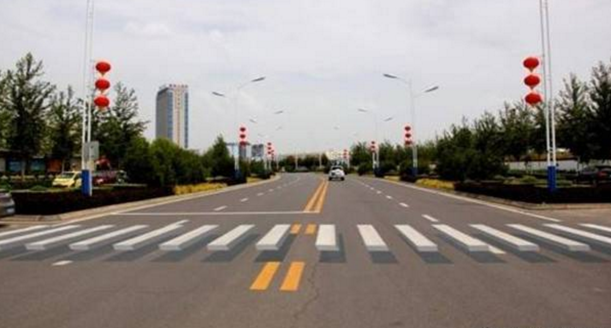
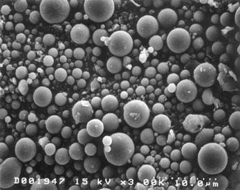

[返回目录](../index.html)

# 斑马线；蜂蜜保质期长；雾霾| 地球电讯

2018-09-05

[TOC]

##历史 | 2000多年前就有了斑马线？

根据人民网报道，最近，在国内一些地方，开始出现一种新的斑马线了，就是过马路的那个斑马线。怎么个新法儿呢？过去的斑马线，都是口字型的，四条边，如果你想到街对角儿去，得过两次马路。而这种新的斑马线，把路口的对角线给连起来了，你可以直接走对角线穿过马路。测试发现，这种新的斑马线，可以帮人们省下40秒左右。下面是这种路口儿的图片。`新斑马线，有对角线，省下40秒左右`

说起斑马线，咱们再熟悉不过了，它也叫人行横道线，能引导行人安全地过马路。下面咱们就来说说，这种斑马线是怎么发明的。`人行横道` `怎么发明的`

你可能觉得，斑马线是咱们现代社会才有的东西，其实早在2000多年前，在古罗马的时候，就有了类似斑马线的东西。`古罗马，类似斑马线的东西`

古罗马有一座城市叫庞贝，这座城市里有一种过马路的装置，叫跳石，就是地面上凸起来的一个个的石墩儿，行人踩着它们就可以过马路，然后石墩儿之间留了缝儿，马车什么的刚好也能开过去，这应该算是最早的斑马线了。`庞贝，跳石，石墩儿，行人踩着过，马车可以开过`

后来一直到19世纪下半叶，距离今天整整150年前，英国伦敦做了一个信号灯，类似我们今天的红绿灯，提醒行人红灯停、绿灯行。但那时候的红绿灯，质量实在是不咋地，用了才两个月，一个红绿灯的灯泡，砰的一下就爆炸了，还弄伤了一个警察。`19世纪下半叶，英国伦敦信号灯，灯泡爆炸`

又过了80多年，到1951年的时候，英国人发明了斑马线，人们发现，往地上刷白的，一条一条的效果最好，司机老远就可以看到，就会减速慢行。弄了斑马线以后，第二年，英国路口因为交通事故丧生的人数，就下降了10%以上。`1951年，英国人发明斑马线` `一条条白线效果最好` `第二年，交通死亡人数下降10%以上`

但是说实话，斑马线用到今天，大家都已经习惯了，所以有些司机和行人都不太当回事，看到斑马线依然抢行，很容易造成交通事故。`习惯，不当回事`

为了给司机和行人做一些更醒目的提示，现在国内有一些地方，画了3D的斑马线，远远看过去，就好像路面凸起来，有东西似的，上面的图片，是不是还挺逼真？它们就好像古罗马的跳石又复活了一样。`3D斑马线`

##饮食 | 蜂蜜的保质期为什么那么长？

根据英国《皇家学会学报》上发表的一项研究，最近，科学家发现，大黄蜂有一个很不好的习惯，就是吃杀虫剂上瘾。这是因为，有些杀虫剂里面含有一种物质，跟香烟里面的尼古丁差不多，这种物质会让大黄蜂上瘾。`大黄蜂吃杀虫剂上瘾` `类似尼古丁的物质`

说起蜜蜂，它可是咱们人类的好朋友，它不光能传播花粉，还能酿出蜂蜜来给我们吃。不知道你有没有注意到一个问题，就是蜂蜜这么好吃，这么甜，那细菌啊、微生物什么的，它们应该也很爱吃蜂蜜啊，这样蜂蜜应该很容易变质才对啊，可为什么蜂蜜的保质期都那么长呢？家里买的蜂蜜，搁很久也不会坏。`蜜蜂，不容易变质`

科学家分析，主要有这么三个原因，总结起来就是7个字：水少、杀菌、太酸了，咱们一个一个来说。`水少、杀菌、太酸`

先说水少。蜂蜜特别黏稠，就是因为含水很少。但是细菌什么的它们想要在一个地儿好好活着，得有水滋养着才行。蜂蜜里面一般只有17%是水，很容易把细菌给干死。`粘稠，17%的水，干死细菌`

第二个原因，杀菌。蜂蜜里面有一种东西，叫过氧化氢，医院里消毒水儿那个味道就是它，这种东西能杀菌。`过氧化氢，杀菌`

第三个原因，是太酸了。不是说蜂蜜的味道太酸了，而是蜂蜜里面有一种酸性物质，叫葡萄糖酸，很多细菌和微生物，都没法在这种酸性的环境里生活。`葡萄糖酸，酸性环境`

水少、杀菌、太酸了——有了这三重保障，蜂蜜自然就不容易坏了。

##科学 | 显微镜底下的灰尘长什么样？

根据美国《国家科学院院刊》上发表的一项最新研究，中国和美国的科学家发现，长期接触严重的空气污染，会让人变得不聪明，人的语言能力，还有算术的能力都会下降。而且他们发现，人接触脏空气的时间越长，对智力的伤害就越大。`空气污染，伤害智力`

说起空气污染，很多人以为，就是空气里飘着一些固体的小颗粒，其实没这么简单。咱们常说的雾霾，是一些固体小颗粒均匀地分散到空气里，会形成一种状态，叫气溶胶，气体的气，溶解的溶，胶水的胶。`雾霾，气溶胶`

这个气溶胶是一种什么状态呢？打个比方，就像牛奶，你看到一杯牛奶整个是白色的，很均匀，这是因为，牛奶里面的那些营养物质，都均匀地悬浮在水里面了，如果不是均匀的，那就会像往水里倒沙子那样，会出现分层的现象。气溶胶就类似于这种状态，有很多东西均匀地悬浮在气体里，它们也不沉底儿，就是分散在气体中。`均匀悬浮在气体里`

科学家在显微镜底下，把空气里悬浮着灰尘的气溶胶，放大了2000倍，发现它们就是很多个小球球，下面是这些小球的图片。`放大后，小球`

这些小球球本身就是污染物，但它们不光是在空气里待着，它们之间互相还会发生化学反应，产生新的污染物，然后继续悬浮在空气里，这些污染物，随时都可能会被你吸进身体里，影响你的身体健康。`小球，本身为污染物` `化学反应，新的污染物` `吸进身体，影响健康`