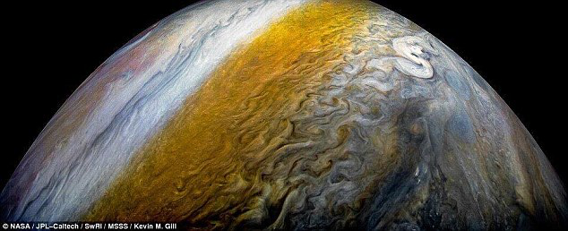

[返回目录](../index.html)

# 尾迹云；南方美食多；时间胶囊| 地球电讯

2018-08-18

[TOC]

##科学 | 为什么飞机飞过会出现一条白线？

根据美国《天体物理学杂志》上面的一项最新研究，最近科学家发现了一个关于木星的秘密。木星的表面有好多五颜六色的花纹，一条一条的，远处看就跟一个布满了花纹的保龄球似的，那这是怎么造成的呢？`木星` `表面五颜六色花纹`

原来，木星的表面，有一些速度很快的气流，叫做喷流，它们绕着木星表面快速地飞过，飞的过程中，还会裹着氨气形成的云彩一起跑，这样在木星表面，就形成了五颜六色的条纹。点击文稿，我给你准备了木星的照片。`喷流` `裹着氨气形成的云彩`



说起木星表面的喷流，它很容易让人想起一种现象，就是喷气式飞机飞过天空的时候，留下来的长长的痕迹，就像是一条线一样的云彩，像国庆阅兵，还有飞行表演的时候，为了好看，还会留下五颜六色的云彩。这种现象叫做尾迹云，有时候也叫飞机拉烟。`喷流->喷气式飞机` `尾迹云`

> 看来伦敦确实是潮湿的，飞机飞过总是会留下尾迹云，即使是大好的晴天。

尾迹云的出现，是有一定条件的，不是每次飞机经过都会留下尾迹云。想要出现尾迹云，一得冷，二得湿。这跟形成云彩的条件差不多。咱们一个一个来说。`尾迹云形成条件：冷；湿` `云彩的形成条件`

云彩是啥？就是大气层里的水蒸气从气体变成了小水滴，或者直接变成了小冰晶、小颗粒，它们聚集在一块儿，就是咱们看见的云彩。飞机喷出来的尾气，里面就有好多水蒸气。但想要在喷出来的瞬间就变成小水滴、小冰晶，飞行的环境必须得足够冷。`聚集的小水滴、小冰晶`

一般来说，飞得越高就越冷，在8000米以上的高空，温度一般会低于零下36度，这种情况下，飞机尾气里的水蒸气，就会在瞬间结成小水滴。这是第一个条件冷。`冷` `8000m+，<-36度`

第二个条件是湿。如果高处的空气湿度不够，干冷干冷的，那喷出来的水蒸气，即使变成了小水滴、小冰晶，量也太少了，人站在地上是看不见的。所以想要有尾迹云，空气湿度就得比较大，水蒸气得多。`湿` `干冷，形成的小水滴、小冰晶少，人看不见`

气温低，湿度大，这是形成尾迹云的两个必要条件。`总结`

##文化 | 为什么南方美食比北方多？

根据中新社的报道，最近中国烹饪协会表示，要重新划分中国的菜系。过去你可能知道，咱们中国有八大菜系，分别是四川的川菜，山东的鲁菜，广东的粤菜，江苏的淮扬菜，福建的闽菜，浙江的浙菜，湖南的湘菜，还有徽州的徽菜。`要重新划分菜系`

不过这八大菜系，不是官方的分法，是咱们老百姓口口相传的。这次中国烹饪协会提出，要重新划分出全国34个地方菜系，预计会在下个月正式公布。`八大菜系` `非官方`

不知道你有没有发现一件事儿，就是刚才咱们说的八大菜系里面，只有山东菜，是北方菜。为什么八大菜系里南方菜那么多，北方菜却只有一种呢？这是偶然吗？还真不是。`只有山东菜为北方菜`

南方美食多，可能有这么两个原因：`原因`

一是南方人的食物来源比较丰富，说白了就是啥都吃，比方说广东人，在吃这方面是出了名的。这是为什么呢？`食物来源丰富`

因为自古以来，中国南方很少有大片大片的草地，没有草地，能饲养的牛羊就少。而且，南方粮食里的蛋白质含量也比北方更低。但人每天还是要吃掉那么多蛋白质来补充营养，粮食和牛羊肉里的蛋白质又不够，所以南方人就有了什么飞禽走兽都吃的饮食习惯。`南方草地少，牛羊少` `粮食低蛋白质含量低` `吃各种飞禽走兽`

南方美食多的第二个原因，跟家庭成员的数量有关。家里人多，饮食习惯就比较复杂多样。像广东福建这些地方，过去有很多家庭都是“宗族”，宗教的宗，民族的族，也就是说，一大家子好几十口人住在一起。这样一家人围着大桌子吃饭，总不能炒10盘儿西红柿炒鸡蛋吧？`家庭成员数量` `人多，饮食习惯复杂`

所以大家庭吃饭的花样就多，容易创造出更多的美食来。而在北方的大部分地方，很多都是夫妻二人，或者三口之家，一顿饭炒俩菜可能就够吃了，没必要顿顿都搞得那么复杂，所以在北方的民间，就不容易发展出很多花样菜品出来。  `北方家庭人少`

以上，是可能导致南方美食多样的两个原因，供你参考。`可能`

##文化 | 什么是时间胶囊？

根据华盛顿邮报的报道，最近美国有一所中学，在施工的时候，从地底下意外地挖出来一个东西，是一个时间胶囊，打开一看，这个胶囊的日期是1894年4月28号。里面装了两份报纸，一套美国内战时期的军装，一枚战争奖章，还有内战中参军的当地人的名字。这些古老的物件儿，距离现在已经有124年的历史了，都是珍贵的文物。现在它们已经被送到专业的文物机构，去做评估和分析了。`美国` `挖出时间胶囊` `1894年` `装了啥`

说到时间胶囊，它可不是头一回出现了。时间胶囊是干什么用的呢？我给你打个比方，你在一些旅游景点儿，见没讲过一种邮局，就是让你给未来的自己写一封信，然后你规定个时间，比方说20年以后，这家邮局会把这封信寄给你。时间胶囊跟这个意思就差不多，只不过，它不是留给自己的，而是留给后人的。`什么是时间胶囊 ` `给未来的自己写信的邮局` `时间胶囊，留给后人`

时间胶囊里面，可以放书信、照片，还有各种物品，然后把它封起来，埋到地底下。一般来说，在重大的纪念日、庆祝活动，还有一些建筑的奠基仪式里，会特意埋一个时间胶囊。比方说1939年的世界博览会，就埋了一颗时间胶囊，长得像一个长长的子弹头儿，里面还放了一封爱因斯坦写给后人的信，讲述了咱们这个时代的成就，还有他对人类的一些担忧。这颗胶囊，说要在5000年以后，也就是6939年再打开，给那时候的人类看一看。`重大的活动 ` `1939年，世界博览会` `爱因斯坦给后人的信` `5000年后打开`

其实不光地球上有时间胶囊，太空里面也有，现在在你头顶的天空上，就漂浮着4个时间胶囊，都是人类用飞船给送上去的，它里面装着地球居民的生活信息。这几个时间胶囊，希望5万年以后的地球人能打开看看。`太空中的时间胶囊` `地球居民的生活信息` `5万年后`

各种各样的时间胶囊汇聚在一起，就像是一座休眠的博物馆，等待着许多年以后的人类遇见，让那时候的人类，看一看过去人类的生活和历史。`休眠的博物馆`

