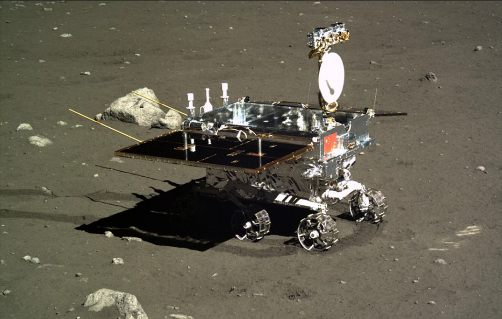

[返回目录](../index.html)

# 月球车；音乐和语言；地面下沉| 地球电讯

2018-08-23

[TOC]

##宇宙 | 中国第一台月球车出了故障还能用？

根据中新社报道，最近，在北京举办了一场活动，给月球车征名。也就是说，要大家给月球车起个好名字。这个月球车，是中国的嫦娥四号探月工程里要用到的，它的任务，是去探索月球的背面。你也可以参加这次活动，为这台月球车起名字。`给月球车征名` `嫦娥四号` `探索月球表面`

说起月球车，下面咱们就来说说中国的第一台月球车，它的名字叫“玉兔号”。这个名字也是当时网友们投票选出来的。玉兔号是嫦娥三号探测器的一部分，2013年，它成功地在月球表面着陆，本来希望它能正常工作3个月，后来它竟然工作了将近1000天，接近3年的时间才退役。下面是玉兔号的图片。`第一台：玉兔号` `嫦娥三号` `2013` `希望工作3年，实际工作近3年`

这辆月球车，整整研发了8年的时间，可以说是全副武装，能经受月球上各种恶劣环境的考验。比方说，月球上早晚温差非常大，玉兔号月球车，可以耐受的温度，上到150度，下到零下180度，它都不怕。`研发8年` `经受恶劣环境考验` `温度举例`

到了夜晚，零下100多度的时候，漆黑一片，玉兔号就把自己的太阳能电池板收起来，把各种设备、仪器都包裹起来，这样它们就不会被冻坏，就像给自己盖了一床被子，科学家还给这种情况起了个名字，叫“包裹式睡眠”。到了白天它再把自己叫醒，再把电池板放出来。`夜晚，包裹式睡眠`

玉兔号是无人驾驶的月球车，在这之前，美国还发射过有人驾驶的月球车，主要就是当汽车使的，宇航员开着它在月球上到处活动，这样活动范围能大一些。`无人驾驶` `美国，有人驾驶的月球车`

玉兔号到月球上面做过很多科学探测，还采集了月球土壤的数据，这些数据传回到地球上以后，很多中国科学家做了进一步的研究，研究成果还发在了美国的《科学》杂志上。`科学探测` `采集月球土壤数据` `研究`

不过玉兔号在月球上这将近3年的时间里，也不是一帆风顺的。它刚工作差不多3个月的时候，就出现了机械故障，后来也没有完全修好，本来它在月球上是能活动的，但是后来它大部分时间，就只能在原地待着，给地球发送一些数据。`3个月，机械故障` `原地待着`

##社会 | 学音乐能帮你学语言？

根据英国BBC报道，今年的英国高考，有3千多名学生，选择了汉语作为考试科目，比去年增长了8%。选择汉语的学生人数，第一次超过了德语，成了英国高考的第三大外语。`英国高考，选择汉语人数增加`

很多人觉得，学语言就是要多练听说读写，也没什么好办法，但现在科学家发现，学习音乐对学习语言是有帮助的，特别是在学语言的早期阶段。`学音乐有利于学语言`

美国和中国的科学家一起做了一项研究，发现中国幼儿园的小朋友，在上了钢琴课以后，对中文语音语调的学习能力会更好。`研究，钢琴课，中文语音语调`

他们选了70多个幼儿园的小朋友，把他们分成了ABC三组，A组每周要上三次钢琴课，B组上的是阅读课，C组啥课也不上。坚持了6个月以后，科学家发现，A组上过钢琴课的小朋友，他们在听到不同汉字的时候，分辨得最清楚，比方说“吃肉”、“吃藕”、“吃柚子”这种听起来差不多的读音，他们最敏感，分得最清。`3组`  `对相似的读音更敏感`

还有，A组学钢琴的小朋友，在听到别人抑扬顿挫地朗读的时候，他们对这些声音的变化也更加敏感。这可能是因为，学钢琴的时候，要培养他们分辨音调的高高低低，所以他们对朗读时候的音调，也会更加敏感。`对声音的变化更敏感`

科学家说，能分清楚字音，听得出字和字之间的差别，对于小朋友学语言来说非常重要。如果想要他们更好地听出声音的差异，包括语言发音的不同，学钢琴比额外的阅读更有效。`分辨声音差异更重要`

##科学 | 地面为什么会下沉？

根据英国BBC的报道，印度尼西亚的首都雅加达，已经成了世界上地面下沉速度最快的一座城市，在过去10年，雅加达的地面下沉了2米5，差不多相当于下沉了一层楼。如果再不想办法控制这个趋势，再过30年，雅加达北半边儿，就几乎全都要沉到海底了。`印度尼西亚首都，雅加达` `地面下沉`

雅加达地面下沉得这么厉害，其中很重要的一个原因，就是过度开采地下水。雅加达人缺少淡水资源，所以老百姓和企业开采地下水，基本上都没人管，可是抽了那么多地下水，地底下抽空的地方，自然就会塌陷。`原因：过度开采地下水`

地面下沉这个事儿，在很多国家都发生过，比方说咱们中国，在上个世纪，上海市同样是因为开采地下水，结果在40多年的时间里，地面下沉了1米7。因为造成了这么严重的后果，政府就不许大家再用地下水了，而且还要重新往地底下灌水进去，费了很大工夫，上海的地面才没有继续下沉。`上海` `禁止，还灌水`

除了抽地下水以外，地面下降跟盖楼也有关系。你知道盖楼得先打好地基，地基就是楼底下支撑整座楼的那些土，盖楼之前都得先把它收拾好，要是打不好地基，这楼就容易出问题。但是这地基里面的土，它分很多层，有些层紧实一些，有些层就松散一些，就像你吃汉堡包，牛肉那层紧实，生菜那层松，你一拿起汉堡包，生菜那层就让你给压瘪了。`与盖楼有关` `地基的土分多层` `以汉堡包类比`

有些土壤层，就像生菜一样，受到压力以后，压缩得比较厉害，结果也会导致地面下沉。有些地方的楼，住着住着就歪了，人还给起了个外号叫“楼歪歪”。这些楼歪的原因，很可能就是楼底下的土，下沉的量不一样，就像你左手拿汉堡，那汉堡左半拉就被压得厉害，右半拉就松，时间久了，这楼就歪了。`楼歪歪`