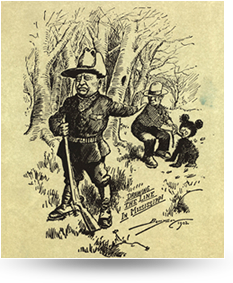

[返回目录](../index.html)

# 脸盲症；联合国会费；泰迪熊名字由来| 地球电讯

2018-08-02

[TOC]

##科学 | 为什么有的人总是记不住人脸？

根据美国公民自由联盟（ACLU）官网的报道，最近这家机构用美国亚马逊公司开发的人脸识别软件，做了一个测试，结果发现，亚马逊的人脸识别不太靠谱。这个测试是这样的，他们对美国国会议员做了识别，结果有28个国会议员，被这个人脸识别系统，识别成了罪犯。`亚马逊的人脸识别软件测试不靠谱` `国会议员被识别为罪犯`

> 直接这么说有误导人脸识别不靠谱的嫌疑。有多少国会议员。该软件的训练数据是什么。等等都没有说清。不过也明白了，所强调的不靠谱，只是为了引出下面的脸盲症。单单记住不靠谱是不对的，也许以前我就记住了许多类似断章取义的结论，而在能力有限的情况下，仅凭想想是找不到不对，却又感觉不对劲。还是得知道为什么。

说起认脸这件事儿，不光是机器，人有时候都会认错人。借着这个事儿，咱们来说一种疾病，叫脸盲症，也叫面孔遗忘症。`->脸盲症`

脸盲症能有多严重呢？我给你举个例子，有一位脸盲症患者，他连他老婆的脸都认不出来。夸张吧！不过呢，他可以通过听他老婆说话的声音，来辨认她的身份。如果给这个脸盲症患者，看他亲朋好友的照片，他还是能认出来一些人来的，但他不是通过看脸认出来的，而是通过特别具体的细节，比如他会盯着照片说：嗯，这个人下巴方方的，还有牙齿也好大，这应该是我哥哥。`严重的病例` `认不出老婆，通过声音辨认` `看照片，通过特别具体的细节`

当然这是一个比较极端的脸盲症患者了，大多数脸盲症患者不会这么严重。不过脸盲症患者一般都是通过细节来识别人的，比如这个人穿什么衣服、怎么走路、高矮胖瘦，讲话声音等等，通过这些细节，来辨认这个人是谁。`强调这是极端病例` `共性：通过细节认人`

科学家说，脸盲症这种病，有的人天生就有，有的人是后天才得的，比方说一氧化碳中毒，也就是煤气中毒，还有帕金森病，都可能会导致脸盲症。`得病原因` `天生，后天` `一氧化碳中毒，帕金森病`

##社会 | 联合国欠费，谁该充值？

根据英国卫报报道，最近联合国秘书长古特雷斯，正在为钱的事情发愁，因为联合国的钱快用完了，但今年还有80多个国家没有按时交会费，占到联合国国家总数的40%。欠费最多的是美国，他们欠了6亿美金，约合40亿人民币，这些钱占联合国今年预算的五分之一。`联合国欠费` `多少人欠费` `谁欠的最多`

说到联合国的会费，它是怎么交的呢？联合国的钱，是各个国家一起出的。首先联合国每两年会做一次预算，预算就是算算接下来这两年总共要花多少钱，然后大家来分摊这些钱。不过这些钱，不是平均分摊的，那谁出多少钱，该怎么算呢？`联合国会费怎么交` `预算，根据国民总收入分摊`

基本上就是看你们国家的国民总收入。什么是国民总收入？比方说中国，所有中国人这一年创造的财富，就叫国民总收入。这个钱，跟你经常听到的GDP，也就是国内生产总值，会差一些，但差不了太多。`解释国民总收入` `类似于GDP`

把所有国家的国民总收入加起来，就是全世界人民这一年挣的钱，假设这个数字是100个亿，那中国呢，赚了10个亿，这样一除你就知道了，中国的国民总收入，占全世界的10%。这样，中国在联合国的会费，就应该是交10%。注意这些数字都不是真实的，是为了方便你明白这个比例关系。`解释会费比例` `强调非真实数字`

当然也有一些特殊情况，比方说有些国家穷人实在是太多了，还有些国家，跟其他国家借了很多钱，联合国会照顾到这些特殊情况，给他们减免一些会费。`特殊情况：减免会费`

还有，联合国为美国这样的大国，设置了一个会费的上限，22%。也就是说，即便一个国家，它的国民总收入占全世界的比例，超过了22%，那它也最多只能交22%的会费。`设置上限22%`

如果一个国家老欠着会费不交，根据《联合国宪章》规定，那联合国以后有什么事儿需要投票表决，这个欠费国家可能就没有投票权了。`不按时交会怎样`

##历史 | 泰迪熊的名字是怎么来的？

最近，英国的玛格丽特·撒切尔基金会官网公布了一些文件，是有关英国前首相撒切尔夫人的私人文件。你可能知道撒切尔夫人有一个外号，叫“铁娘子”，因为她在做首相的时候，风格非常强硬，所以得到了这个称号。`公布撒切尔夫人私人文件` `介绍撒切尔夫人，“铁娘子”`

但在最新公布的这些文件里，人们发现，撒切尔夫人也有她可爱的一面，比方说她喜欢泰迪熊玩偶，还给自己的两只泰迪熊起了名字，一个叫汉弗莱，另一个叫泰迪夫人。`铁娘子，可爱` `喜欢泰迪熊` `起名字`

说起泰迪熊，你知道这个名字是怎么来的吗？泰迪既不是发明它的人的名字，也不是专门儿给这个卡通人物起的名字，而是一位美国前总统的外号，这位总统叫西奥多·罗斯福，你也可以叫他“老罗斯福”。这是怎么回事儿呢？`泰迪熊名字由来` `老罗斯福的外号`

20世纪初的时候，美国有一个地方官，请罗斯福总统去他们那儿打猎，还办了个比赛。可是比着比着，大家发现，好像就总统没打着猎物，别人都打着了，这面子上多过不去啊，有会拍马屁的家伙，就偷偷叫了一帮人，去抓了一只黑熊，给它五花大绑捆到了一棵大柳树上。`20世纪初` `请总统打猎，总统没打着` `有人抓了只黑熊，绑在树上`

然后有人就带着罗斯福总统，走到这棵树边儿上，跟总统说：您可以打这只。谁知道总统说：我不打，这算什么呀，也太不光明正大了。他还补了一句，说：看这熊也怪痛苦的，你们就别折磨它了，把它给杀了吧。咱们也不知道当时是什么情况，为什么不把熊放了，而是要杀了呢？但总统说杀，底下人也没说什么，就给杀了。`让总统打这只` `让他们把熊杀了`

后来有一位记者，就把这件事儿画成了一幅讽刺罗斯福的漫画，下面是这幅漫画，在这幅漫画里，就把黑熊画成了卡通的样子。`讽刺漫画，卡通黑熊`

图片来源：<http://www.theodoreroosevelt.org/site/c.elKSIdOWIiJ8H/b.8684621/k.6632/Real_Teddy_Bear_Story.htm>

有一个玩具商人，在报纸上看到了这幅漫画，灵机一动，就设计出来一款玩具熊，他还知道罗斯福总统有个外号叫泰迪，就写了封信给总统，说我能不能用您的外号给这只熊起名字，没想到罗斯福还真同意了。就这样，这个商人把这只熊放到了玩具店的橱窗里，还写上了小熊的名字，Teddy's Bear，泰迪的小熊。很快，这只泰迪熊就受到了人们的欢迎。`漫画->玩具熊` `请求用外号起名，同意了`