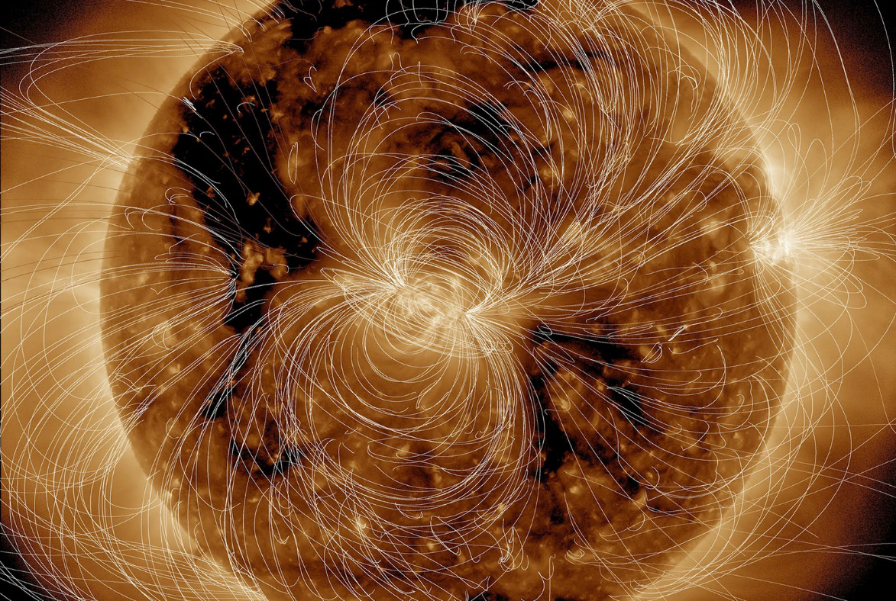
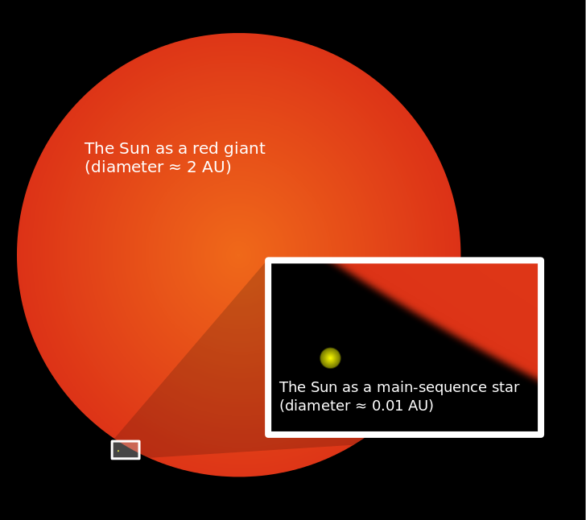

[返回目录](../index.html)

# 动物的抑郁症；太阳的结局；海上丝绸之路| 地球电讯

2018-08-27

[TOC]

##科学 | 动物也会得抑郁症吗？

根据美国《神经元》（Neuron）期刊上发表的一项研究，最近，美国的科学家发现，人有时候产生的悲观情绪，它来自于大脑里面的一个区域，这个区域叫做尾状核，尾巴的尾，形状的状，核心的核。科学家发现，用电流刺激小动物大脑里的尾状核，可以让它们产生悲观、抑郁的情绪。`悲观情绪，来自尾状核`

说起抑郁，你知道有些人会得抑郁症，就是觉得干什么事儿都提不起兴趣来。其实不光是人会抑郁，动物也会抑郁。准确一点儿说，是科学家发现，有些动物会表现出类似得了抑郁症的行为，比方说：没有食欲、对什么东西都提不起兴趣、遇到一点儿困难就放弃，等等。`抑郁症`

科学家有一些办法，能测出来一个动物是不是抑郁了。比方说，把小老鼠扔到水桶里，一般来说，正常的小老鼠会一个劲儿地扑腾，想法子爬出来；可是疑似患上了抑郁症的老鼠，它扑腾几下就放弃了，一脸爱咋咋地，淹死算了的样子。`测量动物是不是抑郁` `小老鼠扔水桶里，扑腾几下就放弃，疑似抑郁症`

再比如，小老鼠天生爱吃甜的，但是疑似患了抑郁症的小老鼠，它对甜食就不太感冒，可能是因为抑郁了以后，甜的东西也不能刺激它产生快感。科学家发现，如果给这些不爱吃甜的的小老鼠吃对抗抑郁症的药物，那它们渐渐地，就又会喜欢上甜食了。`疑似抑郁症的小老鼠，不爱吃甜的` `吃抗抑郁症的药物，逐渐喜欢甜食`

不过我还要提醒你一点，这些实验都是通过观察一些现象，去推测一个动物是不是患了抑郁症，动物不像人，它没法跟人说，它心里是怎么想的，所以这些结论不一定都是正确的，我们只能说，动物身上出现这些情况，有可能是因为患上了抑郁症。`只是观察，不一定正确，只能说疑似患上抑郁症`

##宇宙 | 太阳的大结局是什么？

根据生活科学（Live Science）网站的报道，最近美国国家航空航天局，也就是NASA，公布了一张太阳的照片，这张照片是用紫外线拍摄，用电脑处理过的，在这张照片上面，你可以看到围绕太阳的电磁场是怎么分布的。这张照片非常漂亮。下面就是这张照片。`太阳照片` `紫外线拍摄，电脑处理` `电磁场分布`

虽然现在的太阳还非常活跃，但其实它已经是个“中年人”了，已经走过了它一半儿的寿命，也就是已经燃烧了45亿年。科学家估计，它的寿命还有50亿年。那你会不会好奇，到50亿年之后，太阳会发生什么呢？会爆炸吗？科学家说，不会的，它会先变大，后变小，然后慢慢变凉。咱们一步一步来说。`“中年人”` `45亿年` `还有50亿年寿命` `先变大，后变小，然后变凉`

现在在太阳的中心，每一秒钟，都会把400万吨的物质转化成能量。中心的东西烧完了，这个剧烈的反应会往外面扩散，太阳会一边烧一边膨胀，它的个头儿会越来越大，会有多大呢？科学家说，太阳会把离它最近的三颗行星都吞进去，也就是水星、金星还有地球。`现在，太阳中心燃烧` `中心烧完，向外扩散，碰撞` `吞掉最近的三颗行星，水金地`

如果说那个时候的太阳是个西瓜，那现在的太阳，也就是个芝麻。下面是太阳膨胀前后的对比图。膨胀之后的太阳，会变成一颗红巨星，红色的红，巨大的巨，就是又红又大的一颗恒星。`膨胀前后对比图` `红巨星`

这还没完，这个又红又大的太阳，其实是虚胖，因为它的“燃料”都已经烧得差不多了，它的内核，最中间的地方，会变得又小又紧实，像一个小铅球，但是外面包着的，就像一堆热热的红色棉花糖，用不了多长时间，这颗红巨星，就会把棉花糖通通甩掉，只留下最里面那个核，那个小球。`虚胖` `最后只留下内核`

而这个留下来的部分，叫做白矮星，因为它是白色的，又很矮小的样子。一开始的时候，白矮星依然很烫，但是它已经没得可烧了，不会再产生热量了，所以它会变得越来越冷。从红巨星变成白矮星，然后从白矮星再变冷，这就是太阳的大结局。`白矮星`

##历史 | 海上丝绸之路有两条路线？

根据新华社报道，最近，中国和斯里兰卡两个国家的考古学家，正在斯里兰卡进行考古挖掘，在那里，发现了一些中国北宋时期的瓷器碎片。考古学家说，这些瓷器碎片对我们研究海上丝绸之路，非常重要。`斯里兰卡考古挖掘` `北宋的瓷器碎片` `海上丝绸之路`

借着这个事儿，咱们就来说说海上丝绸之路是怎么回事儿。你应该知道丝绸之路，一般是指陆地上的丝绸之路，从汉朝的首都长安，也就是现在的西安出发，一直能到欧洲。`陆地上的丝绸之路，汉朝首都长安（西安）->欧洲`

那海上丝绸之路又是从哪儿到哪儿呢？好些人以为它是一条线儿，其实不对，是两条线儿，一条往南，一条往东。`南、东两条线`

咱先说往东的这一条，这条路线在春秋战国的时候就有了，那时候的齐国，跟朝鲜做生意，就从山东起航，去朝鲜半岛。到了汉朝和唐朝的时候，这条线还一直保持着往来，中国、日本和朝鲜三国，可以通过这条海路开展贸易。`东，春秋战国` `齐国（山东）-> 朝鲜（朝鲜半岛）` `汉朝和唐朝` `中国、日本、朝鲜，贸易`

但是现在人们说海上丝绸之路，说的比较多的不是东边这趟线儿，而是往南走的那一趟，南线儿的起点是广东的广州，还有福建的泉州。`说的较多的是南边这条` `广州、泉州`

考古学家发现，在公元前3千到5千年的时候，在广东、广西、海南那一带的老百姓，就已经开始出海做贸易了，有时候还会跑到海外的一些岛上去。`公元前3千到5千年`

到唐朝的时候，因为陆地上，西边很多地方经常打仗，所以陆地上的丝绸之路经常会被切断，就这样，海上的丝绸之路就发展了起来，在唐朝，这条海上路线全长达到了14000公里，相当于地球赤道长度的三分之一，是当时全世界最长的一条航线。那时候走航线运的最多的是丝绸，所以后来就叫海上丝绸之路了。`唐朝` `当时最长的航线` `丝绸，海上丝绸之路`

经过唐宋元明，中国的造船技术越来越发达了。到了明朝的时候，郑和下西洋，一共7次。郑和一艘大船的甲板，比现在世界杯足球场的面积还要大。`明朝，郑和下西洋`

中国的海上丝绸之路，到过欧洲，还到过非洲，可以说，正是这些重要的航线，把古代的东西方文明，连成了一张大网。`到过欧洲、非洲` `连接古代的东西方文明`