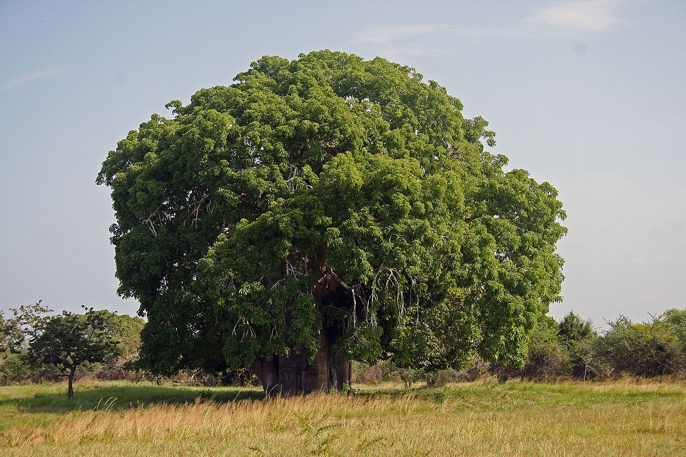
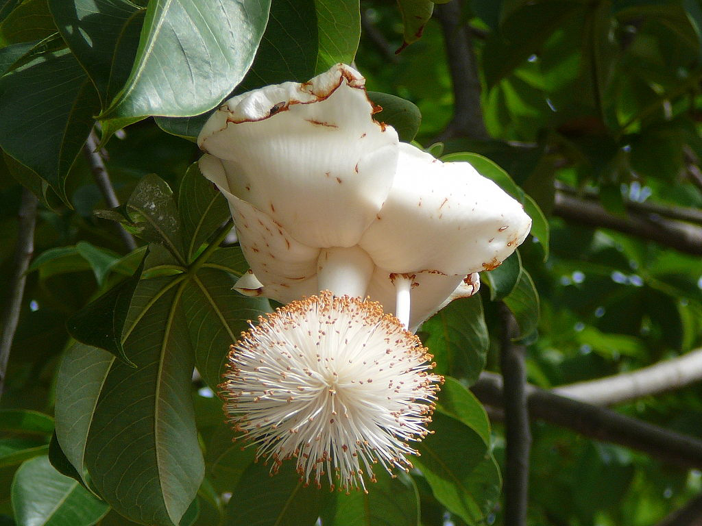

[返回目录](../index.html)

# 快餐的历史；猴面包树；网络欺凌| 地球电讯

2018-09-06

[TOC]

##历史 | 世界上第一种快餐是什么？

根据《英国医学杂志》上发表的一项研究，像快餐、薯片、蛋糕、点心这些食品，它们跟癌症之间存在着一定的关系。这些吃的，我们平时管它们叫垃圾食品，它们还有个更专业的名字，叫过度加工的食品。就是说，煎炒烹炸这些食品的工序太多了。科学家发现，如果一个人多吃了10%的过度加工食品，那这个人患上各种癌症的风险，就会提高12%。所以说，为了你的健康，这些东西平时能少吃就尽量少吃。`垃圾食品，过度加工的食品，患癌症`

说到快餐，下面咱们来说说快餐的历史。`快餐的历史`

咱们今天吃到的油炸快餐，其实是19世纪才发明出来的。第一种快餐，不是汉堡，也不是热狗，而是炸鱼配薯条。150年前，英国人发现，把炸鱼和薯条放在一起吃，味道不错，因为英国靠海，海鲜多，当地的土豆也多，在码头附近，鱼打捞上来，直接炸，直接卖。那时候的英国工人，最爱吃的就是炸鱼配薯条。`炸鱼薯条，英国，靠海、土豆多`

这种快餐有多火呢？仅仅过了半个世纪，到20世纪初，全英国卖炸鱼薯条的快餐店，就开了35000多家。`很火`

差不多同样的时期，美国也有了快餐。当时很多美国人开汽车，有人就发明了一种餐厅，叫免下车餐厅。这时候我们熟悉的汉堡包就登场了。它一开始的目标，就是卖给司机的，路上经过汉堡店，不用下车，窗口直接买，在车上就可以吃。`美国，免下车餐厅，汉堡包`

除了上菜的速度快，快餐还有一个特点，就是吃饭不用餐具。司机吃汉堡不沾手，吃完抹抹嘴就接着上路了。`不用餐具`

汉堡、披萨这些洋快餐进入咱们中国，时间已经很晚了，是最近30年才发生的事情，进入中国以后，外国人发现，吃这些快餐的人群，主要是小朋友。但刚才咱们也说了，在英国、美国，快餐主要是给工人、司机这些成年人吃的。外国人发现这点差别以后，就想尽办法来吸引更多的孩子，而且，只要孩子过来吃，大人就一定会跟着一块儿吃，可以说是一举两得。`国内，小朋友吃的多`

不过最后我还是要提醒你，洋快餐这种东西，即便你觉得它好吃，偶尔吃一吃、解解馋也就可以了，如果经常吃、天天吃，它对你的身体是不好的。`只能偶尔吃`

##自然 | 猴面包树的名字是怎么来的？

根据北京日报报道，最近，2018年中非合作论坛北京峰会成功举办，为了迎接这次峰会，北京植物园从9月2号开始，举办了一场非洲植物精品展，展出了来自非洲的50多种植物，比方说有猴面包树、光棍树、酒瓶椰子、帝王花等等。`中非合作论坛北京峰会` `非洲植物精品展` `猴面包树`

借着这个事儿，咱们就来说说猴面包树。这种树为什么要叫这个名字呢？是因为当它结了果子的时候，猴子就成群结队地爬到树上来，摘果子吃，它的果子就像猴子的主食、猴子的面包一样，所以就叫猴面包树了。`果子像猴子的主食`

这种树不光名字奇特，长得也很奇特，它的树干特别粗，长得也高，能长到一二十米，枝叶很细。猴面包树一年12个月里，只有3个月长叶子，剩下9个月都是光秃秃的，下面是两张图，一张有叶子，一张没叶子，你看，差别是不是还挺大的？`树干粗，高，枝叶很细` `只有3个月长叶子`

不过，你别看它肚子大，腰粗，但实际上是“虚胖”，因为猴面包树的树干，不是实心儿的，里面特别空，如果用手枪打一枪，一颗子弹打进去，子弹能从树干另一头儿穿出来。 `树干空心`

猴面包树开花

猴面包树的果实

虽然腹中空空，但猴面包树浑身都是宝。它结出来的大果子，有椰子那么大，果肉也很甜，很多动物都爱吃。它的叶子可以摘下来当饲料。它的树汁儿也很好喝，在干旱的时候，大象就会跑到猴面包树下面，吸它树皮底下的汁水儿喝。`浑身是宝，果肉好吃、叶子饲料、树汁好喝`

##社会 | 你遇到过网络欺凌吗？

根据美国有线电视新闻网CNN的报道，最近，美国的第一夫人梅拉尼娅·特朗普，也就是美国总统特朗普的妻子，发表了一场公开讲话。她特别提到，在今天这个网络时代，很多青少年每天都在使用社交媒体，但是如果不能正确地使用，社交媒体对青少年的坏处是大于好处的，很有可能会造成网络上的攻击和欺凌。`梅拉妮娅·特朗普发表讲话` `社交媒体，青少年，网络欺凌`

这位美国的第一夫人，她提到了一个重要的话题，叫网络欺凌，意思就是说在网上欺负人。咱们平时说欺凌、欺负人，一般说的是坏学生跟人打架、欺负同学。那在网上怎么欺负人呢？我给你举个例子，比方说，在别人账号底下留言，给别人私信，说的都是些很恶毒的脏话，而且还骂个没完。还有一些人去网上“人肉”对方，所谓的“人肉”，就是把人家的手机号、身份证、家庭住址这些隐私信息，都给扒出来，然后公布到网上，告诉所有人。这些行为，都属于网络欺凌。`留言恶毒的话，人肉对方`

很多国家的调查显示，有不少青少年，都遭到过网络欺凌，还有一些青少年竟然也成了网络上的欺凌者，去欺负别人、辱骂别人，因为他们觉得这很好玩儿，而且用的是网名，不用承担责任。其实这是一种非常恶劣的行为，在国内外都出现过很多起这种事情，就是青少年因为遭到了网络欺凌，心理上受到严重的打击，退了学，患上了抑郁，甚至还有自杀身亡的。所以说，网络欺凌造成的后果可能会非常严重。`青少年遭遇网络欺凌` `青少年成为网络欺凌者` `不用承担责任，但后果很严重`

如果你发现自己遭遇到网络欺凌，一定不要沉默，不要害怕，要赶紧告诉家长、告诉老师，让他们做你坚强的后盾。也希望你以后能够正确地使用互联网，不要在网上欺凌别人，不要把别人当出气筒。网络欺凌和在现实生活里欺负人一样，都是没有道德的恶人，才会做的事情。`正确使用互联网`