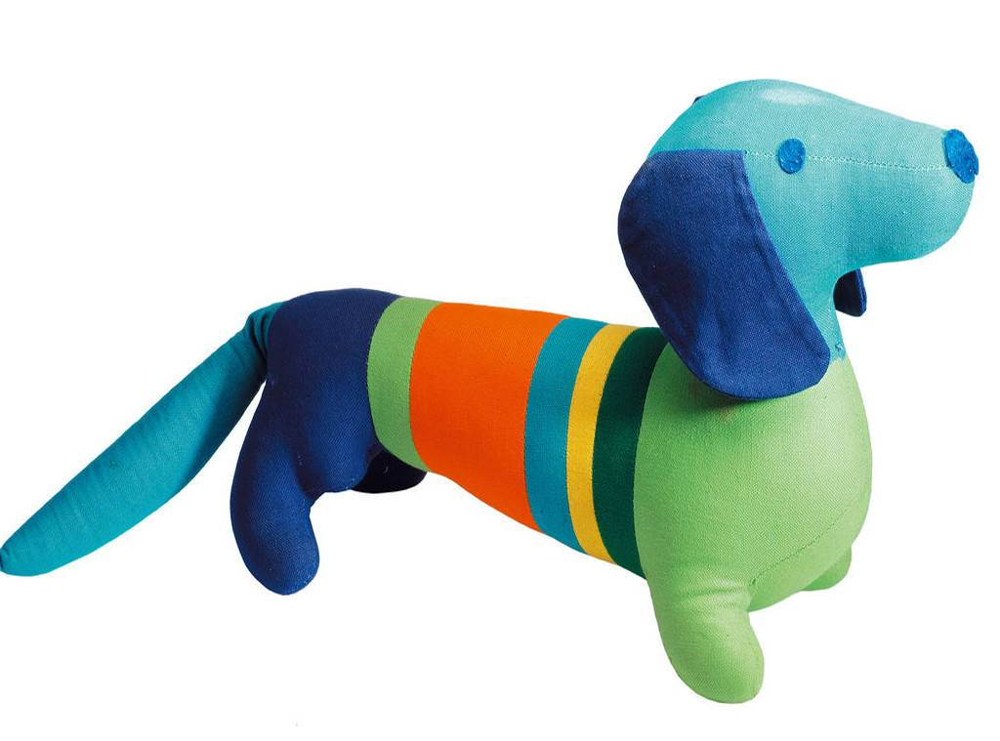

[返回目录](../index.html)

# 细菌发电；散点透视法；最早的奥运会吉祥物

2018-07-28

[TOC]

##科学 | 细菌可以发电吗？

根据美国太空网（Space）的报道，最近美国的科学家们正在国际空间站上面做一项实验，用一种细菌来发电，这种细菌的名字有点奇怪，叫希瓦氏菌。科学家说，这种细菌不光能发电，而且还能帮航天员净化水。如果实验成功，这种细菌以后又能发电，又能净水，那将来太空旅行的时候，就可以减减负，不用带那么多东西了。`国际空间上，研究细菌发电` `希瓦氏菌` `发电，净水`

借着这个事儿，咱们就来说说，这小小的细菌为什么能发电呢？`提出问题`

简单来说，想要有电得有两个条件，就是得有带电的粒子，第二，这些粒子要做运动。而细菌能发电，是因为它能传输电子，让电子不断地运动，这样就有了电。`电：带电粒子，能传输电子`

比方说希瓦氏菌，它就能传输电子，那具体怎么传呢？首先把这种细菌放在一些含有金属的石头上，比方说铁矿石上。在铁矿石的表面，很多希瓦氏菌会聚集在一块儿，能形成一层膜，然后它们就开始“发功”了，它们从自己的身体表面，长出一种又长又细的丝线来，跟石头里面的金属分子直接接触，然后从里面把电子拿走，送到别的地方，这个过程就能产生电。`怎么传输电子` `聚集在铁矿石表面，形成膜，长出丝线，拿走电子，送走`

我给你打个比方，这就有点儿像你给手机充电，希瓦氏菌就是一部手机，从它表面伸出来的丝线，就像手机连着的充电线，能导电，能传递电子，而岩石当中的金属，就是插座，细菌是把自己插到插座上，就能充电了。`类比手机充电` `希瓦氏菌-手机` `丝线-充电线` `岩石中金属-插座`

只不过，细菌用的充电线特别细，细到什么程度，只有10纳米，这是个什么概念呢？就是10000根细丝线排成一排，才和你的头发丝儿一样粗。 `10纳米`

虽然单个细菌能发的电很微弱，但是科学家也在不断努力，让细菌发的电能真的派上用场，比方说，有些科学家用细菌做出了细菌电池，给电池充电16个小时以后，可以提供8个小时的电力。`很微弱` `细菌电池`

##艺术 | 什么是散点透视法？

根据国际在线的报道，最近在香港，收藏家何耀光的私人机构，向特区政府捐赠了355件中国书法、绘画作品。这些书画作品里有很多都非常珍贵，比方说里面有明朝大画家唐寅，也就是唐伯虎的作品。`捐赠` `唐伯虎`

说起咱们中国古代的绘画作品，咱们来说一个相关的知识点，叫散点透视法。`绘画->散点透视法`

在说散点透视法之前，咱们先得说说透视法。学过画画儿的同学都知道，这是绘画里常用的一种方法。透视法画出来的画儿，就跟你眼睛看到的一样，比方说你看着火车的两条铁轨向远处伸出去，最后消失在一个点上，然后你照着这样给它画下来，这就是透视法。`透视法` `铁轨在远处消失于一个点`

西方绘画常用的画法，叫焦点透视法。就是我站在一个地方不动，我就从这个角度，把我眼前看见的东西都画下来，就像站在一个地方拍照片一样。下面有一张图片，这就是西方人用焦点透视法画出来的，你在看这幅画儿的时候，就好像这个故事是在你眼前发生的一样。 `焦点透视法`

.jpg)

*Assumption of the Virgin* (Correggio)

图片来源：https://www.pinterest.com/pin/288582288596128016

但是咱们中国的山水画儿，好多都不是这么画的，它们用的是散点透视法，就是站在很多个点上用透视法，而不是站在一个点上。比方说《清明上河图》，你看它那么老长的一幅画儿，画家就不是站在一个点上画的，你可以说他是边走边画的，站在河的上游，就画河的上游，站在桥的附近，就画一座桥，站在下游就画下游。这种方法能把整条河上的所有画面都画下来，就像走几步就拍一张照片一样，最后再把这些照片拼在一块儿。`中国山水画-散点透视法` `多个点上用透视法` `清明上河图` `拼接照片`

咱们中国人画山水画儿，经常采用的这种方法，已经有上千年的历史了。一开始没有人管这个叫“散点透视”，是西方的透视法传进中国以后，才有人给中国的画法起了名字，叫散点透视。`方法历史悠久，名字根据西方透视法而得`

##历史 | 最早的奥运会吉祥物长什么样？

根据中央电视台的报道，最近东京奥组委正式公布了奥运会吉祥物的名称，是由日文单词里的“未来”和“永远”组合而成的，寓意是希望美好的未来永远继续下去。这个名字是日本的小学生投票选出来的。 `东京奥运会吉祥物` `未来和永远` `日本小学生投票`

说起奥运会吉祥物，你知道它是怎么发展来的吗？英文里吉祥物叫mascot，这个词儿最早是从19世纪法国的一部歌剧里来的，意思是幸运符。`来源` `mascot` `法国歌剧，幸运符`

人们第一次把吉祥物用到奥运会上，是在50年前，1968年的法国冬奥会上。当时有人做了一个吉祥物，是一个小人儿站在滑雪板上，身上有红白蓝三种颜色，也就是法国国旗的颜色。`第一次，法国冬奥会`

不过第一个正式的奥运会吉祥物，是4年以后的夏季奥运才出现的。1972年夏季奥运会，在德国举办，这届奥运会的吉祥物是一只可爱的小狗，准确地说，它是一只腊肠狗，身子长长的，像一根腊肠一样。下面是这个吉祥物的图片。它是德国很受欢迎的一种狗，跟运动员一样，又灵活，又有韧劲儿。那年奥运会的马拉松长跑，还特意把跑道给设计成了这只小狗的形状。`正式奥运会吉祥物，德国夏季奥运会` `腊肠狗 ` `灵活又韧劲儿` `马拉松长跑跑道`

图片来源：https://www.eonline.com/au/news/785758/ranking-the-olympic-mascots-where-does-rio-stand-on-our-list

从此之后，每一届奥运会，就都有官方的吉祥物了。这些年我们能看到一个变化，就是奥运会的吉祥物，用动物形象的越来越少了，用虚拟人偶的形象比较多。比方说，北京奥运会的福娃，是5个卡通娃娃；伦敦奥运会的吉祥物文洛克，是一个长了一只大眼睛的人偶；还有这次东京奥运会的吉祥物，长得就像日本卡通动漫里的人物。`动物形象->虚拟人偶形象`

不过不管是真实动物，还是虚拟人物，可爱的奥运会吉祥物，都能吸引更多的少年关注奥运会。同时对于主办方来说，吉祥物相关的玩具、商品，也能够增加一点儿奥运会的收入。

> 家里有福娃的毛绒玩具，不过我貌似对这些没多大兴趣。也许是太占地方了吧，能看着各届不同的形象与寓意，倒更加有趣。不知是否有人开发了奥运吉祥物的3D应用。不知是否有那么一家店，或者一个展览，放置着各届的吉祥物，最好还能触碰把玩。某人的私人收藏中应该会有吧。

