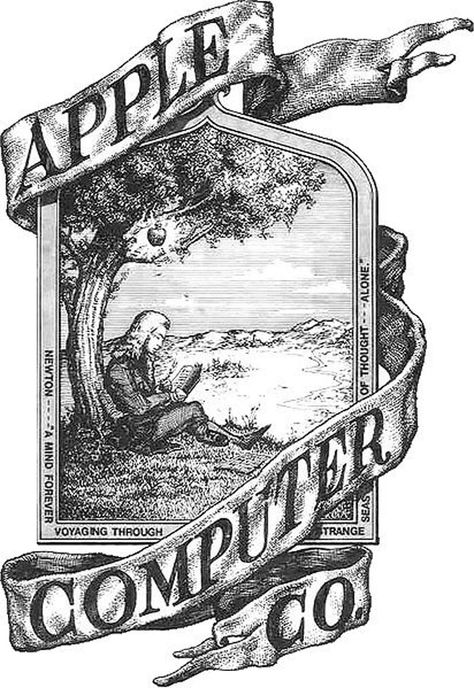
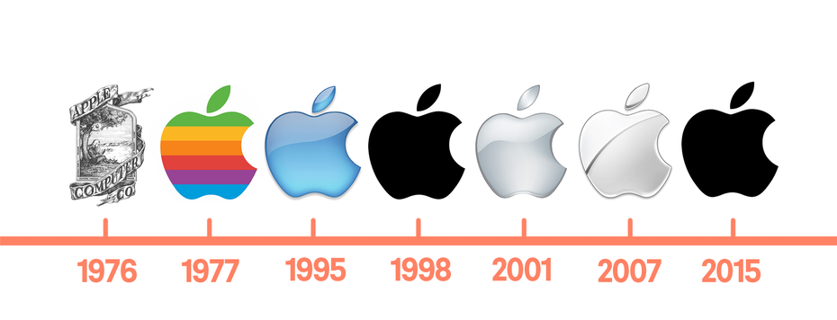

[返回目录](../index.html)

# 地震光；马拉松；苹果商标| 地球电讯

2018-08-07

[TOC]

##自然 | 地震光是怎么形成的？

根据《自然·科学报告》的一项最新研究，美国的科学家最近发现，如果一个地方发生了大地震，那在地球的另一边，也可能会引发新的地震。也就是说，假设你把地球当一颗苹果，从地震点扎一根针进去，穿过苹果的中心，从苹果背面扎出来，在扎出来的位置附近，有可能在几天之内就会发生地震。`地震发生的另一边也可能会地震` `苹果穿针类比`

说起地震，下面咱们来说一种跟地震有关的现象，叫地震光，也叫地光。所谓地震光，就是有些地震发生的前后，天空中会出现奇特的光芒，跟北极的极光有点像。一般5级以上的地震，才可能出现地震光，5级以下的地震很少能见到。`地震光` `地震发生的前后` `5级以上地震`

目前关于地震光出现的原因，科学家还没有给出统一的解释。我来跟你说其中一种比较靠谱的分析。 `原因` `一靠谱分析`

地震的时候，地壳里面的一些岩石，会承受很大的压力，组成岩石的那些分子，就会被破坏，释放出一些化学元素到空气中，这些元素再进行化学反应，跟空气里的粒子互相撞击，碰撞过程就会释放出能量，从而形成了地震光。`地震->岩石分子被破坏->释放化学元素->和空气中的粒子碰撞->地震光`

##社会 | 马拉松为什么受欢迎？

根据澳大利亚广播公司的报道，最近在澳大利亚举办的一场半程马拉松比赛里，一只流浪狗把所有参赛选手的风头都给抢了。这是为什么呢？因为这只狗跑完了比赛的全程。`马拉松比赛` `流浪狗跑完全程抢风头`

你知道马拉松比赛差不多是42公里，半程马拉松，就是一半儿，21公里。这只狗跑完全程，只用了两个半小时，跟参赛选手平均花费的时间差不多。你说这只小狗厉不厉害？比赛的主办方，还专门给它颁发了一块奖牌。`全程42公里` `半程21公里` `狗用时两个半小时，选手平均时间` `小狗被颁发奖牌`

> 表述有歧义，是小狗跑完42公里全程花了两个半小时，还是21公里两个半小时。参赛选手的平均速度的话，应该是半程的时间。但是，跟小狗比跑步，还跑得是人类平均速度，这值得炫耀吗？只是因为新奇，还是因为小狗沿着赛道跑？

说起马拉松，在中国这是一项挺热门的运动。下面咱们就来说说，为什么马拉松会受人欢迎？`马拉松热门`

你在体育课上可能跑过400米、1000米，对吧？这跑下来都很累。马拉松全程是42195米，要是400米的跑道，得绕100多圈，这跑完不得累死啊？你说跑马拉松的人，他们图啥呢？主要啊，有这么几个原因。`400米跑道100多圈` `为什么跑马拉松`

首先，如果一个人真能跑完马拉松，他会获得一种精神上的优越感。因为跑完马拉松不容易，能做到的人少，所以只要能跑完，就能把他跟其他人区别开来，产生一种优越感：我能做到，你们都做不到。就像一张卷子，别人都考六七十分，就我能考100分。`精神上的优越感` `做到别人做不到的` `以考试类比`

其次，就是有一些人把马拉松当成了一种精神寄托。他们想通过自己的努力，挑战自己。如果我能跑下来全程，我就是超越了自己，突破了自己的极限。所以说，马拉松能帮助一些人证明自己。`精神寄托` `证明自己、超越自己`

最后，如果一个人在跑的时候，能得到别人的鼓励，那他就会跑得更起劲儿，更容易坚持下来。有人研究过，如果一个跑步的人，有人告诉他，说：诶，我觉得你跑得好轻松哦，一点都不费力。听到这样的话，他们就会跑得更好，甚至迈出同样的步伐，他们消耗的能量都会变少。所以说，经常受到鼓励的跑步者，他的耐力会更持久，更愿意长跑。`得到鼓励，更易坚持`

不过最后还是要提醒你一句，跑马拉松要量力而行，不是所有人都适合跑马拉松，如果准备活动没有做好，或者跑步姿势不正确，跑马拉松可能会伤害到你的膝盖。`要量力而行` `做好准备活动` `正确的跑步姿势` `可能伤害膝盖`

##历史 | 苹果公司的商标被谁咬掉了一块？

根据美国全国广播公司NBC的报道 ，8月2号，也就是上周四，苹果公司成为美国第一家市值超过1万亿美元的公司。市值，就是一家公司所有的股票加起来值多少钱，也可以说是这家公司值多少钱。`苹果公司市值超过1万亿美元` `市值：所有股票加起来值多少钱`

1万亿美元是个啥概念？咱们中国有个成语，叫“富可敌国”，这个词现在正好可以用来形容苹果公司。你看，全世界将近有200个国家，根据国际货币基金组织和世界银行的统计，到2017年，这些国家的GDP，也就是国内生产总值，能超过1万亿美元的国家，你猜有多少个？只有16个。所以说，苹果公司的市值，已经超过100多个国家的GDP了，这可不就是“富可敌国”吗？`到2017只有16个国家的GDP能超过1万亿美元` `富可敌国`

不过苹果公司只是美国第一家超过1万亿美金的公司，可不是全世界第一家。全世界第一家1万亿美金的公司，是咱们国家的中石油，全称叫中国石油天然气集团有限公司，它曾经在2007年达到过1万亿美金的市值。`第一家：中石油，2007年`

说到苹果公司，咱们来说说，苹果公司的商标。你看苹果现在的商标，不是一颗完整的苹果，而是像被咬了一口，缺了一块儿。这是怎么回事儿呢？`苹果商标`

有一种说法流传得很广，说苹果公司的创始人乔布斯，他喜欢大数学家图灵，就是提出图灵测试的那个艾伦·图灵。图灵去世的时候，床边有一颗苹果，吃了一半儿。乔布斯是因为这个，把苹果的商标设计成了现在的样子。但这个故事其实是个谣传，苹果商标跟图灵没关系。`喜欢图灵` `图灵去世的床边有吃一半苹果` `谣传`

那苹果商标到底是怎么来的呢？最早的时候，苹果公司设计过一款商标，就是牛顿坐在苹果树底下。下图就是这个设计。不过这设计，没有成为苹果真正的商标，因为乍一看跟科技公司没啥关系，所以没用。`牛顿坐在苹果树下的商标` `与科技公司无关`

图片来源：<https://www.pinterest.co.uk/pin/347762402449779532>

根据《史蒂夫·乔布斯传》的说法，后来设计师就给乔布斯设计了两个新的商标，一个是完整的苹果，另一个就是咬了一口的苹果。乔布斯拿过来一看，说这完整的苹果，长得也太像樱桃了吧，不要，咱们用第二个吧。就这么着，咬了一口的苹果，就成了苹果公司的正式商标，后来虽然变过颜色，比方说彩虹色，蓝色，黑色，都换过，但是这个形状一直都没变。`史蒂夫·乔布斯传` `完整苹果VS咬一口的苹果` `颜色变化，形状未变`

图片来源：<https://99designs.co.uk/blog/logo-branding/famous-logos/>

上图苹果公司从创立以来，正式用过的几个商标，最右边的就是现在用的。你看看，你更喜欢哪一个呢？

> 98年和15年的是一样的吗？01年的最吸引我了吧，金属质感，高科技的感觉。

