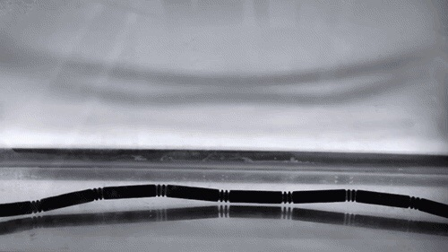

[返回目录](../index.html)

# 香草；4D打印；清醒梦| 地球电讯

2018-09-01

[TOC]

##自然 | 香草不是草！

根据英国卫报报道，英国的消费调查机构最近发现，英国人现在吃的香草口味儿的冰激凌，每五杯里面就有一杯，既没有香草，也没有牛奶和奶油。商家用一些人工合成的东西来替代它们。这是因为今年香草价格飙升，一斤香草甚至比一斤白银还要贵。所以，做冰激凌的商家才会找东西来代替香草。`香草冰淇淋中可能没有香草` `香草价格飙升`

说起香草，很多人以为香草是一种草，其实不是，香草来自一种兰花，叫做香荚兰，豆荚的荚。这种兰花有一个细长的豆荚，长得就跟枯树枝似的，把这个豆荚划开，里面有很多的小豆子，正宗的香草冰激凌，它的香味儿就来自这些小豆子。下面是豆荚和里面小豆子的图片。`香草来自于香荚兰` `豆荚像枯树枝`

为什么香草现在这么贵，是因为从种植香荚兰，到做出香草来，整个过程，需要付出非常多的人工劳动，这个劳动是不能用机器替代的。`需要大量的人工劳动`

比方说，我们知道，植物要结果实，需要授粉，传粉一般都是蜜蜂蝴蝶干的活儿，但很多能长香荚兰的地方，没有蜜蜂，所以只能人工授粉。而且人工授粉很困难，因为香荚兰的雌蕊跟雄蕊，是长在一块儿的，但不挨着，所以要拿一个牙签儿，把雄蕊里的花粉给拨到雌蕊里。每一朵花都要这么弄，就很折腾人。`只能人工授粉`

种植好香荚兰，还没有得到香草。还要把这些豆荚摘下来，把它们拿热水烫一遍，这叫“杀青”，然后让它们晒太阳，烘干，甚至还要拿手给它们挨个儿按摩，这样豆荚才能充分地发酵，里面的香气才能充分释放出来。六百朵授了粉的花儿，只能产出6公斤的小豆子来，再做人工处理以后，就只剩下1公斤的干豆子了。`杀青，晒太阳，烘干，按摩`

所以你看，得有多少人付出辛勤的劳动，才能让你吃上一口正宗的香草冰激凌啊，说起来真是太不容易了。`不容易`

##科技 | 4D打印比3D打印牛在哪里？

根据《科学进展》（Science Advances）期刊上发表的一项最新研究，香港城市大学的研究团队，最近成功开发出陶瓷的4D打印技术，这在全世界都是第一次。4D打印，听起来有点陌生，你可能听说过3D打印，其实它们俩是有点儿像的。`陶瓷4D打印`

3D打印用的是塑料粉和金属粉，你在电脑里设计好一个东西，比如说一个小城堡，然后3D打印机会通过一个嘴儿，把塑料粉喷到一个底板儿上，从城堡的最底下一点点往上塑造，最后，就会打印出一个小城堡来。`3D打印，塑料粉和金属粉，从下往上塑造`

这是3D打印，你可能都知道。那4D打印又是个什么东西呢？3D、4D这个D，是英文dimension的缩写，是维度的意思，3D就是三维，只有长宽高这三个维度。那4D多了个啥呢？是多了时间这样一个维度。`多一个时间维度`

3D打印出来的东西，都是死的，就是说不管过了多长时间，它们都是一个样子，不会变，不会随着时间变化而变化，所以说，3D打印出来的东西没有时间维度，它只有空间里的长宽高。而4D打印出来的东西就不一样了，虽然它的打印方法跟3D打印差不多，但它打出来的东西是会活动的，比方说，把一条4D打印的链子扔到热水里，它立马就会折成一个正方体的形状，有了这个变化，也就有了时间维度，这就是4D打印。下面是一个4D打印出来的东西，你看它是怎么变的。`会随时间活动`

刚才新闻里提到的技术，叫做陶瓷4D打印，它用的材料，不是塑料粉和金属粉，而是陶瓷，当然了，不是咱们生活里那种硬邦邦的陶瓷，而是细小的陶瓷颗粒。这种陶瓷颗粒跟一种化学物质结合在一起，科学家给这种材料起了个名字，叫“陶瓷墨水”。用这种陶瓷墨水打印出来的东西，特别柔软，特别有弹性。打个比方，就跟拉橡皮筋儿似的，同时这种陶瓷材料还特别的坚固，不会轻易折断。科学家说，这种材料，以后可以做电子产品，可以做陶瓷的手机后盖，还有可能会用到火箭跟飞船上。`陶瓷墨水` `柔软，有弹性，坚固` `电子产品，陶瓷的手机后盖，火箭和飞船`

##心理 | 你做过“清醒梦”吗？

根据美国《公共科学图书馆》期刊上发表的一项最新研究，美国的科学家发现，有一种药，本来是用来治疗老年痴呆症的，结果吃了这种药以后，还有一个效果，就是会让更多的人做梦，而且做的还是清醒梦，有超过40%的人说，吃了这种药，会做清醒梦。`治疗老年痴呆的一种药会使人做清醒梦`

做梦咱们都知道，那什么是清醒梦呢？

这个词儿很容易让人误会，说清醒梦就是白日梦呗，但实际上不是这样的。清醒梦就是一边做梦，一边还知道自己是在做梦，而且还能控制我要做什么样的梦。这听起来就比较神了。`知道自己做梦，还能控制`

一般咱们做梦都是不由自主的，做一个噩梦，害怕得不行，突然一下惊醒过来，才发现，哦，我刚才是做梦啊，吓死我了。这就是梦境控制了你，你没意识到自己是在做梦。`一般的梦`

那清醒梦是什么样呢？就是一边做梦，一边还能清醒的告诉自己，这就是个梦。有些人，还能编排自己做什么样的梦，能自己主导梦的情节。比如本来可能是个噩梦，梦到我被坏蛋欺负，但清醒梦能改变剧情，改成我去打坏蛋。所以说，做清醒梦，就像自己编剧本一样，可以照着自己的意愿来。`知道这是梦，能主导梦的情节`

会不会做清醒梦，这跟大脑当中的一些地方是不是活跃，有关系。有一些心理治疗师，会碰到一些经常做噩梦的患者，治疗师会诱导患者做更多的清醒梦，这时候他们做噩梦的次数就减少了。`通过做更多清醒梦治疗做噩梦`

科学家还统计过，有超过一半儿的成年人，都做过清醒梦。你可以问问你的爸爸妈妈，让他们回忆一下，有没有哪次做梦的时候，很清楚自己是在做梦？你可以告诉他们，这个就叫做清醒梦。`超过一半的成年人都做过清醒梦`

