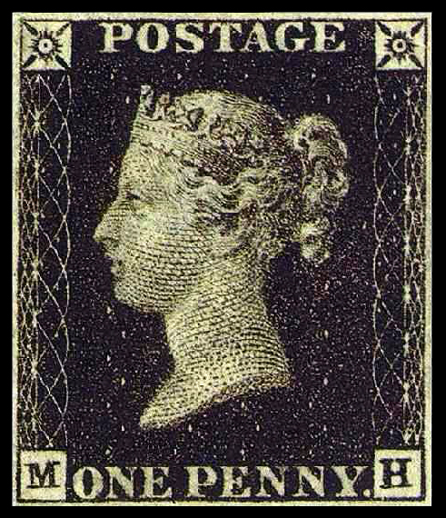

[返回目录](../index.html)

# 联合国秘书长选拔；逆时针跑步；黑便士邮票| 地球电讯

2018-08-20

[TOC]

##时政 | 联合国秘书长是怎么选出来的？

根据新华社的报道，8月18号，也就是上周六，联合国前秘书长科菲·安南，在瑞士去世，享年80岁。安南1997年到2006年期间，担任联合国秘书长。2001年，安南和联合国曾经共同获得诺贝尔和平奖。`前联合国秘书长科菲·安南去世` `2001，诺贝尔和平奖`

不知道你有没有想过，长大以后当联合国秘书长。如果你有这个梦想的话，那十分抱歉，我要给你泼一盆冷水了，因为你几乎不可能当选。这可不是在怀疑你的能力，不是因为你个人的原因。而是跟国家有关系。你可能知道，联合国安理会有5个常任理事国，分别是中国、美国、英国、俄罗斯，还有法国，这五个国家在联合国有一票否决权，也就是说，这5个国家在联合国里的权利和地位，是比其他国家要高的。`常任理事国` `一票否决权` 

为了公平起见，所以联合国有一条不成文的规定，就是联合国秘书长，不能来自这5个大国。另外，连着的两任联合国秘书长，最好不要是同一个大洲的，要轮换着来。还有，联合国还希望在性别上做到公平，联合国秘书长要有男有女，但到目前为止，9任联合国秘书长全是男的，还没有出现过女的。`联合国秘书长不能来自常任理事国` `接连两任，最好来自不同大洲` `希望性别上公平，但目前全是男性`

知道了这些条件，只能是大概确定联合国秘书长的人选范围，但具体要怎么选呢？下面咱们来详细说说。最近几年，联合国采用了新的选拔方式，比方说2015年底的时候，联合国邀请了全部193个成员国家，提名候选人，这是联合国历史上第一次用公开竞争的方式，来选拔秘书长。`2015底开始，提名，公开竞争`

到2016年4月，有8名候选人开始接受联合国的面试，面试的过程，跟你们班选班长差不多，就是要做一个自我陈述，说说如果我当上秘书长，我要做些什么。然后回答大家向你提出的各种问题。这样候选人就能在公开、透明的平台上做自我展示，让大家都看到。

这些候选人，他们处理国际事务的经验都非常丰富。最后是在联合国做过高级官员的安东尼奥·古特雷斯胜出，他还做过葡萄牙的总理。2017年1月1号，古特雷斯正式担任联合国秘书长，任期是5年。一般来说，一个联合国秘书长最多连着干两届，总共也就是10年的时间，目前还没有人连任3次。`古特雷斯` `任期5年，最多连任两届`

##体育 | 为什么跑步都要逆时针跑？

根据新华社的报道，8月18号晚上，第18届亚运会开幕式在印度尼西亚的首都，雅加达举行。本次开幕式筹备时间超过1年，总成本超过2亿元人民币。中国体育代表团是本届亚运会的第一大代表团，一共有845名运动员，将参加总共38个大项、376个小项的比赛。`亚运会开幕` `印度尼西亚，雅加达` 

说起亚运会比赛，不知道你有没有注意过一个问题，你看亚运会、还有奥运会的赛场上，运动员们跑步，一般都是逆时针跑，你基本看不到有人是顺时针跑的，这是为什么呢？`跑步逆时针跑`

关于这个问题，有很多种解释，说法都不一样，下面咱们来说两个可能的原因。`可能原因`

第一个原因，可能跟心脏的位置有关系。大部分人的心脏都长在左边，而心脏里有很多血液，是比较重的。所以跑步的时候，人左半边胸腔就比右半边胸腔更重，在跑步急转弯的时候，更重的半边靠里，转弯就会更容易一些。`心脏位置`

第二个原因是大部分人都是右撇子，平时习惯用右手写字，右腿踢球儿，右手右腿的力量比左手左腿要好一些。当我们蒙上双眼走路的时候，大多数人不会直着往前走，而是往左边偏，所以跑步的时候往左跑是一个比较自然的倾向。而且让更有力量的右手右腿在外侧，它们的前后摆动幅度更大，更能用得上劲儿。`右撇子`

下次你可以试一试，看看顺时针跑两圈，是不是真的会比逆时针跑起来更累呢？

##历史 | 世界上第一枚邮票叫什么？

根据新华社的报道，今年是中国的第一套邮票，也叫“大龙邮票”，发行140周年，现在这套邮票回到了它一开始的发行地——辽宁省营口市，进行展出。“大龙邮票”上面有龙的图案，是清朝皇家的象征，所以才起了这个名字。`中国第一套邮票` `大龙邮票` `龙`

说起邮票，你知道世界上最早的邮票叫什么吗？`世界上最早的邮票`

叫“黑便士邮票”。便士就是英国一种硬币的名字，相当于咱们中国的1分钱硬币。为什么叫黑便士邮票呢？因为这种邮票是黑色的，每一枚邮票只需要1便士。下面是这种邮票的照片，它上面印的是英国维多利亚女王的头像。`黑便士邮票` `英国维多利亚女王头像`



为什么要发明这种邮票呢？有这样一个故事。在18世纪初的时候，英国的邮费特别贵，而且一般都是收信的人付钱。英国邮政局有一个官员，叫罗兰·希尔，他就想改革英国的邮政系统。有一次，罗兰·希尔看到一个年轻的姑娘，从邮递员手里接过来一封信，看了看信封，也没拆，就给邮递员退了回去，说：这信我拒收，谢谢。`18世纪，邮费贵，收信人付钱` `拒收的故事`

罗兰·希尔很纳闷儿，等邮递员走了，就过去问她说：姑娘，这信你为啥不收呢？姑娘说：这是我未婚夫给我寄过来的信，我俩商量好了，如果他在那边一切都好的话，就在信封上做个暗号，我看到暗号就放心了。收信实在是太贵了，我收不起。就这么着，罗兰·希尔才下定决心，要改革英国的邮政体系。不过这个故事到底是不是真的，现在已经没法考证了。`->改革英国的邮政体系`

罗兰·希尔发明的这个黑便士邮票，把邮费降到了1分钱，也就是1便士，只要一封信不超过14克，也就是薄薄的一张纸，那么不管你寄多远，都只收1便士。而且，开始贴邮票以后，就不是收信人交钱了，而是寄信人在寄出的时候，就已经花过钱了。`1便士` `寄信人花钱`

黑便士邮票是在1840年5月正式发行的，比咱们中国的大龙邮票早了将近40年。黑便士邮票在英国一共发行了将近7000万枚。不过它只用了1年的时间，就被别的邮票给替换掉了。为什么呢？`1年就被替换`

因为用着用着发现，在黑便士邮票上盖红色的邮戳儿，那红色很容易让人给擦掉，擦掉以后还不容易被发现。这样哪怕是用过的黑便士邮票，还可以揭下来重复使用。这让一些不舍得花钱买邮票的人，钻了空子。`容易重复使用`

所以后来黑便士邮票，就变成了红便士邮票，同样的图案，变成了红色的，往上面盖黑色的邮戳，黑色的印迹可没那么容易擦干净了，这样就防止了邮票重复使用。`红便士邮票`

> 回国前，买点邮票回去