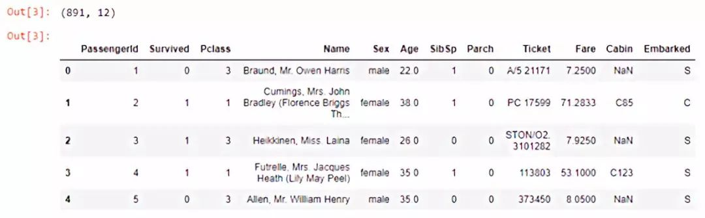
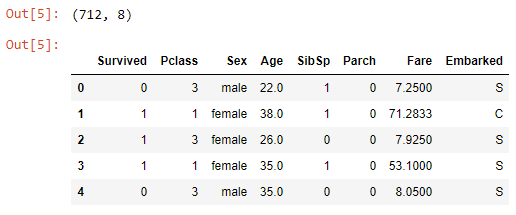
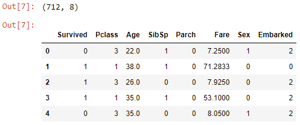
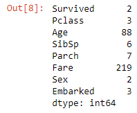
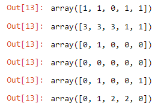
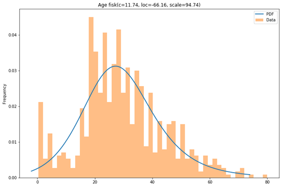
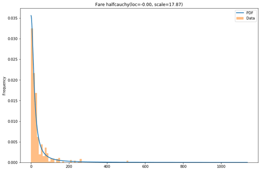
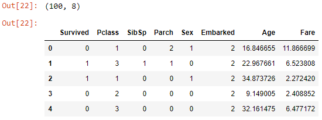
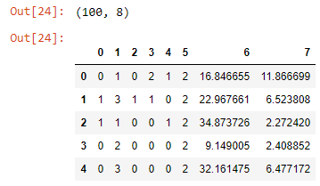

[返回到首页](../index.html)

#手把手：如何方便地使用Python和Pandas来匿名信息

大数据文摘

编译：毅航、胡笳、Aileen

[TOC]

##**本文阅读收获**

1. 每行信息唯一的列需要删除。`drop()`

2. 通过对名称进行数值编码匿名信息（分类变量的类名，列名）。`LabelEncoder()`

3. 分布拟合。类别数据：根据频率，创建离散概率分布。连续变量：从预定义的分布列表中确定最佳连续分布。

4. 从离散和连续分布中生成数据。

5. 知道了sklearn_pandas包，DataFrameMapper类。

6. 转换器：LabelEncoder()，MinMaxScaler()，StandardScaler()，FunctionTransfomer()

7. Jupyter notebook技巧：多个输出。

8. 本文忽略了变量间的关系。


1. 每行信息唯一的列需要删除。`drop()`

2. 通过对名称进行数值编码匿名信息（分类变量的类名，列名）。`LabelEncoder()`

3. 分布拟合。类别数据：根据频率，创建离散概率分布。连续变量：从预定义的分布列表中确定最佳连续分布。

   ```python
   for c in categorical:
           counts = df[c].value_counts()
           np.random.choice(list(counts.index), p=(counts/len(df)).values, size=5)
   ```

   ```python
   from utils import best_fit_distribution
   
   best_distributions = []
   for c in continuous:
       data = df[c]
       best_fit_name, best_fit_params = best_fit_distribution(data, 50)
       best_distributions.append((best_fit_name, best_fit_params))
   # Result
   best_distributions = [
       ('fisk', (11.744665309421649, -66.15529969956657, 94.73575225186589)),
       ('halfcauchy', (-5.537941926133496e-09, 17.86796415175786))]
   ```

   [utils.py](./py/utils - fakedata.py)

4. 从离散和连续分布中生成数据。

   ```python
   def generate_like_df(df, categorical_cols, continuous_cols, best_distributions, n, seed=0):
       np.random.seed(seed)
       d = {}
       for c in categorical_cols:
           counts = df[c].value_counts()
           d[c] = np.random.choice(list(counts.index), p=(counts/len(df)).values, size=n)
       for c, bd in zip(continuous_cols, best_distributions):
           dist = getattr(scipy.stats, bd[0])
           d[c] = dist.rvs(size=n, *bd[1])
       return pd.DataFrame(d, columns=categorical_cols+continuous_cols)
   ```

5. 知道了sklearn_pandas包，DataFrameMapper类。

   ```python
   from sklearn_pandas import DataFrameMapper
   from sklearn.preprocessing import LabelEncoder
   
   encoders = [(["Sex"], LabelEncoder()),(["Embarked"],LabelEncoder())]
   mapper = DataFrameMapper(encoders, df_out=True)
   new_cols = mapper.fit_transform(df.copy())
   ```

6. 转换器：LabelEncoder()，MinMaxScaler()，StandardScaler()，FunctionTransfomer()

7. Jupyter notebook技巧：多个输出。

   ```python
   # get more than one output per Jupyter cell
   from IPython.core.interactiveshell import InteractiveShell
   InteractiveShell.ast_node_interactivity = "all"
   ```

8. 本文忽略了变量间的关系。


最近，我收到了一个数据集，其中包含有关客户的敏感信息，这些信息在任何情况下都不应公开。数据集位于我们的一台服务器上，一个相当安全的地方。`客户敏感信息`

但我想将数据复制到我的本地磁盘上，以便更方便地处理数据，同时又不希望担心数据不安全。于是，我写了一个改变数据的小脚本，同时仍然保留了一些关键信息。我将详细介绍我所采取的所有步骤，并重点介绍一些方便的技巧。`改变数据，保留关键信息`

## **任务**：与原始数据无太大差异，反映原始数据集分布

我们的任务是准备一个数据集，以便以后能用于机器学习（例如分类，回归，聚类）而且不包含任何敏感信息。最终的数据集不应与原始数据集有太大差异，且应该反映原始数据集的分布。`与原始数据集无太大差异` `反映原始数据集的分布`


**动手开始吧!**

我使用Jupyter notebook作为编程环境。首先，让我们引入所有必须的库。

```python
import pandas as pd
import numpy as np
import scipy.stats
%matplotlib inline
import matplotlib.pyplot as plt
from sklearn_pandas import DataFrameMapper
from sklearn.preprocessing import LabelEncoder
# get rid of warnings
import warnings
warnings.filterwarnings("ignore")
# get more than one output per Jupyter cell
from IPython.core.interactiveshell import InteractiveShell
InteractiveShell.ast_node_interactivity = "all"
# for functions we implement later
from utils import best_fit_distribution
from utils import plot_result
```

我假设您已熟悉此处使用的大多数库。我只想强调三件事。sklearn_pandas是一个方便的库，减少了使用两个包之间的差距。`使用sklearn_pandas包`

sklearn_pandas：

https://github.com/scikit-learn-contrib/sklearn-pandas

它提供了一个DataFrameMapper类，使得处理pandas.DataFrame更容易，因为它可以在更少的代码行中完成变量的编码转换。`DataFrameMapper类` `更容易处理DataFrame`

我利用IPython.core.interactiveshell ...更改了Jupyter Notebook默认配置，用来显示多个输出。这里有一篇很好的博文介绍了其他关于Jupyter的实用小技巧。`Jupyter Notebook显示多个输出`

最后，我们将一些代码放入一个名为utils.py的文件中，我们把这个文件放在Notebook代码文件旁边。`util.py文件`

Jupyter的实用小技巧：

https://www.dataquest.io/blog/jupyter-notebook-tips-tricks-shortcuts/

```
df = pd.read_csv("../data/titanic_train.csv")
```

我们的分析采用Titanic Dataset的训练数据集。`使用Titanic训练数据集`

数据集链接：

https://www.kaggle.com/c/titanic

```python
df.shape
df.head()
```



##删除信息唯一的列

现在我们已经加载了数据，后面将删除所有可识别个人身份的信息。列[“PassengerId”，“Name”]包含此类信息。请注意，[“PassengerId”，“Name”]对于每一行都是唯一的，因此如果构建机器学习模型，无论如何都需要在后续删除它们。`删除包含个人信息的唯一的列`

同样对[“Ticket”，“Cabin”]列也进行类似的操作，因为这两列对于每一行几乎都是唯一的。`删除几乎唯一的列，Ticket，Cabin`

出于演示方便，我们不会处理缺失值。我们只是忽略所有包含缺失值的观察结果。`忽略缺失值的观察结果`

```python
df.drop(columns=["PassengerId", "Name"], inplace=True) # dropped because unique for every row
df.drop(columns=["Ticket", "Cabin"], inplace=True) # dropped because almost unique for every row
df.dropna(inplace=True)
```

结果看起来像这样。

```python
df.shape
df.head()
```



##对类别进行数值编码转换 类别->数字

接下来，为了剔除更多信息，并作为后续步骤的预处理，我们将对“Sex”和“Embarked”进行数值编码转换。`对Sex和Embarked进行数值编码转换`

“Sex”被编码为“0,1”，“Embarked”被编码为“0,1,2”。LabelEncoder()类为我们完成了大部分工作。`LabelEncoder()`

```python
encoders = [(["Sex"], LabelEncoder()), (["Embarked"], LabelEncoder())]

mapper = DataFrameMapper(encoders, df_out=True)

new_cols = mapper.fit_transform(df.copy())

df = pd.concat([df.drop(columns=["Sex", "Embarked"]), new_cols], axis="columns")
```

DataFrameMapper来自sklearn_pandas包，接收元组（tuple）列表作为参数，其中元组的第一项是列名，第二项是转换器。`DataFrameMapper使用`

我们在这里使用LabelEncoder()，但也可以使用其它转换器（MinMaxScaler()，StandardScaler()，FunctionTransfomer()）。`转换器`

在最后一行中，我们将编码后的数据与其余数据连接起来。请注意，您也可以写axis = 1，但是axis =“columns”可读性更强，我鼓励大家使用后者。

```python
df.shape
df.head()
```



```python
df.nunique()
```




##**通过从同一分布中抽样来匿名化**

上述代码我打印了每列的唯一值的取值个数。我们假设具有少于20个取值个数的是名义变量或分类变量，具有大于等于20个取值个数的都是连续变量。`假设<20取值为类别变量；>20为连续变量`

我们将名义/分类变量放在一个列表中，将其它变量放在另一个列表中。`将类别和连续变量分别放置`

```python
categorical = []
continuous = []
for c in list(df):
    col = df[c]
    nunique = col.nunique()
    if nunique < 20:
        categorical.append(c)
    else:
        continuous.append(c)
```

for c in list(df): 迭代所有列。对于list(df)，我们也可以写成df.columns.tolist()。我还是喜欢list(df)。

以下是本文的核心思想：对于每个分类变量，我们将计算其每项取值出现的频率，然后为每个取值创建具有相同频率的离散概率分布。`分类变量计算频率，创建离散概率分布`

对于每个连续变量，我们将从预定义的分布列表中确定最佳连续分布。我们怎么做呢？一旦确定了所有概率分布（离散和连续），我们就可以从这些分布中进行采样以创建新的数据集。`连续变量，从预定义的分布列表中确定最佳连续分布` `从分布中采样创建新的数据集`

###**处理名义/分类变量**

这是一个简单的例子，只用三行代码。

```python
for c in categorical:
        counts = df[c].value_counts()
        np.random.choice(list(counts.index), p=(counts/len(df)).values, size=5)
```



首先，我们确定变量中每个唯一值出现的频率。然后我们使用这个经验概率函数并将其传递给np.random.choice()以创建一个具有相同概率函数的新随机变量。`np.random.choice()`

###**处理连续变量**

幸运的是，StackOverflow上有一个类似问题的讨论。主要解决方案如下，对于每个连续变量做如下处理：

- 使用预定义数量的区间来创建直方图
- 尝试一系列连续函数，让每个函数都去拟合该直方图，拟合过程中会产生函数的参数。
- 找到具有最小误差（最小残差平方和）的函数，该函数与该直方图将被我们用来模拟连续变量分布。

该解决方案的作者将所有内容整齐地分为两个函数。我创建了第三个函数并将所有内容放在一个名为utils.py的文件中，后面将在Jupyter Notebook中使用utils.py中定义的函数。

```python
best_distributions = []
for c in continuous:
    data = df[c]
    best_fit_name, best_fit_params = best_fit_distribution(data, 50)
    best_distributions.append((best_fit_name, best_fit_params))
# Result
best_distributions = [
    ('fisk', (11.744665309421649, -66.15529969956657, 94.73575225186589)),
    ('halfcauchy', (-5.537941926133496e-09, 17.86796415175786))]
```

Age的最佳分布是fisk，Fare的最佳分布是halfcauchy，让我们来看看结果。

```python
plot_result(df, continuous, best_distributions)
```






还不错哦。

**把代码整合到一个函数中**

```python
def generate_like_df(df, categorical_cols, continuous_cols, best_distributions, n, seed=0):
    np.random.seed(seed)
    d = {}
    for c in categorical_cols:
        counts = df[c].value_counts()
        d[c] = np.random.choice(list(counts.index), p=(counts/len(df)).values, size=n)
    for c, bd in zip(continuous_cols, best_distributions):
        dist = getattr(scipy.stats, bd[0])
        d[c] = dist.rvs(size=n, *bd[1])
    return pd.DataFrame(d, columns=categorical_cols+continuous_cols)
```

现在我们有了一个函数，可以用它来创建100个新的观测值。

```python
gendf = generate_like_df(df, categorical, continuous, best_distributions, n=100)
gendf.shape
gendf.head()
```



##删除列名

作为后置处理步骤，还可以对连续变量进行取舍。我选择不这样做。我所做的是删除了所有列名，因为这也可能泄漏有关数据集的一些信息，简单地用0,1,2…替换它们。`删除列名`

```python
gendf.columns = list(range(gendf.shape[1]))
```



最后，大功告成。

```py
gendf.to_csv("output.csv", index_label="id")
```

**总结**

这种方法的一个缺点是变量之间的所有交互都丢失了。例如，假设在原始数据集中，女性（Sex= 1）存活的机会（Survived= 1）比男性（Sex= 0）高，而在生成的数据集中，这个信息丢失了，其它变量之间可能存在的关系也会丢失。

我希望你发现这篇文章有用，可以在文末留言区讨论。

文中所有代码

https://github.com/r0f1/dev_to_posts/tree/master/fake_data

原文链接：

https://dev.to/r0f1/a-simple-way-to-anonymize-data-with-python-and-pandas-79g